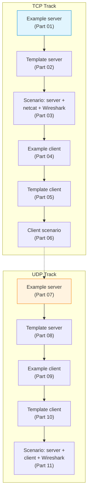

# S02 — Socket Programming: TCP and UDP Servers with Clients

Week 2 transitions from passive observation to active construction. Students implement concurrent TCP and UDP echo servers in Python, write matching clients and verify the resulting traffic in Wireshark. The seminar provides both complete examples and skeleton templates that require students to fill in critical sections, reinforcing the distinction between connection-oriented (TCP) and connectionless (UDP) transport.

## File/Folder Index

| Name | Type | Description |
|---|---|---|
| [`S02_Part01_Example_TCP_Server.py`](S02_Part01_Example_TCP_Server.py) | Example | Complete TCP echo server with threading |
| [`S02_Part02_Template_TCP_Server.py`](S02_Part02_Template_TCP_Server.py) | Template | TCP server skeleton — students complete the missing logic |
| [`S02_Part03_Scenario_TCP_Server_Netcat_Wireshark.md`](S02_Part03_Scenario_TCP_Server_Netcat_Wireshark.md) | Scenario | Testing the TCP server with netcat and Wireshark |
| [`S02_Part04_Example_TCP_Client.py`](S02_Part04_Example_TCP_Client.py) | Example | Complete TCP client |
| [`S02_Part05_Template_TCP_Client.py`](S02_Part05_Template_TCP_Client.py) | Template | TCP client skeleton |
| [`S02_Part06_Scenario_TCP_Client.py`](S02_Part06_Scenario_TCP_Client.py) | Scenario | TCP client scenario script |
| [`S02_Part07_Example_UDP_Server.py`](S02_Part07_Example_UDP_Server.py) | Example | Complete UDP echo server |
| [`S02_Part08_Template_UDP_Server.py`](S02_Part08_Template_UDP_Server.py) | Template | UDP server skeleton |
| [`S02_Part09_Example_UDP_Client.py`](S02_Part09_Example_UDP_Client.py) | Example | Complete UDP client |
| [`S02_Part10_Template_UDP_Client.py`](S02_Part10_Template_UDP_Client.py) | Template | UDP client skeleton |
| [`S02_Part11_Scenario_UDP_Server_Client_Wireshark.md`](S02_Part11_Scenario_UDP_Server_Client_Wireshark.md) | Scenario | UDP server and client verified through Wireshark |
| [`assets/puml/`](assets/puml/) | Diagrams | 4 PlantUML sources: command protocol, TCP echo sequence, TCP vs UDP Wireshark, UDP echo sequence |
| [`assets/render.sh`](assets/render.sh) | Script | PlantUML batch renderer |

## Visual Overview



## Usage

Run a TCP server and test with netcat:

```bash
python3 S02_Part01_Example_TCP_Server.py &
nc localhost 9999
```

Observe traffic with Wireshark or tshark on the loopback interface.

## Pedagogical Context

Each protocol track follows the pattern: read a complete example → attempt the template → verify behaviour in a scenario. This example-template-scenario triad recurs throughout the seminar series and grounds the student's understanding in observable, reproducible evidence.

## Cross-References

| Related resource | Path | Relationship |
|---|---|---|
| Lecture C02 — OSI and TCP/IP models | [`../../03_LECTURES/C02/`](../../03_LECTURES/C02/) | Theoretical foundation (layers, encapsulation) |
| Lecture C03 — Intro network programming | [`../../03_LECTURES/C03/`](../../03_LECTURES/C03/) | Socket API concepts covered here |
| Quiz Week 02 | [`../../00_APPENDIX/c)studentsQUIZes(multichoice_only)/COMPnet_W02_Questions.md`](../../00_APPENDIX/c%29studentsQUIZes%28multichoice_only%29/COMPnet_W02_Questions.md) | Tests socket fundamentals |
| Instructor notes (Romanian) | [`../../00_APPENDIX/d)instructor_NOTES4sem/roCOMPNETclass_S02-instructor-outline-v2.md`](../../00_APPENDIX/d%29instructor_NOTES4sem/roCOMPNETclass_S02-instructor-outline-v2.md) | Romanian delivery guide for S02 |
| HTML support pages | [`../_HTMLsupport/S02/`](../_HTMLsupport/S02/) | 11 browser-viewable HTML renderings |
| Reference solutions | [`../_tutorial-solve/s2/`](../_tutorial-solve/s2/) | Template solution for TCP server |
| Python self-study guide | [`../../00_APPENDIX/a)PYTHON_self_study_guide/`](../../00_APPENDIX/a%29PYTHON_self_study_guide/) | Socket programming fluency assumed |
| Project S01 — TCP chat | [`../../02_PROJECTS/01_network_applications/S01_multi_client_tcp_chat_text_protocol_and_presence.md`](../../02_PROJECTS/01_network_applications/S01_multi_client_tcp_chat_text_protocol_and_presence.md) | Extends the multi-threaded TCP server pattern from this seminar |
| Previous: S01 (Wireshark, netcat) | [`../S01/`](../S01/) | Observation skills applied here |
| Next: S03 (broadcast, multicast) | [`../S03/`](../S03/) | Extends UDP patterns to group communication |

**Suggested sequence:** [`../S01/`](../S01/) → this folder → [`../S03/`](../S03/)

## Downstream Dependencies

S03 through S04 build directly on the TCP and UDP server patterns introduced here. Every subsequent seminar that involves Python socket code assumes familiarity with the `socket`, `bind`, `listen`, `accept`, `sendto` and `recvfrom` API calls practised in this session.

## Selective Clone

**Method A — Git sparse-checkout (requires Git 2.25+)**

```bash
git clone --filter=blob:none --sparse https://github.com/antonioclim/COMPNET-EN.git
cd COMPNET-EN
git sparse-checkout set 04_SEMINARS/S02
```

**Method B — Direct download**

```
https://github.com/antonioclim/COMPNET-EN/tree/main/04_SEMINARS/S02
```

---

*Course: COMPNET-EN — ASE Bucharest, CSIE*
