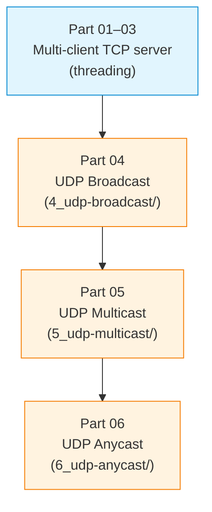

# S03 — UDP Broadcast, Multicast, Anycast and Multi-client TCP

Week 3 extends the socket skills from S02 into group communication patterns. Students implement UDP broadcast, multicast and simulated anycast alongside a multi-client TCP server that handles concurrent connections with threading. The seminar demonstrates how a single transport protocol (UDP) can serve fundamentally different distribution models and how TCP servers must scale beyond one-client-at-a-time designs.

## File/Folder Index

| Name | Type | Description |
|---|---|---|
| [`S03_Part01_Example_TCP_Multi_client_Server.py`](S03_Part01_Example_TCP_Multi_client_Server.py) | Example | Threaded multi-client TCP server |
| [`S03_Part02_Template_TCP_Multi_client_Server.py`](S03_Part02_Template_TCP_Multi_client_Server.py) | Template | Multi-client server skeleton |
| [`S03_Part03_Scenario_TCP_Multi_client_Server.md`](S03_Part03_Scenario_TCP_Multi_client_Server.md) | Scenario | Testing the multi-client server |
| [`4_udp-broadcast/`](4_udp-broadcast/) | Subdir | UDP broadcast sender, receiver (example + template) and scenario (4 files) |
| [`5_udp-multicast/`](5_udp-multicast/) | Subdir | UDP multicast sender, receiver (example + template) and scenario (4 files) |
| [`6_udp-anycast/`](6_udp-anycast/) | Subdir | UDP anycast server, client (example + template) and scenario (4 files) |
| [`assets/puml/`](assets/puml/) | Diagrams | 5 PlantUML sources: cast types comparison, TCP chat architecture, anycast simulation, broadcast flow, multicast flow |
| [`assets/render.sh`](assets/render.sh) | Script | PlantUML batch renderer |

## Visual Overview



## Pedagogical Context

Moving from unicast to broadcast, multicast and anycast within a single session highlights the addressing and routing consequences of each pattern. The TCP multi-client server introduces concurrency as a first-class design concern, a theme that recurs in S08 (HTTP), S09 (FTP containers) and S11 (load balancing).

## Cross-References

| Related resource | Path | Relationship |
|---|---|---|
| Lecture C03 — Intro network programming | [`../../03_LECTURES/C03/`](../../03_LECTURES/C03/) | Covers broadcast, multicast and socket options |
| Quiz Week 03 | [`../../00_APPENDIX/c)studentsQUIZes(multichoice_only)/COMPnet_W03_Questions.md`](../../00_APPENDIX/c%29studentsQUIZes%28multichoice_only%29/COMPnet_W03_Questions.md) | Tests group communication concepts |
| Instructor notes (Romanian) | [`../../00_APPENDIX/d)instructor_NOTES4sem/roCOMPNETclass_S03-instructor-outline-v2.md`](../../00_APPENDIX/d%29instructor_NOTES4sem/roCOMPNETclass_S03-instructor-outline-v2.md) | Romanian delivery guide for S03 |
| HTML support pages | [`../_HTMLsupport/S03/`](../_HTMLsupport/S03/) | 6 browser-viewable HTML renderings |
| Project S01 — TCP chat | [`../../02_PROJECTS/01_network_applications/S01_multi_client_tcp_chat_text_protocol_and_presence.md`](../../02_PROJECTS/01_network_applications/S01_multi_client_tcp_chat_text_protocol_and_presence.md) | Extends the multi-client TCP pattern |
| Project S06 — TCP Pub/Sub broker | [`../../02_PROJECTS/01_network_applications/S06_tcp_pub_sub_broker_topics_and_deterministic_routing.md`](../../02_PROJECTS/01_network_applications/S06_tcp_pub_sub_broker_topics_and_deterministic_routing.md) | Builds on multicast concepts at application level |
| Project S09 — TCP tunnel | [`../../02_PROJECTS/01_network_applications/S09_tcp_tunnel_single_port_session_multiplexing_and_demultiplexing.md`](../../02_PROJECTS/01_network_applications/S09_tcp_tunnel_single_port_session_multiplexing_and_demultiplexing.md) | Uses multi-client connection handling |
| Previous: S02 (TCP/UDP sockets) | [`../S02/`](../S02/) | Socket foundations required |
| Next: S04 (custom protocols) | [`../S04/`](../S04/) | Adds protocol framing to the server patterns |

**Suggested sequence:** [`../S02/`](../S02/) → this folder → [`../S04/`](../S04/)

## Selective Clone

**Method A — Git sparse-checkout (requires Git 2.25+)**

```bash
git clone --filter=blob:none --sparse https://github.com/antonioclim/COMPNET-EN.git
cd COMPNET-EN
git sparse-checkout set 04_SEMINARS/S03
```

**Method B — Direct download**

```
https://github.com/antonioclim/COMPNET-EN/tree/main/04_SEMINARS/S03
```

---

*Course: COMPNET-EN — ASE Bucharest, CSIE*
