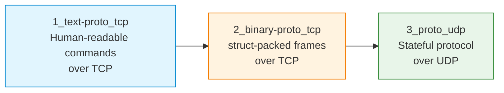

# S04 — Custom Text and Binary Protocols over TCP and UDP

Week 4 moves from generic echo servers to purpose-built application-layer protocols. Students design and implement three protocol variants: a text-based command protocol over TCP, a binary protocol over TCP using `struct` packing and a stateful protocol over UDP. Each variant exposes different trade-offs in serialisation efficiency, message framing, error handling and human readability.

## File/Folder Index

| Name | Type | Description |
|---|---|---|
| [`1_text-proto_tcp/`](1_text-proto_tcp/) | Subdir | Text protocol over TCP: example server/client, template server, scenario (4 files) |
| [`2_binary-proto_tcp/`](2_binary-proto_tcp/) | Subdir | Binary protocol over TCP: example server/client, template server, scenario (4 files) |
| [`3_proto_udp/`](3_proto_udp/) | Subdir | UDP protocol: example server/client, templates, scenario, plus helper scripts for serialisation, state and transfer units (8 files) |
| [`assets/puml/`](assets/puml/) | Diagrams | 5 PlantUML sources: text protocol TCP flow, binary framing, text vs binary comparison, UDP message flow, UDP state machine |
| [`assets/render.sh`](assets/render.sh) | Script | PlantUML batch renderer |

## Visual Overview



## Usage

Run the text protocol server and interact with it:

```bash
cd 1_text-proto_tcp
python3 S04_Part01A_Example_Text_Proto_TCP_Server.py &
python3 S04_Part01B_Example_Text_Proto_TCP_Client.py
```

The `3_proto_udp/` subdirectory includes standalone scripts for exploring serialisation (`S04_Part03_Script_Serialization.py`), state management (`S04_Part03_Script_State.py`) and protocol data units (`S04_Part03_Script_Transfer_Units.py`).

## Pedagogical Context

Protocol design is introduced as an engineering discipline rather than an implementation detail. Comparing text and binary representations within a single session makes the size-versus-readability trade-off concrete. The UDP variant adds unreliable delivery, forcing students to consider retransmission and ordering — a precursor to the reliability mechanisms studied in C08 (transport layer).

## Cross-References

| Related resource | Path | Relationship |
|---|---|---|
| Lecture C04 — Physical and data link | [`../../03_LECTURES/C04/`](../../03_LECTURES/C04/) | Framing and encoding at lower layers |
| Lecture C03 — Intro network programming | [`../../03_LECTURES/C03/`](../../03_LECTURES/C03/) | Socket API and serialisation |
| Quiz Week 04 | [`../../00_APPENDIX/c)studentsQUIZes(multichoice_only)/COMPnet_W04_Questions.md`](../../00_APPENDIX/c%29studentsQUIZes%28multichoice_only%29/COMPnet_W04_Questions.md) | Tests protocol design concepts |
| Instructor notes (Romanian) | [`../../00_APPENDIX/d)instructor_NOTES4sem/roCOMPNETclass_S04-instructor-outline-v2.md`](../../00_APPENDIX/d%29instructor_NOTES4sem/roCOMPNETclass_S04-instructor-outline-v2.md) | Romanian delivery guide for S04 |
| HTML support pages | [`../_HTMLsupport/S04/`](../_HTMLsupport/S04/) | 3 browser-viewable HTML renderings |
| Project S01 — TCP chat with text protocol | [`../../02_PROJECTS/01_network_applications/S01_multi_client_tcp_chat_text_protocol_and_presence.md`](../../02_PROJECTS/01_network_applications/S01_multi_client_tcp_chat_text_protocol_and_presence.md) | Applies text protocol design at scale |
| Project S02 — File transfer (FTP-style) | [`../../02_PROJECTS/01_network_applications/S02_file_transfer_server_control_and_data_channels_ftp_passive.md`](../../02_PROJECTS/01_network_applications/S02_file_transfer_server_control_and_data_channels_ftp_passive.md) | Uses control/data channel protocol design |
| Previous: S03 (broadcast, multicast) | [`../S03/`](../S03/) | Multi-client patterns assumed |
| Next: S05 (subnetting, simulation) | [`../S05/`](../S05/) | Shifts focus to network-layer addressing |

**Suggested sequence:** [`../S03/`](../S03/) → this folder → [`../S05/`](../S05/)

## Selective Clone

**Method A — Git sparse-checkout (requires Git 2.25+)**

```bash
git clone --filter=blob:none --sparse https://github.com/antonioclim/COMPNET-EN.git
cd COMPNET-EN
git sparse-checkout set 04_SEMINARS/S04
```

**Method B — Direct download**

```
https://github.com/antonioclim/COMPNET-EN/tree/main/04_SEMINARS/S04
```

---

*Course: COMPNET-EN — ASE Bucharest, CSIE*
