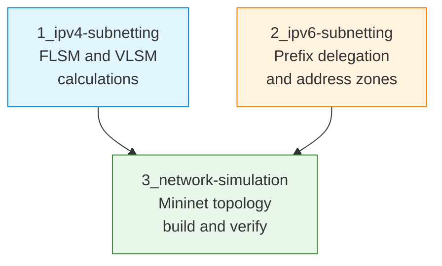

# S05 — IPv4/IPv6 Subnetting and Network Simulation

Week 5 shifts from application-layer programming to network-layer addressing. Students perform manual subnet calculations for both IPv4 (FLSM and VLSM) and IPv6 (prefix delegation and address planning), then apply these calculations inside a Mininet network simulator to configure and verify a working multi-subnet topology.

## File/Folder Index

| Name | Type | Description |
|---|---|---|
| [`1_ipv4-subnetting/`](1_ipv4-subnetting/) | Subdir | IPv4 subnetting: explanation, exercises and solutions template (3 files) |
| [`2_ipv6-subnetting/`](2_ipv6-subnetting/) | Subdir | IPv6 subnetting: explanation, exercises and solutions template (3 files) |
| [`3_network-simulation/`](3_network-simulation/) | Subdir | Mininet topology: explanation, Python topology script, configuration tasks (3 files) |
| [`assets/puml/`](assets/puml/) | Diagrams | 5 PlantUML sources: FLSM equal split, VLSM exercise, IPv6 address zones, IPv6 prefix delegation, Mininet topology |
| [`assets/render.sh`](assets/render.sh) | Script | PlantUML batch renderer |

## Visual Overview



## Usage

Run the Mininet topology (requires Mininet installed or the Mininet-SDN VM):

```bash
cd 3_network-simulation
sudo python3 S05_Part03B_Script_Mininet_Topology.py
```

## Pedagogical Context

Subnetting is presented as a design skill rather than a rote calculation exercise. The progression from paper-based IPv4 VLSM to IPv6 prefix delegation and finally to a simulated topology ensures students connect arithmetic to operational network configuration. The Mininet step provides immediate feedback: miscalculated addresses result in unreachable hosts.

## Cross-References

| Related resource | Path | Relationship |
|---|---|---|
| Lecture C05 — Addressing and subnetting | [`../../03_LECTURES/C05/`](../../03_LECTURES/C05/) | Theoretical foundation: IP addressing, CIDR, subnetting |
| Lecture C06 — NAT, ARP, DHCP, NDP, ICMP | [`../../03_LECTURES/C06/`](../../03_LECTURES/C06/) | Address resolution and autoconfiguration for the subnets designed here |
| Quiz Week 05 | [`../../00_APPENDIX/c)studentsQUIZes(multichoice_only)/COMPnet_W05_Questions.md`](../../00_APPENDIX/c%29studentsQUIZes%28multichoice_only%29/COMPnet_W05_Questions.md) | Tests subnetting and addressing |
| Instructor notes (Romanian) | [`../../00_APPENDIX/d)instructor_NOTES4sem/roCOMPNETclass_S05-instructor-outline-v2.md`](../../00_APPENDIX/d%29instructor_NOTES4sem/roCOMPNETclass_S05-instructor-outline-v2.md) | Romanian delivery guide for S05 |
| HTML support pages | [`../_HTMLsupport/S05/`](../_HTMLsupport/S05/) | 4 browser-viewable HTML renderings |
| Mininet-SDN guide | [`../../01_GUIDE_MININET-SDN/`](../../01_GUIDE_MININET-SDN/) | Setup and operation of the Mininet-SDN environment |
| Project S14 — Distance-vector routing in Mininet | [`../../02_PROJECTS/01_network_applications/S14_didactic_distance_vector_routing_in_mininet_convergence_and_anti_loop.md`](../../02_PROJECTS/01_network_applications/S14_didactic_distance_vector_routing_in_mininet_convergence_and_anti_loop.md) | Extends Mininet topologies with routing algorithms |
| Previous: S04 (custom protocols) | [`../S04/`](../S04/) | Application-layer skills that run atop the networks designed here |
| Next: S06 (SDN, routing) | [`../S06/`](../S06/) | Builds on Mininet and subnet configuration |

| Prerequisite | Path | Reason |
|---|---|---|
| Mininet-SDN environment | [`../../01_GUIDE_MININET-SDN/`](../../01_GUIDE_MININET-SDN/) | Required for Part 03 (network simulation) |

**Suggested sequence:** [`../S04/`](../S04/) → this folder → [`../S06/`](../S06/)

## Selective Clone

**Method A — Git sparse-checkout (requires Git 2.25+)**

```bash
git clone --filter=blob:none --sparse https://github.com/antonioclim/COMPNET-EN.git
cd COMPNET-EN
git sparse-checkout set 04_SEMINARS/S05
```

To include the Mininet guide:

```bash
git sparse-checkout add 01_GUIDE_MININET-SDN
```

**Method B — Direct download**

```
https://github.com/antonioclim/COMPNET-EN/tree/main/04_SEMINARS/S05
```

---

*Course: COMPNET-EN — ASE Bucharest, CSIE*
