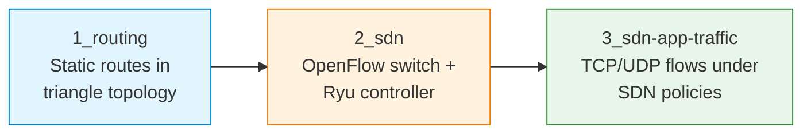

# S06 — SDN, Static Routing and Mininet Topologies

Week 6 introduces software-defined networking and routing within simulated topologies. Students configure static routes in a triangle topology, deploy an OpenFlow-based SDN controller (Ryu) and observe how application-level TCP and UDP traffic behaves under different forwarding policies. The seminar bridges the gap between the addressing skills of S05 and the traffic-inspection skills of S07.

## File/Folder Index

| Name | Type | Description |
|---|---|---|
| [`1_routing/`](1_routing/) | Subdir | Triangle topology routing: explanation, Mininet script, tasks (3 files) |
| [`2_sdn/`](2_sdn/) | Subdir | SDN fundamentals: explanation, topology script, Ryu controller script, tasks (4 files) |
| [`3_sdn-app-traffic/`](3_sdn-app-traffic/) | Subdir | SDN application traffic: explanation, tasks, TCP and UDP client/server scripts (6 files) |
| [`assets/puml/`](assets/puml/) | Diagrams | 6 PlantUML sources: routing triangle paths, routing triangle topology, SDN app client-server, SDN architecture, OpenFlow topology, SDN traffic policy |
| [`assets/render.sh`](assets/render.sh) | Script | PlantUML batch renderer |

## Visual Overview



## Usage

Run the triangle topology routing exercise (requires Mininet):

```bash
cd 1_routing
sudo python3 S06_Part01B_Script_Routing_Triangle_Topology.py
```

Start the SDN controller in one terminal and the topology in another:

```bash
# Terminal 1 — controller
ryu-manager S06_Part02C_Script_SDNOS_Ken_Controller.py

# Terminal 2 — topology
sudo python3 S06_Part02B_Script_SDN_Topo_Switch.py
```

## Pedagogical Context

The seminar makes the control plane visible. Traditional routing is experienced first as manual static configuration, then SDN replaces manual routes with programmatic flow rules. By running application traffic (Part 3) under both models, students observe that the forwarding plane is identical from the application's perspective — only the control mechanism differs.

## Cross-References

| Related resource | Path | Relationship |
|---|---|---|
| Lecture C06 — NAT, ARP, DHCP, NDP, ICMP | [`../../03_LECTURES/C06/`](../../03_LECTURES/C06/) | Addressing protocols that operate alongside routing |
| Lecture C07 — Routing protocols | [`../../03_LECTURES/C07/`](../../03_LECTURES/C07/) | Routing theory underpinning Part 1 |
| Quiz Week 06 | [`../../00_APPENDIX/c)studentsQUIZes(multichoice_only)/COMPnet_W06_Questions.md`](../../00_APPENDIX/c%29studentsQUIZes%28multichoice_only%29/COMPnet_W06_Questions.md) | Tests SDN and routing concepts |
| Instructor notes (Romanian) | [`../../00_APPENDIX/d)instructor_NOTES4sem/roCOMPNETclass_S06-instructor-outline-v2.md`](../../00_APPENDIX/d%29instructor_NOTES4sem/roCOMPNETclass_S06-instructor-outline-v2.md) | Romanian delivery guide for S06 |
| HTML support pages | [`../_HTMLsupport/S06/`](../_HTMLsupport/S06/) | 4 browser-viewable HTML renderings |
| Mininet-SDN guide | [`../../01_GUIDE_MININET-SDN/`](../../01_GUIDE_MININET-SDN/) | Environment setup for Mininet and Ryu |
| Project A01 — SDN firewall | [`../../02_PROJECTS/02_administration_security/A01_sdn_firewall_filtering_policies_via_openflow_rules.md`](../../02_PROJECTS/02_administration_security/A01_sdn_firewall_filtering_policies_via_openflow_rules.md) | Extends SDN flow rules to filtering policies |
| Project A07 — SDN learning switch | [`../../02_PROJECTS/02_administration_security/A07_sdn_learning_switch_controller_flow_installation_and_ageing.md`](../../02_PROJECTS/02_administration_security/A07_sdn_learning_switch_controller_flow_installation_and_ageing.md) | Builds a learning switch controller |
| Project A09 — SDN IPS | [`../../02_PROJECTS/02_administration_security/A09_sdn_ips_dynamic_blocking_via_openflow_triggered_by_ids_detection.md`](../../02_PROJECTS/02_administration_security/A09_sdn_ips_dynamic_blocking_via_openflow_triggered_by_ids_detection.md) | Combines SDN with intrusion prevention |
| Project S14 — Distance-vector routing | [`../../02_PROJECTS/01_network_applications/S14_didactic_distance_vector_routing_in_mininet_convergence_and_anti_loop.md`](../../02_PROJECTS/01_network_applications/S14_didactic_distance_vector_routing_in_mininet_convergence_and_anti_loop.md) | Implements dynamic routing in Mininet |
| Previous: S05 (subnetting, simulation) | [`../S05/`](../S05/) | Mininet and addressing skills required |
| Next: S07 (sniffing, scanning) | [`../S07/`](../S07/) | Applies packet capture to the topologies studied here |

| Prerequisite | Path | Reason |
|---|---|---|
| Mininet-SDN environment | [`../../01_GUIDE_MININET-SDN/`](../../01_GUIDE_MININET-SDN/) | Required for all three parts |
| Subnetting fundamentals (S05) | [`../S05/`](../S05/) | Address configuration assumed |

**Suggested sequence:** [`../S05/`](../S05/) → this folder → [`../S07/`](../S07/)

## Selective Clone

**Method A — Git sparse-checkout (requires Git 2.25+)**

```bash
git clone --filter=blob:none --sparse https://github.com/antonioclim/COMPNET-EN.git
cd COMPNET-EN
git sparse-checkout set 04_SEMINARS/S06
```

To include the Mininet guide:

```bash
git sparse-checkout add 01_GUIDE_MININET-SDN
```

**Method B — Direct download**

```
https://github.com/antonioclim/COMPNET-EN/tree/main/04_SEMINARS/S06
```

---

*Course: COMPNET-EN — ASE Bucharest, CSIE*
