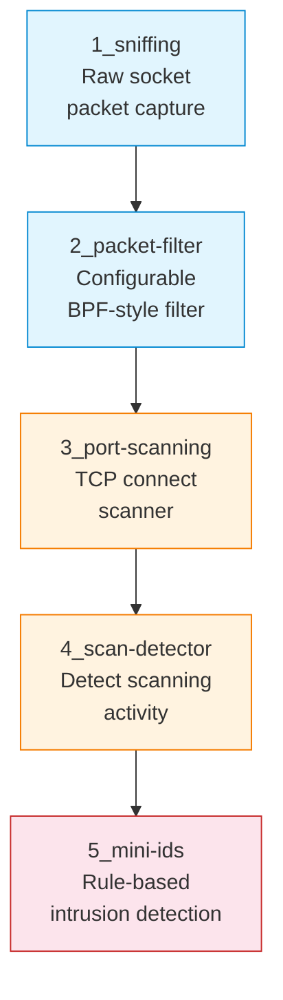

# S07 — Packet Sniffing, Filtering, Port Scanning and Intrusion Detection

Week 7 returns to the observation discipline introduced in S01, now armed with raw socket programming. Students build five tools of increasing sophistication: a raw packet sniffer, a configurable packet filter, a TCP connect port scanner, a scan detector and a minimal intrusion detection system (IDS). Each tool is implemented in Python using raw sockets and standard library modules.

## File/Folder Index

| Name | Type | Description |
|---|---|---|
| [`1_sniffing/`](1_sniffing/) | Subdir | Packet sniffer: explanation, script, tasks (3 files) |
| [`2_packet-filter/`](2_packet-filter/) | Subdir | Packet filter: script, tasks (2 files) |
| [`3_port-scanning/`](3_port-scanning/) | Subdir | Port scanner: script, tasks, sample output (3 files) |
| [`4_scan-detector/`](4_scan-detector/) | Subdir | Scan detection: script, tasks (2 files) |
| [`5_mini-ids/`](5_mini-ids/) | Subdir | Mini IDS: script, tasks (2 files) |
| [`assets/puml/`](assets/puml/) | Diagrams | 5 PlantUML sources: raw socket capture, packet filter pipeline, TCP connect scan, scan detection, mini IDS architecture |
| [`assets/render.sh`](assets/render.sh) | Script | PlantUML batch renderer |

## Visual Overview



## Usage

Run the packet sniffer (requires root or `CAP_NET_RAW`):

```bash
cd 1_sniffing
sudo python3 S07_Part01B_Script_Packet_Sniffer.py
```

Run the port scanner against localhost:

```bash
cd 3_port-scanning
python3 S07_Part03A_Script_Port_Scanner.py
```

## Pedagogical Context

The five-tool progression models the attacker–defender cycle: capture traffic → filter it → scan for services → detect scanning → build automated detection. Each step reuses the output of the previous one, so students experience both offensive and defensive perspectives within a single session. This dual perspective is essential preparation for the penetration testing methodology in S13.

## Cross-References

| Related resource | Path | Relationship |
|---|---|---|
| Lecture C07 — Routing protocols | [`../../03_LECTURES/C07/`](../../03_LECTURES/C07/) | Network-layer context for packet analysis |
| Lecture C08 — Transport layer | [`../../03_LECTURES/C08/`](../../03_LECTURES/C08/) | TCP handshake and port concepts used in scanning |
| Quiz Week 07 | [`../../00_APPENDIX/c)studentsQUIZes(multichoice_only)/COMPnet_W07_Questions.md`](../../00_APPENDIX/c%29studentsQUIZes%28multichoice_only%29/COMPnet_W07_Questions.md) | Tests packet capture and scanning concepts |
| Instructor notes (Romanian) | [`../../00_APPENDIX/d)instructor_NOTES4sem/roCOMPNETclass_S07-instructor-outline-v2.md`](../../00_APPENDIX/d%29instructor_NOTES4sem/roCOMPNETclass_S07-instructor-outline-v2.md) | Romanian delivery guide for S07 |
| HTML support pages | [`../_HTMLsupport/S07/`](../_HTMLsupport/S07/) | 6 browser-viewable HTML renderings |
| Seminar S13 — Penetration testing | [`../S13/`](../S13/) | Applies scanning and vulnerability analysis in a Docker lab |
| Project A02 — IDS | [`../../02_PROJECTS/02_administration_security/A02_ids_simple_rules_scan_detection_tcp_anomalies_and_payload_patterns.md`](../../02_PROJECTS/02_administration_security/A02_ids_simple_rules_scan_detection_tcp_anomalies_and_payload_patterns.md) | Extends the mini IDS to a full rule-based system |
| Project A03 — PCAP report generator | [`../../02_PROJECTS/02_administration_security/A03_pcap_report_generator_flow_statistics_top_talkers_and_tcp_indicators.md`](../../02_PROJECTS/02_administration_security/A03_pcap_report_generator_flow_statistics_top_talkers_and_tcp_indicators.md) | Analyses captured traffic in depth |
| Project A05 — Laboratory port scanning | [`../../02_PROJECTS/02_administration_security/A05_laboratory_port_scanning_tcp_connect_scan_and_minimal_service_fingerprinting.md`](../../02_PROJECTS/02_administration_security/A05_laboratory_port_scanning_tcp_connect_scan_and_minimal_service_fingerprinting.md) | Extends the port scanner with service fingerprinting |
| Previous: S06 (SDN, routing) | [`../S06/`](../S06/) | Network topologies to scan |
| Next: S08 (HTTP, Nginx) | [`../S08/`](../S08/) | Application-layer services that could be scanned |

**Suggested sequence:** [`../S06/`](../S06/) → this folder → [`../S08/`](../S08/)

## Selective Clone

**Method A — Git sparse-checkout (requires Git 2.25+)**

```bash
git clone --filter=blob:none --sparse https://github.com/antonioclim/COMPNET-EN.git
cd COMPNET-EN
git sparse-checkout set 04_SEMINARS/S07
```

**Method B — Direct download**

```
https://github.com/antonioclim/COMPNET-EN/tree/main/04_SEMINARS/S07
```

---

*Course: COMPNET-EN — ASE Bucharest, CSIE*
