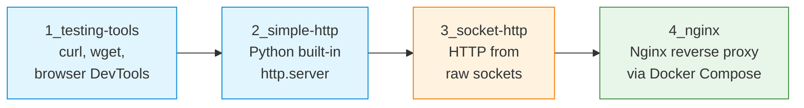

# S08 — HTTP Server Implementation and Nginx Reverse Proxy

Week 8 marks the transition to application-layer services and containerised deployments. Students progress through four stages: testing HTTP with command-line tools, running Python's built-in HTTP server, implementing a minimal HTTP server from raw sockets and configuring Nginx as a reverse proxy inside Docker Compose. This seminar is the first to require Docker.

## File/Folder Index

| Name | Type | Description |
|---|---|---|
| [`1_testing-tools/`](1_testing-tools/) | Subdir | HTTP introduction: explanation and tasks (2 files) |
| [`2_simple-http/`](2_simple-http/) | Subdir | Python built-in HTTP server: explanation, example script, tasks (3 files) |
| [`3_socket-http/`](3_socket-http/) | Subdir | Raw socket HTTP server: explanation, example script, tasks, plus `static/` with HTML pages (5 files) |
| [`4_nginx/`](4_nginx/) | Subdir | Nginx reverse proxy: explanation, tasks, Docker Compose config, Nginx config (4 files) |
| [`assets/puml/`](assets/puml/) | Diagrams | 5 PlantUML sources: HTTP request-response, built-in server, socket HTTP server flow, Nginx reverse proxy, Docker Compose topology |
| [`assets/render.sh`](assets/render.sh) | Script | PlantUML batch renderer |

## Visual Overview



## Usage

Run the built-in HTTP server:

```bash
cd 2_simple-http
python3 S08_Part02B_Example_Simple_HTTP_Builtin.py
```

Launch the Nginx reverse proxy stack:

```bash
cd 4_nginx
docker compose -f S08_Part04_Config_Docker_Compose.yml up -d
```

## Pedagogical Context

The four-stage progression ensures students understand HTTP at every abstraction level: as a user (curl), as a library consumer (http.server), as a protocol implementer (raw sockets) and as an operator (Nginx in Docker). The raw socket implementation makes header parsing, content-length handling and connection management explicit — knowledge that remains invisible when using frameworks.

## Cross-References

| Related resource | Path | Relationship |
|---|---|---|
| Lecture C08 — Transport layer (TCP, UDP, TLS) | [`../../03_LECTURES/C08/`](../../03_LECTURES/C08/) | TCP reliability underpinning HTTP |
| Lecture C10 — HTTP and application layer | [`../../03_LECTURES/C10/`](../../03_LECTURES/C10/) | HTTP protocol theory |
| Quiz Week 08 | [`../../00_APPENDIX/c)studentsQUIZes(multichoice_only)/COMPnet_W08_Questions.md`](../../00_APPENDIX/c%29studentsQUIZes%28multichoice_only%29/COMPnet_W08_Questions.md) | Tests HTTP and transport concepts |
| Instructor notes (Romanian) | [`../../00_APPENDIX/d)instructor_NOTES4sem/roCOMPNETclass_S08-instructor-outline-v2.md`](../../00_APPENDIX/d%29instructor_NOTES4sem/roCOMPNETclass_S08-instructor-outline-v2.md) | Romanian delivery guide for S08 |
| HTML support pages | [`../_HTMLsupport/S08/`](../_HTMLsupport/S08/) | 5 browser-viewable HTML renderings |
| Portainer guide | [`../../00_TOOLS/Portainer/SEMINAR08/`](../../00_TOOLS/Portainer/SEMINAR08/) | Docker management via Portainer for S08 |
| Project S03 — HTTP/1.1 socket server | [`../../02_PROJECTS/01_network_applications/S03_http11_socket_server_no_framework_static_files.md`](../../02_PROJECTS/01_network_applications/S03_http11_socket_server_no_framework_static_files.md) | Extends the raw socket HTTP server to full HTTP/1.1 |
| Project S04 — Forward HTTP proxy | [`../../02_PROJECTS/01_network_applications/S04_forward_http_proxy_with_filtering_and_traffic_logging.md`](../../02_PROJECTS/01_network_applications/S04_forward_http_proxy_with_filtering_and_traffic_logging.md) | Builds a forward proxy with filtering |
| Project S05 — HTTP load balancer | [`../../02_PROJECTS/01_network_applications/S05_application_level_http_load_balancer_health_checks_and_two_algorithms.md`](../../02_PROJECTS/01_network_applications/S05_application_level_http_load_balancer_health_checks_and_two_algorithms.md) | Extends the reverse proxy concept |
| Seminar S11 — Load balancing | [`../S11/`](../S11/) | Builds on the Nginx skills introduced here |
| Previous: S07 (sniffing, scanning) | [`../S07/`](../S07/) | Packet analysis skills applied to HTTP traffic |
| Next: S09 (FTP, file transfer) | [`../S09/`](../S09/) | Another application-layer service in Docker |

| Prerequisite | Path | Reason |
|---|---|---|
| Docker and WSL2 setup | [`../../00_TOOLS/Prerequisites/`](../../00_TOOLS/Prerequisites/) | Required for Part 4 (Nginx in Docker) |

**Suggested sequence:** [`../S07/`](../S07/) → this folder → [`../S09/`](../S09/)

## Selective Clone

**Method A — Git sparse-checkout (requires Git 2.25+)**

```bash
git clone --filter=blob:none --sparse https://github.com/antonioclim/COMPNET-EN.git
cd COMPNET-EN
git sparse-checkout set 04_SEMINARS/S08
```

**Method B — Direct download**

```
https://github.com/antonioclim/COMPNET-EN/tree/main/04_SEMINARS/S08
```

---

*Course: COMPNET-EN — ASE Bucharest, CSIE*
