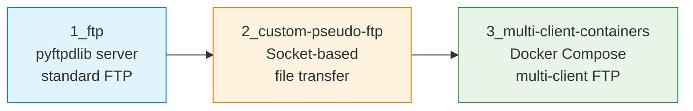

# S09 — FTP, Custom File Transfer and Docker Containers

Week 9 examines file transfer at three levels of abstraction: a standard FTP server using pyftpdlib, a custom pseudo-FTP implementation over raw sockets and a multi-client containerised FTP deployment orchestrated with Docker Compose. The seminar demonstrates how control and data channels cooperate in file transfer protocols and how containerisation enables reproducible multi-client testing.

## File/Folder Index

| Name | Type | Description |
|---|---|---|
| [`1_ftp/`](1_ftp/) | Subdir | pyftpdlib FTP server: file protocol intro, pyftpdlib explanation, server and client scripts, tasks, test data (6 files) |
| [`2_custom-pseudo-ftp/`](2_custom-pseudo-ftp/) | Subdir | Custom file transfer: explanation, server and client scripts, tasks (4 files + temp dirs) |
| [`3_multi-client-containers/`](3_multi-client-containers/) | Subdir | Dockerised multi-client FTP: explanation, tasks, Docker Compose, server and client scripts (5 files + data dirs) |
| [`assets/puml/`](assets/puml/) | Diagrams | 7 PlantUML sources: FTP active vs passive, control/data channels, indirect transfer sequence, pseudo-FTP architecture, pseudo-FTP get sequences (active/passive), Docker multi-client topology |
| [`assets/render.sh`](assets/render.sh) | Script | PlantUML batch renderer |

## Visual Overview



## Usage

Start the pyftpdlib server:

```bash
cd 1_ftp
python3 S09_Part01C_Script_Pyftpd_Server.py
```

Launch the multi-client Docker environment:

```bash
cd 3_multi-client-containers
docker compose -f S09_Part03_Config_Docker_Compose.yml up -d
```

## Pedagogical Context

Progressing from a library-based FTP server to a custom implementation and then to a containerised deployment mirrors the real-world progression from using existing tools to understanding the underlying protocol to operating at scale. The custom pseudo-FTP forces students to implement control/data channel separation, which is the defining architectural pattern of FTP (RFC 959).

## Cross-References

| Related resource | Path | Relationship |
|---|---|---|
| Lecture C09 — Session and presentation | [`../../03_LECTURES/C09/`](../../03_LECTURES/C09/) | Session management and data representation |
| Lecture C11 — FTP, DNS and SSH | [`../../03_LECTURES/C11/`](../../03_LECTURES/C11/) | FTP protocol theory (RFC 959) |
| Quiz Week 09 | [`../../00_APPENDIX/c)studentsQUIZes(multichoice_only)/COMPnet_W09_Questions.md`](../../00_APPENDIX/c%29studentsQUIZes%28multichoice_only%29/COMPnet_W09_Questions.md) | Tests file transfer and session concepts |
| Instructor notes (Romanian) | [`../../00_APPENDIX/d)instructor_NOTES4sem/roCOMPNETclass_S09-instructor-outline-v2.md`](../../00_APPENDIX/d%29instructor_NOTES4sem/roCOMPNETclass_S09-instructor-outline-v2.md) | Romanian delivery guide for S09 |
| HTML support pages | [`../_HTMLsupport/S09/`](../_HTMLsupport/S09/) | 3 browser-viewable HTML renderings |
| Portainer guide | [`../../00_TOOLS/Portainer/SEMINAR09/`](../../00_TOOLS/Portainer/SEMINAR09/) | Docker management via Portainer for S09 |
| Project S02 — File transfer (FTP-style) | [`../../02_PROJECTS/01_network_applications/S02_file_transfer_server_control_and_data_channels_ftp_passive.md`](../../02_PROJECTS/01_network_applications/S02_file_transfer_server_control_and_data_channels_ftp_passive.md) | Full FTP-style server with passive mode |
| Project S10 — Network file synchronisation | [`../../02_PROJECTS/01_network_applications/S10_network_file_synchronisation_manifest_hashes_and_conflict_resolution.md`](../../02_PROJECTS/01_network_applications/S10_network_file_synchronisation_manifest_hashes_and_conflict_resolution.md) | Extends file transfer to synchronisation with hashing |
| Previous: S08 (HTTP, Nginx) | [`../S08/`](../S08/) | Docker skills introduced there |
| Next: S10 (DNS, SSH in Docker) | [`../S10/`](../S10/) | Continues containerised service deployment |

| Prerequisite | Path | Reason |
|---|---|---|
| Docker and WSL2 setup | [`../../00_TOOLS/Prerequisites/`](../../00_TOOLS/Prerequisites/) | Required for Part 3 (Docker Compose) |
| pyftpdlib | — | Install via `pip install pyftpdlib` |

**Suggested sequence:** [`../S08/`](../S08/) → this folder → [`../S10/`](../S10/)

## Selective Clone

**Method A — Git sparse-checkout (requires Git 2.25+)**

```bash
git clone --filter=blob:none --sparse https://github.com/antonioclim/COMPNET-EN.git
cd COMPNET-EN
git sparse-checkout set 04_SEMINARS/S09
```

**Method B — Direct download**

```
https://github.com/antonioclim/COMPNET-EN/tree/main/04_SEMINARS/S09
```

---

*Course: COMPNET-EN — ASE Bucharest, CSIE*
