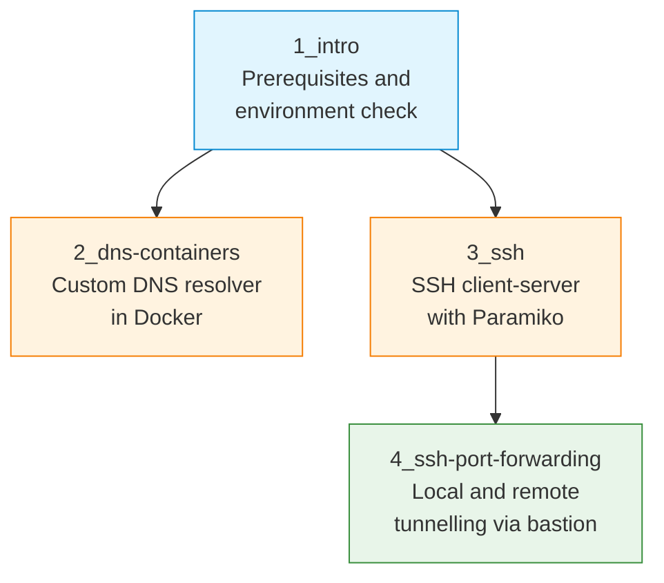

# S10 — DNS, SSH and Port Forwarding in Docker Containers

Week 10 deploys three network services — DNS, SSH and SSH port forwarding — entirely within Docker containers. Students configure a custom DNS resolver, establish SSH client-server communication using the Paramiko library and implement local and remote port forwarding through an SSH bastion host. All scenarios use Docker Compose for orchestration.

## File/Folder Index

| Name | Type | Description |
|---|---|---|
| [`1_intro/`](1_intro/) | Subdir | Seminar introduction and prerequisites: explanation, tasks (2 files) |
| [`2_dns-containers/`](2_dns-containers/) | Subdir | DNS in Docker: explanation, Docker Compose, Dockerfile, DNS server script (4 files) |
| [`3_ssh/`](3_ssh/) | Subdir | SSH with Paramiko: explanation, tasks, Docker Compose, plus `ssh-client/` and `ssh-server/` with Dockerfiles and Paramiko client script (6 files) |
| [`4_ssh-port-forwarding/`](4_ssh-port-forwarding/) | Subdir | SSH tunnelling: explanation, tasks, Docker Compose, plus `ssh-bastion/` Dockerfile and `web-content/` with HTML pages (6 files) |
| [`assets/puml/`](assets/puml/) | Diagrams | 5 PlantUML sources: DNS server flow, DNS Docker topology, services overview, SSH Paramiko workflow, SSH port forwarding tunnel |
| [`assets/render.sh`](assets/render.sh) | Script | PlantUML batch renderer |

## Visual Overview



## Usage

Launch the DNS container environment:

```bash
cd 2_dns-containers
docker compose -f S10_Part02_Config_Docker_Compose.yml up -d
```

Launch the SSH environment:

```bash
cd 3_ssh
docker compose -f S10_Part03_Config_Docker_Compose.yml up -d
```

Launch the port forwarding scenario:

```bash
cd 4_ssh-port-forwarding
docker compose -f S10_Part04_Config_Docker_Compose.yml up -d
```

## Pedagogical Context

By deploying DNS, SSH and port forwarding as containers, the seminar isolates each service's network behaviour without polluting the host. Students observe DNS resolution, SSH key exchange and tunnel establishment as discrete, inspectable events. The bastion-host topology in Part 4 introduces the security principle of minimal exposure — a recurring theme in S13.

## Cross-References

| Related resource | Path | Relationship |
|---|---|---|
| Lecture C10 — HTTP and application layer | [`../../03_LECTURES/C10/`](../../03_LECTURES/C10/) | Application-layer service concepts |
| Lecture C11 — FTP, DNS and SSH | [`../../03_LECTURES/C11/`](../../03_LECTURES/C11/) | DNS and SSH protocol theory |
| Quiz Week 10 | [`../../00_APPENDIX/c)studentsQUIZes(multichoice_only)/COMPnet_W10_Questions.md`](../../00_APPENDIX/c%29studentsQUIZes%28multichoice_only%29/COMPnet_W10_Questions.md) | Tests DNS, SSH and containerisation |
| Instructor notes (Romanian) | [`../../00_APPENDIX/d)instructor_NOTES4sem/roCOMPNETclass_S10-instructor-outline-v2.md`](../../00_APPENDIX/d%29instructor_NOTES4sem/roCOMPNETclass_S10-instructor-outline-v2.md) | Romanian delivery guide for S10 |
| HTML support pages | [`../_HTMLsupport/S10/`](../_HTMLsupport/S10/) | 5 browser-viewable HTML renderings |
| Portainer guide | [`../../00_TOOLS/Portainer/SEMINAR10/`](../../00_TOOLS/Portainer/SEMINAR10/) | Docker management via Portainer for S10 |
| Project S07 — UDP DNS resolver | [`../../02_PROJECTS/01_network_applications/S07_udp_dns_resolver_local_zone_forwarding_and_ttl_cache.md`](../../02_PROJECTS/01_network_applications/S07_udp_dns_resolver_local_zone_forwarding_and_ttl_cache.md) | Full DNS resolver with zones, forwarding and TTL cache |
| Project S12 — TLS messaging | [`../../02_PROJECTS/01_network_applications/S12_client_server_messaging_tls_channel_and_minimal_authentication.md`](../../02_PROJECTS/01_network_applications/S12_client_server_messaging_tls_channel_and_minimal_authentication.md) | Extends SSH-like secure channel to TLS messaging |
| Previous: S09 (FTP, containers) | [`../S09/`](../S09/) | Docker Compose skills assumed |
| Next: S11 (load balancing) | [`../S11/`](../S11/) | Continues multi-container orchestration |

| Prerequisite | Path | Reason |
|---|---|---|
| Docker and WSL2 setup | [`../../00_TOOLS/Prerequisites/`](../../00_TOOLS/Prerequisites/) | Required for all three Docker Compose environments |
| Paramiko | — | Install via `pip install paramiko` for the SSH exercises |

**Suggested sequence:** [`../S09/`](../S09/) → this folder → [`../S11/`](../S11/)

## Selective Clone

**Method A — Git sparse-checkout (requires Git 2.25+)**

```bash
git clone --filter=blob:none --sparse https://github.com/antonioclim/COMPNET-EN.git
cd COMPNET-EN
git sparse-checkout set 04_SEMINARS/S10
```

**Method B — Direct download**

```
https://github.com/antonioclim/COMPNET-EN/tree/main/04_SEMINARS/S10
```

---

*Course: COMPNET-EN — ASE Bucharest, CSIE*
