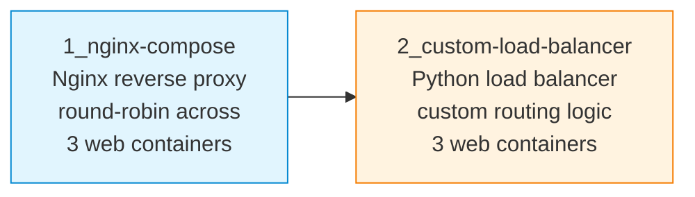

# S11 — Load Balancing with Nginx and a Custom Python Balancer

Week 11 addresses traffic distribution across multiple back-end servers. Students first configure Nginx as a reverse proxy with round-robin load balancing across three web containers, then implement a custom Python load balancer from scratch and compare the two approaches. Both scenarios are orchestrated through Docker Compose.

## File/Folder Index

| Name | Type | Description |
|---|---|---|
| [`1_nginx-compose/`](1_nginx-compose/) | Subdir | Nginx load balancer: reverse proxy intro, Nginx Compose setup explanation, tasks, Docker Compose config, Nginx config, plus `web1/`, `web2/`, `web3/` with HTML pages (8 files) |
| [`2_custom-load-balancer/`](2_custom-load-balancer/) | Subdir | Custom load balancer: explanation, tasks, comparison explanation, Compose tasks, Docker Compose config, Dockerfile, Python LB script, plus `web1/`, `web2/`, `web3/` with HTML pages (10 files) |
| [`assets/puml/`](assets/puml/) | Diagrams | 5 PlantUML sources: custom LB architecture, round-robin flow, Nginx Compose topology, Nginx vs custom comparison, reverse proxy concept |
| [`assets/render.sh`](assets/render.sh) | Script | PlantUML batch renderer |

## Visual Overview



## Usage

Launch the Nginx load balancer:

```bash
cd 1_nginx-compose
docker compose -f S11_Part01_Config_Docker_Compose_Nginx.yml up -d
```

Launch the custom Python load balancer:

```bash
cd 2_custom-load-balancer
docker compose -f S11_Part02_Config_Docker_Compose_Lb_Custom.yml up -d
```

Test with repeated requests to observe distribution:

```bash
for i in $(seq 1 9); do curl -s http://localhost:8080/; done
```

## Pedagogical Context

Comparing a production-grade reverse proxy (Nginx) with a hand-written load balancer reveals what the abstraction hides: connection handling, health monitoring, retry logic and session persistence. The comparison explanation in Part 2 formalises these differences, equipping students to make informed architectural decisions.

## Cross-References

| Related resource | Path | Relationship |
|---|---|---|
| Lecture C11 — FTP, DNS and SSH | [`../../03_LECTURES/C11/`](../../03_LECTURES/C11/) | Infrastructure service patterns |
| Lecture C10 — HTTP and application layer | [`../../03_LECTURES/C10/`](../../03_LECTURES/C10/) | HTTP semantics used by the load balancer |
| Quiz Week 11 | [`../../00_APPENDIX/c)studentsQUIZes(multichoice_only)/COMPnet_W11_Questions.md`](../../00_APPENDIX/c%29studentsQUIZes%28multichoice_only%29/COMPnet_W11_Questions.md) | Tests load balancing and reverse proxy concepts |
| Instructor notes (Romanian) | [`../../00_APPENDIX/d)instructor_NOTES4sem/roCOMPNETclass_S11-instructor-outline-v2.md`](../../00_APPENDIX/d%29instructor_NOTES4sem/roCOMPNETclass_S11-instructor-outline-v2.md) | Romanian delivery guide for S11 |
| HTML support pages | [`../_HTMLsupport/S11/`](../_HTMLsupport/S11/) | 8 browser-viewable HTML renderings |
| Portainer guide | [`../../00_TOOLS/Portainer/SEMINAR11/`](../../00_TOOLS/Portainer/SEMINAR11/) | Docker management via Portainer for S11 |
| Seminar S08 — HTTP and Nginx | [`../S08/`](../S08/) | Nginx reverse proxy basics introduced there |
| Project S05 — HTTP load balancer | [`../../02_PROJECTS/01_network_applications/S05_application_level_http_load_balancer_health_checks_and_two_algorithms.md`](../../02_PROJECTS/01_network_applications/S05_application_level_http_load_balancer_health_checks_and_two_algorithms.md) | Full load balancer with health checks and multiple algorithms |
| Project S11 — REST microservices | [`../../02_PROJECTS/01_network_applications/S11_rest_microservices_service_registry_api_gateway_dynamic_routing.md`](../../02_PROJECTS/01_network_applications/S11_rest_microservices_service_registry_api_gateway_dynamic_routing.md) | Extends load balancing to a service mesh |
| Previous: S10 (DNS, SSH) | [`../S10/`](../S10/) | Docker Compose skills assumed |
| Next: S12 (RPC, gRPC) | [`../S12/`](../S12/) | From HTTP-based distribution to RPC frameworks |

| Prerequisite | Path | Reason |
|---|---|---|
| Docker and WSL2 setup | [`../../00_TOOLS/Prerequisites/`](../../00_TOOLS/Prerequisites/) | Required for both Docker Compose stacks |
| Nginx basics (S08) | [`../S08/`](../S08/) | Nginx reverse proxy configuration assumed |

**Suggested sequence:** [`../S10/`](../S10/) → this folder → [`../S12/`](../S12/)

## Selective Clone

**Method A — Git sparse-checkout (requires Git 2.25+)**

```bash
git clone --filter=blob:none --sparse https://github.com/antonioclim/COMPNET-EN.git
cd COMPNET-EN
git sparse-checkout set 04_SEMINARS/S11
```

**Method B — Direct download**

```
https://github.com/antonioclim/COMPNET-EN/tree/main/04_SEMINARS/S11
```

---

*Course: COMPNET-EN — ASE Bucharest, CSIE*
