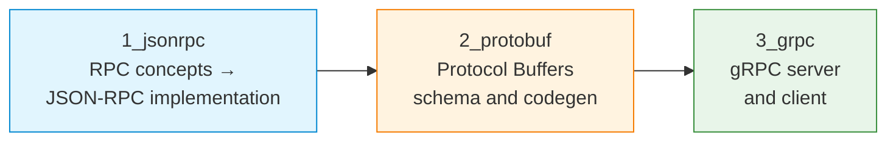

# S12 — JSON-RPC, Protocol Buffers and gRPC

Week 12 introduces remote procedure call (RPC) as an alternative to REST-style HTTP for inter-process communication. Students implement a JSON-RPC service, define structured messages with Protocol Buffers and build a full client-server pair using gRPC. The seminar traces the evolution from ad-hoc text protocols (studied in S04) to schema-driven, type-safe service interfaces.

## File/Folder Index

| Name | Type | Description |
|---|---|---|
| [`1_jsonrpc/`](1_jsonrpc/) | Subdir | JSON-RPC: RPC intro explanation, RPC tasks, JSON-RPC explanation, JSON-RPC tasks, client script (5 files) |
| [`2_protobuf/`](2_protobuf/) | Subdir | Protocol Buffers: explanation, tasks, `.proto` definition file (3 files) |
| [`3_grpc/`](3_grpc/) | Subdir | gRPC: server explanation, server tasks, client explanation, client tasks, server script, client script (6 files) |
| [`assets/puml/`](assets/puml/) | Diagrams | 6 PlantUML sources: gRPC calculator architecture, gRPC client-server flow, JSON-RPC request-response, protobuf codegen flow, RPC call types, RPC vs REST |
| [`assets/render.sh`](assets/render.sh) | Script | PlantUML batch renderer |

## Visual Overview



## Usage

Run the JSON-RPC client (assumes a JSON-RPC server is running):

```bash
cd 1_jsonrpc
python3 S12_Part01_Script_JSONRPC_Client.py
```

Compile the Protocol Buffers definition:

```bash
cd 2_protobuf
protoc --python_out=. S12_Part02_Config_Calculator.proto
```

Run the gRPC server and client:

```bash
cd 3_grpc
python3 S12_Part03_Script_g_RPC_Server.py &
python3 S12_Part03_Script_g_RPC_Client.py
```

## Pedagogical Context

The three-step progression — JSON-RPC (text, schema-free) → Protocol Buffers (binary, schema-defined) → gRPC (binary, schema-driven with streaming) — recapitulates the text-versus-binary trade-off from S04 at a higher level of abstraction. Students see how IDL-based code generation eliminates the manual parsing and serialisation that consumed most of the effort in earlier seminars.

## Cross-References

| Related resource | Path | Relationship |
|---|---|---|
| Lecture C12 — Email protocols (SMTP, POP3, IMAP) | [`../../03_LECTURES/C12/`](../../03_LECTURES/C12/) | Structured message exchange patterns |
| Lecture C09 — Session and presentation | [`../../03_LECTURES/C09/`](../../03_LECTURES/C09/) | Data representation and serialisation |
| Quiz Week 12 | [`../../00_APPENDIX/c)studentsQUIZes(multichoice_only)/COMPnet_W12_Questions.md`](../../00_APPENDIX/c%29studentsQUIZes%28multichoice_only%29/COMPnet_W12_Questions.md) | Tests RPC and serialisation concepts |
| Instructor notes (Romanian) | [`../../00_APPENDIX/d)instructor_NOTES4sem/roCOMPNETclass_S12-instructor-outline-v2.md`](../../00_APPENDIX/d%29instructor_NOTES4sem/roCOMPNETclass_S12-instructor-outline-v2.md) | Romanian delivery guide for S12 |
| HTML support pages | [`../_HTMLsupport/S12/`](../_HTMLsupport/S12/) | 3 browser-viewable HTML renderings |
| Seminar S04 — Custom protocols | [`../S04/`](../S04/) | Text and binary protocol design at socket level |
| Project S13 — gRPC service | [`../../02_PROJECTS/01_network_applications/S13_grpc_rpc_service_proto_definition_unary_and_streaming_methods.md`](../../02_PROJECTS/01_network_applications/S13_grpc_rpc_service_proto_definition_unary_and_streaming_methods.md) | Full gRPC service with unary and streaming methods |
| Project S11 — REST microservices | [`../../02_PROJECTS/01_network_applications/S11_rest_microservices_service_registry_api_gateway_dynamic_routing.md`](../../02_PROJECTS/01_network_applications/S11_rest_microservices_service_registry_api_gateway_dynamic_routing.md) | Contrasts REST with RPC approaches |
| Previous: S11 (load balancing) | [`../S11/`](../S11/) | HTTP-based service patterns |
| Next: S13 (security, pentest) | [`../S13/`](../S13/) | Security testing of networked services |

**Suggested sequence:** [`../S11/`](../S11/) → this folder → [`../S13/`](../S13/)

## Selective Clone

**Method A — Git sparse-checkout (requires Git 2.25+)**

```bash
git clone --filter=blob:none --sparse https://github.com/antonioclim/COMPNET-EN.git
cd COMPNET-EN
git sparse-checkout set 04_SEMINARS/S12
```

**Method B — Direct download**

```
https://github.com/antonioclim/COMPNET-EN/tree/main/04_SEMINARS/S12
```

---

*Course: COMPNET-EN — ASE Bucharest, CSIE*
