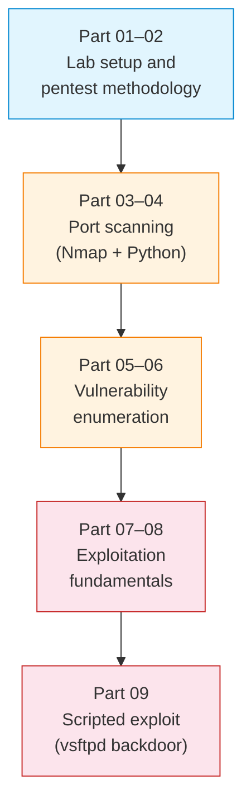

# S13 — Penetration Testing: Scanning, Enumeration and Exploitation

Week 13 introduces a structured penetration testing methodology within a controlled Docker environment. Students perform reconnaissance, port scanning, vulnerability enumeration and basic exploitation against intentionally vulnerable targets. The session covers both automated tools (Nmap) and manual techniques (custom Python scripts), culminating in a scripted exploit against a known vsftpd backdoor.

## Optional: avoid host port conflicts via `.env`

By default, the S13 lab publishes these services on the host:

- DVWA → `localhost:8888`
- WebGoat → `localhost:8080`
- vsftpd 2.3.4 → `localhost:2121` (backdoor port: `6200`)

If you already have something running on those ports, you can generate a local `.env`
file (in this directory) and Docker Compose will automatically use it.

From `04_SEMINARS/S13`:

```bash
python3 generate_env_ports.py
cat .env
```

Then start the lab normally:

```bash
docker compose -f S13_Part02_Config_Docker_Compose_Pentest.yml up -d
```

All S13 helper scripts that connect to host ports (defensive checker, vsftpd exploit)
will also read `.env` automatically.


## File/Folder Index

| Name | Type | Description |
|---|---|---|
| [`S13_Part01_Explanation_Pentest_Intro.md`](S13_Part01_Explanation_Pentest_Intro.md) | Explanation | Penetration testing methodology and ethics |
| [`S13_Part02_Config_Docker_Compose_Pentest.yml`](S13_Part02_Config_Docker_Compose_Pentest.yml) | Config | Docker Compose for the pentest lab (vulnerable targets) |
| [`S13_Part02_Tasks_Pentest.md`](S13_Part02_Tasks_Pentest.md) | Tasks | Lab setup and initial reconnaissance |
| [`S13_Part03_Explanation_Scanning.md`](S13_Part03_Explanation_Scanning.md) | Explanation | Scanning techniques (Nmap and custom) |
| [`S13_Part04_Script_Simple_Scanner.py`](S13_Part04_Script_Simple_Scanner.py) | Script | Python port scanner for the lab |
| [`S13_Part04_Tasks_Scanning.md`](S13_Part04_Tasks_Scanning.md) | Tasks | Scanning exercises |
| [`S13_Part05_Explanation_Vuln_Enumeration.md`](S13_Part05_Explanation_Vuln_Enumeration.md) | Explanation | Vulnerability enumeration methods |
| [`S13_Part05_Script_Defensive_Vuln_Checker.py`](S13_Part05_Script_Defensive_Vuln_Checker.py) | Script | Defensive-only fingerprinting for the lab targets (optional) |
| [`S13_Part06_Tasks_Vuln_Enumeration.md`](S13_Part06_Tasks_Vuln_Enumeration.md) | Tasks | Enumeration exercises |
| [`report_generator.py`](report_generator.py) | Script | Generate a single Markdown report from artefacts (optional) |
| [`artifacts/`](artifacts/) | Folder | Generated outputs: JSON checks, notes, report.md |
| [`S13_Part07_Explanation_Exploitation.md`](S13_Part07_Explanation_Exploitation.md) | Explanation | Exploitation fundamentals |
| [`S13_Part08_Tasks_Exploitation.md`](S13_Part08_Tasks_Exploitation.md) | Tasks | Exploitation exercises |
| [`S13_Part09_Explanation_Exploit_Script.md`](S13_Part09_Explanation_Exploit_Script.md) | Explanation | Writing exploit scripts |
| [`S13_Part09_Script_FTP_Backdoor_Exploit.py`](S13_Part09_Script_FTP_Backdoor_Exploit.py) | Script | vsftpd 2.3.4 backdoor exploit |
| [`S13_Part09B_Tasks_Exploit.md`](S13_Part09B_Tasks_Exploit.md) | Tasks | Exploit scripting exercises |
| [`assets/puml/`](assets/puml/) | Diagrams | 5 PlantUML sources: pentest lab topology, pentest workflow, TCP port states, vsftpd backdoor exploit, vulnerability enumeration tools |
| [`assets/render.sh`](assets/render.sh) | Script | PlantUML batch renderer |

## Visual Overview



## Usage

Launch the pentest lab:

```bash
docker compose -f S13_Part02_Config_Docker_Compose_Pentest.yml up -d
```

Run the Python scanner against the lab:

```bash
python3 S13_Part04_Script_Simple_Scanner.py
```

## Pedagogical Context

The seminar follows the standard pentest lifecycle — reconnaissance → scanning → enumeration → exploitation — within a sandboxed Docker environment that poses no risk to production systems. The emphasis is on methodology and evidence gathering rather than tool mastery. By scripting their own exploit in Part 9, students experience the full chain from vulnerability discovery to confirmed access, reinforcing why secure coding and patch management matter.

## Cross-References

| Related resource | Path | Relationship |
|---|---|---|
| Lecture C13 — IoT and network security | [`../../03_LECTURES/C13/`](../../03_LECTURES/C13/) | Security theory and threat models |
| Quiz Week 13 | [`../../00_APPENDIX/c)studentsQUIZes(multichoice_only)/COMPnet_W13_Questions.md`](../../00_APPENDIX/c%29studentsQUIZes%28multichoice_only%29/COMPnet_W13_Questions.md) | Tests security and scanning concepts |
| Instructor notes (Romanian) | [`../../00_APPENDIX/d)instructor_NOTES4sem/roCOMPNETclass_S13-instructor-outline-v2.md`](../../00_APPENDIX/d%29instructor_NOTES4sem/roCOMPNETclass_S13-instructor-outline-v2.md) | Romanian delivery guide for S13 |
| HTML support pages | [`../_HTMLsupport/S13/`](../_HTMLsupport/S13/) | 1 browser-viewable HTML rendering |
| Portainer guide | [`../../00_TOOLS/Portainer/SEMINAR13/`](../../00_TOOLS/Portainer/SEMINAR13/) | Docker management via Portainer for S13 |
| Seminar S07 — Sniffing, scanning, IDS | [`../S07/`](../S07/) | Packet capture and port scanning foundations |
| Project A02 — IDS | [`../../02_PROJECTS/02_administration_security/A02_ids_simple_rules_scan_detection_tcp_anomalies_and_payload_patterns.md`](../../02_PROJECTS/02_administration_security/A02_ids_simple_rules_scan_detection_tcp_anomalies_and_payload_patterns.md) | Extends detection to rule-based IDS |
| Project A04 — ARP spoofing detection | [`../../02_PROJECTS/02_administration_security/A04_arp_spoofing_detection_and_mitigation_alerts_evidence_and_controlled_blocking.md`](../../02_PROJECTS/02_administration_security/A04_arp_spoofing_detection_and_mitigation_alerts_evidence_and_controlled_blocking.md) | Network-layer attack detection |
| Project A05 — Port scanning lab | [`../../02_PROJECTS/02_administration_security/A05_laboratory_port_scanning_tcp_connect_scan_and_minimal_service_fingerprinting.md`](../../02_PROJECTS/02_administration_security/A05_laboratory_port_scanning_tcp_connect_scan_and_minimal_service_fingerprinting.md) | Extended scanning with fingerprinting |
| Project A10 — Network hardening | [`../../02_PROJECTS/02_administration_security/A10_network_hardening_containerised_services_segmentation_egress_filtering_docker_user.md`](../../02_PROJECTS/02_administration_security/A10_network_hardening_containerised_services_segmentation_egress_filtering_docker_user.md) | Defensive counterpart to the offensive techniques here |
| Previous: S12 (RPC, gRPC) | [`../S12/`](../S12/) | Networked services that could be targets |
| Next: S14 (revision, assessment) | [`../S14/`](../S14/) | Consolidation and project assessment |

| Prerequisite | Path | Reason |
|---|---|---|
| Docker and WSL2 setup | [`../../00_TOOLS/Prerequisites/`](../../00_TOOLS/Prerequisites/) | Required for the pentest lab containers |
| Packet capture skills (S01, S07) | [`../S07/`](../S07/) | Wireshark and raw socket familiarity assumed |

**Suggested sequence:** [`../S12/`](../S12/) → this folder → [`../S14/`](../S14/)

## Selective Clone

**Method A — Git sparse-checkout (requires Git 2.25+)**

```bash
git clone --filter=blob:none --sparse https://github.com/antonioclim/COMPNET-EN.git
cd COMPNET-EN
git sparse-checkout set 04_SEMINARS/S13
```

**Method B — Direct download**

```
https://github.com/antonioclim/COMPNET-EN/tree/main/04_SEMINARS/S13
```

---

*Course: COMPNET-EN — ASE Bucharest, CSIE*
