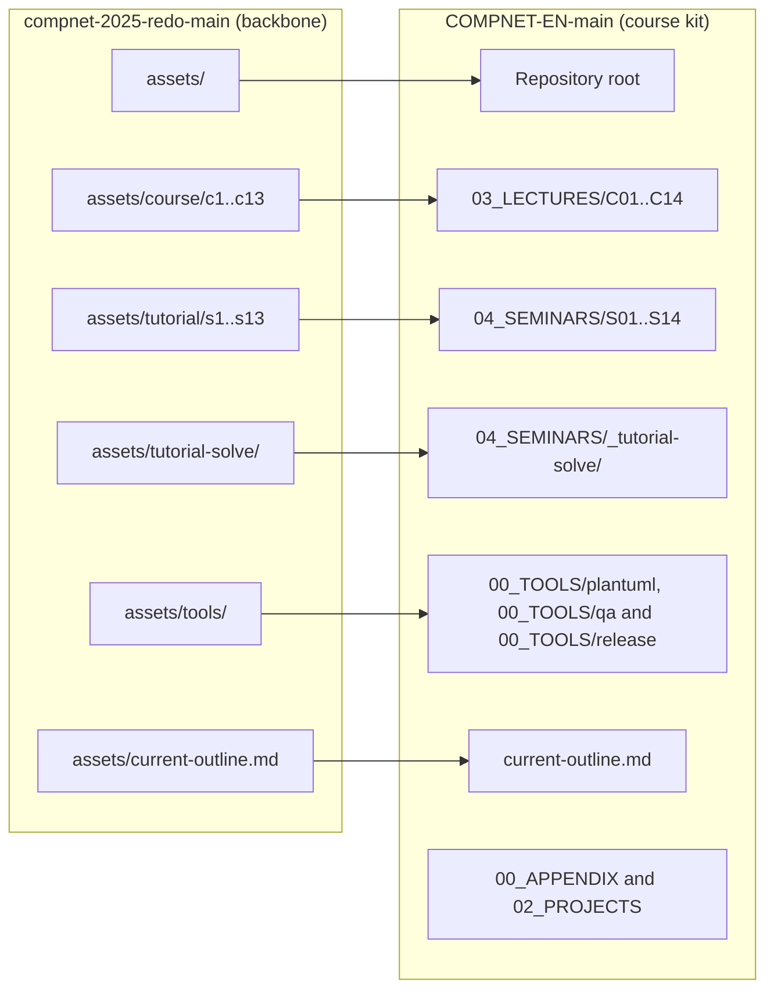

# CHANGELOG — Backbone comparison (compnet-2025-redo-main → COMPNET-EN-main)

Prepared on 25 February 2026.

This document is a **snapshot-level changelog** that compares two repository archives:

- **Backbone (upstream):** `compnet-2025-redo-main.zip` (from `hypothetical-andrei/compnet-2025-redo`)
- **Derived course kit (downstream):** `COMPNET-EN-main.zip` (from `antonioclim/COMPNET-EN`)

The intent is to provide an **audit-grade** description of what was preserved, what was refactored, what was renamed and what was newly introduced. The emphasis is on **functional artefacts** (Python scripts, Docker Compose files, configuration files and build scripts) and on the **pedagogical restructuring** (lectures, seminars, projects and supporting tooling).

---

## 1) Scope, method and terminology

### 1.1 Scope

The comparison is performed at the level of:

- folders and subfolders (repository structure)
- files (presence, absence, relocation and renaming)
- text content (line-level and token-level statistics)
- executable artefacts (Python scripts, shell scripts and Docker related configuration)
- diagram sources (PlantUML) and their rendered artefacts (PNG)

No Git history is used. All conclusions are grounded in the two supplied `.zip` snapshots.

### 1.2 Method (verifiable)

The analysis uses three complementary lenses:

1. **Path-based comparison**  
   A strict comparison of relative paths (what appears as “added” or “removed” when paths change).

2. **Content-based comparison (SHA-256 identity)**  
   A file is treated as *reused verbatim* if its SHA-256 hash matches exactly across the two archives, regardless of its path.

3. **Subtree-level scenario comparison**  
   For teaching and laboratory scenarios, subtrees are compared file-by-file, classifying files as unchanged, modified, added or removed and quantifying approximate line deltas for text files.

---

## 2) High-level repository equivalence

### 2.1 Snapshot metrics

| Metric | compnet-2025-redo-main | COMPNET-EN-main |
| --- | --- | --- |
| Archive name | compnet-2025-redo-main.zip | COMPNET-EN-main.zip |
| Total files | 501 | 1193 |
| Total size (bytes) | 17669827 | 8153843 |
| Total size (MiB) | 16.85 | 7.78 |
| Text files (UTF-8 decodable) | 414 | 1184 |
| Total text lines | 25387 | 169685 |
| Total text words (heuristic) | 75152 | 914880 |
| Symlinks | 0 | 0 |

Key observation: **COMPNET-EN-main is materially smaller on disk (7.78 MiB) than the backbone (16.85 MiB) despite containing more than twice as many files.** The reduction is driven primarily by the removal of heavyweight binary artefacts such as `assets/tools/plantuml.jar` and by the elimination of pre-rendered PNG diagrams.

### 2.2 Structural footprint

Top-level folder distribution:

| Top-level | compnet-2025-redo-main | COMPNET-EN-main |
| --- | --- | --- |
| (root) | 1 | 12 |
| assets | 500 | 0 |
| 00_APPENDIX | 0 | 132 |
| 00_TOOLS | 0 | 176 |
| 01_GUIDE_MININET-SDN | 0 | 3 |
| 02_PROJECTS | 0 | 193 |
| 03_LECTURES | 0 | 320 |
| 04_SEMINARS | 0 | 356 |
| .github | 0 | 1 |

At a path level, the two repositories are **not structurally isomorphic**. The backbone concentrates content under a single `assets/` root. The downstream kit reorganises material into explicit top-level domains (`00_APPENDIX`, `00_TOOLS`, `01_GUIDE_MININET-SDN`, `02_PROJECTS`, `03_LECTURES` and `04_SEMINARS`), plus GitHub automation under `.github/`.

### 2.3 File type comparison

Selected extensions (counts):

| Extension | compnet-2025-redo-main | COMPNET-EN-main |
| --- | --- | --- |
| md | 135 | 379 |
| puml | 84 | 386 |
| py | 118 | 138 |
| yml | 16 | 19 |
| yaml | 0 | 4 |
| sh | 23 | 51 |
| html | 9 | 100 |
| png | 85 | 1 |
| jar | 1 | 0 |
| pptx | 1 | 0 |
| json | 2 | 30 |
| proto | 1 | 1 |
| pyc | 0 | 6 |
| xlsx | 0 | 1 |
| conf | 6 | 6 |
| env | 1 | 1 |
| zone | 1 | 1 |
| (no ext) | 12 | 54 |

Two points have direct operational impact:

- The backbone carries a large Java archive (`.jar`) and many `.png` diagrams. COMPNET-EN-main largely replaces these with **source-first diagrams** (`.puml`) and supporting tooling.
- COMPNET-EN-main introduces **formatting infrastructure** (`package.json`, `.prettierrc`, `format-offline.js`) and **quality assurance scripts** under `00_TOOLS/qa/`.

---

## 3) Backbone continuity statement (with evidence)

Although the directory layout is extensively refactored, the downstream kit retains the backbone’s **core executable laboratory artefacts** as a recognisable base.

### 3.1 Verbatim reuse of functional artefacts

The table below is restricted to artefact families that materially affect runtime behaviour:

| Artefact family | Old count | New count | Old reused verbatim in new | Evidence |
| --- | --- | --- | --- | --- |
| Python scripts (.py) | 118 | 138 | 38 | SHA-256 identity across archives |
| Compose and YAML (.yml, .yaml) | 16 | 23 | 8 | SHA-256 identity across archives |
| Shell scripts (.sh) | 23 | 51 | 11 | SHA-256 identity across archives |
| Nginx and DNS config (.conf, .zone) | 7 | 7 | 6 | SHA-256 identity across archives |
| PlantUML sources (.puml) | 84 | 386 | 0 | No identical PlantUML sources detected |
| Rendered images (.png) | 85 | 1 | 0 | Binary artefacts mostly removed |

Interpretation:

- **Python and YAML artefacts are partially preserved verbatim** (38 Python scripts and 8 YAML files).  
- **Most PlantUML sources and Markdown files are rewritten**, which is consistent with a translation and pedagogical reframing effort rather than a simple reorganisation.

### 3.2 Structural mapping: backbone → course kit

The downstream repository implements a stable mapping from the backbone’s “asset buckets” to explicit teaching domains:



This refactor causes a **near-total path delta** (only `.gitignore` is shared by path), but it does not imply content discontinuity. Content continuity must be assessed through SHA-256 identity and scenario subtree comparisons.

---

## 4) Lecture and seminar coverage

### 4.1 Lecture backbone retention (c01–c13)

The backbone contains content for **13 lectures** (c1–c13). The downstream kit retains those lectures and introduces **C14** explicitly.

The main lecture markdown files are mapped by lecture number, with translation and expansion evidenced by word and line deltas:

| Lecture | Old path | New path | Old lines | New lines | Δ lines | Old words | New words | Δ words |
| --- | --- | --- | --- | --- | --- | --- | --- | --- |
| C01 | assets/course/c1/c1-fundamente-retele.md | 03_LECTURES/C01/c1-network-fundamentals.md | 203 | 206 | 3 | 429 | 459 | 30 |
| C02 | assets/course/c2/c2-modele-arhitecturale.md | 03_LECTURES/C02/c2-architectural-models.md | 350 | 354 | 4 | 668 | 690 | 22 |
| C03 | assets/course/c3/c3-introducere-programare-retea.md | 03_LECTURES/C03/c3-intro-network-programming.md | 151 | 155 | 4 | 456 | 529 | 73 |
| C04 | assets/course/c4/c4-fizic-si-legatura-de-date.md | 03_LECTURES/C04/c4-physical-and-data-link.md | 292 | 292 | 0 | 830 | 922 | 92 |
| C05 | assets/course/c5/c5-nivelul-retea-adresare.md | 03_LECTURES/C05/c5-network-layer-addressing.md | 224 | 235 | 11 | 731 | 802 | 71 |
| C06 | assets/course/c6/c6-nat-arp-dhcp-ndp-icmp.md | 03_LECTURES/C06/c6-nat-arp-dhcp-ndp-icmp.md | 224 | 225 | 1 | 718 | 808 | 90 |
| C07 | assets/course/c7/c7-protocoale-de-rutare.md | 03_LECTURES/C07/c7-routing-protocols.md | 183 | 187 | 4 | 594 | 649 | 55 |
| C08 | assets/course/c8/c8.md | 03_LECTURES/C08/c8-transport-layer.md | 456 | 464 | 8 | 939 | 1039 | 100 |
| C09 | assets/course/c9/c9.md | 03_LECTURES/C09/c9-session-presentation.md | 207 | 219 | 12 | 545 | 656 | 111 |
| C10 | assets/course/c10/c10.md | 03_LECTURES/C10/c10-http-application-layer.md | 301 | 329 | 28 | 753 | 986 | 233 |
| C11 | assets/course/c11/c11.md | 03_LECTURES/C11/c11-ftp-dns-ssh.md | 315 | 314 | -1 | 626 | 684 | 58 |
| C12 | assets/course/c12/c12.md | 03_LECTURES/C12/c12-email-protocols.md | 406 | 424 | 18 | 600 | 779 | 179 |
| C13 | assets/course/c13/c13.md | 03_LECTURES/C13/c13-iot-security.md | 247 | 237 | -10 | 497 | 517 | 20 |

A translation and enrichment step is also visible in `assets/current-outline.md` becoming `current-outline.md` (see §7.4 for the diff excerpt).

### 4.2 Seminar backbone retention (s01–s13)

The backbone contains **13 seminars** (s1–s13). The downstream kit retains those seminars and introduces **S14** explicitly, alongside an expanded instructor and student support layer.

Seminar-level file counts and verbatim reuse are shown below:

| Seminar | Old files | New files | Identical files reused |
| --- | --- | --- | --- |
| S01 | 6 | 13 | 0 |
| S02 | 11 | 17 | 0 |
| S03 | 15 | 22 | 0 |
| S04 | 16 | 24 | 0 |
| S05 | 9 | 17 | 0 |
| S06 | 13 | 22 | 0 |
| S07 | 12 | 20 | 1 |
| S08 | 13 | 22 | 0 |
| S09 | 14 | 31 | 0 |
| S10 | 17 | 25 | 1 |
| S11 | 15 | 26 | 1 |
| S12 | 14 | 22 | 0 |
| S13 | 13 | 20 | 0 |

The low “identical reuse” count for seminar subtrees reflects heavy renaming and translation of teaching text, not necessarily a removal of practical content.

---

## 5) Functional equivalence in Python and YAML

This section answers the question: **does COMPNET-EN-main preserve the backbone’s Python and YAML applications as a recognisable backbone, even after refactoring?**

### 5.1 Scenario set equivalence (lectures)

The lecture scenarios are the most direct proxy for “application equivalence”.

Scenario inventory changes:

- Added scenarios in COMPNET-EN-main:
  - `C04/scenario-line-coding`
  - `C04/scenario-mac-arp-ethernet`
  - `C07/scenario-dijkstra` (spelling correction and restructuring)
- Removed scenario name:
  - `C07/scenario-djikstra` (superseded by `scenario-dijkstra`)

The **scenario subtree comparison** below is based on on-disk content.

#### 5.1.1 Scenario summary matrix (file-level)

| Lecture | Scenario | Unchanged files | Modified files | Added files | Removed files | Code changed | Docs changed |
| --- | --- | --- | --- | --- | --- | --- | --- |
| C01 | scenario-capture-basics | 1 | 2 | 0 | 0 | Yes | Yes |
| C01 | scenario-ping-traceroute | 0 | 1 | 0 | 0 | No | Yes |
| C02 | scenario-tcp-udp-layers | 2 | 3 | 0 | 0 | Yes | Yes |
| C03 | scenario-scapy-icmp | 1 | 1 | 0 | 0 | No | Yes |
| C03 | scenario-tcp-framing | 1 | 2 | 0 | 0 | Yes | Yes |
| C03 | scenario-tcp-multiclient | 1 | 2 | 0 | 0 | Yes | Yes |
| C03 | scenario-udp-session-ack | 1 | 2 | 0 | 0 | Yes | Yes |
| C05 | scenario-cidr-basic | 0 | 2 | 0 | 0 | Yes | Yes |
| C05 | scenario-ipv4-ipv6-capture | 0 | 1 | 0 | 0 | No | Yes |
| C05 | scenario-ipv6-shortening | 0 | 2 | 0 | 0 | Yes | Yes |
| C05 | scenario-subnetting-flsm | 0 | 2 | 0 | 0 | Yes | Yes |
| C05 | scenario-vlsm | 0 | 2 | 0 | 0 | Yes | Yes |
| C06 | scenario-arp-capture | 0 | 1 | 0 | 0 | No | Yes |
| C06 | scenario-dhcp-capture | 0 | 1 | 0 | 0 | No | Yes |
| C06 | scenario-icmp-traceroute | 0 | 1 | 0 | 0 | No | Yes |
| C06 | scenario-nat-linux | 1 | 1 | 0 | 0 | No | Yes |
| C06 | scenario-ndp-capture | 0 | 1 | 0 | 0 | No | Yes |
| C07 | scenario-bellman-ford | 1 | 1 | 0 | 0 | No | Yes |
| C07 | scenario-dijkstra | 0 | 1 | 1 | 1 | No | Yes |
| C07 | scenario-mininet-routing | 0 | 2 | 0 | 0 | Yes | Yes |
| C08 | scenario-tcp-handshake-tcpdump | 3 | 2 | 0 | 0 | Yes | Yes |
| C08 | scenario-tls-openssl | 4 | 1 | 0 | 0 | No | Yes |
| C08 | scenario-udp-vs-tcp-loss | 6 | 1 | 0 | 0 | No | Yes |
| C09 | scenario-encoding-utf8 | 1 | 2 | 0 | 0 | Yes | Yes |
| C09 | scenario-mime-encoding-gzip | 3 | 2 | 0 | 0 | Yes | Yes |
| C10 | scenario-custom-http-semantics | 2 | 1 | 0 | 0 | No | Yes |
| C10 | scenario-http-compose | 7 | 2 | 0 | 0 | Yes | Yes |
| C10 | scenario-rest-maturity | 6 | 1 | 0 | 0 | No | Yes |
| C10 | scenario-websocket-protocol | 1 | 3 | 0 | 0 | Yes | Yes |
| C11 | scenario-dns-ttl-caching | 5 | 1 | 0 | 0 | No | Yes |
| C11 | scenario-ftp-baseline | 2 | 2 | 1 | 0 | Yes | Yes |
| C11 | scenario-ftp-nat-firewall | 2 | 2 | 3 | 0 | Yes | Yes |
| C11 | scenario-ssh-provision | 4 | 2 | 0 | 0 | Yes | Yes |
| C12 | scenario-local-mailbox | 7 | 1 | 1 | 0 | No | Yes |
| C13 | scenario-iot-basic | 6 | 1 | 0 | 0 | No | Yes |
| C13 | scenario-vulnerability-lab | 5 | 1 | 0 | 0 | No | Yes |

Interpretation:

- All 36 backbone scenarios that exist in the downstream kit have **documentation changes** (README rewrite and translation).
- Exactly half of these scenarios also include **code or configuration changes** beyond README changes. These changes are typically small and traceable (see §7.2 and §7.3).

#### 5.1.2 Scenarios with code-level deltas

| Lecture | Scenario | Changed files |
| --- | --- | --- |
| C01 | scenario-capture-basics | dns-query.py |
| C02 | scenario-tcp-udp-layers | tcp-client.py, udp-client.py |
| C03 | scenario-tcp-framing | client.py |
| C03 | scenario-tcp-multiclient | client.py |
| C03 | scenario-udp-session-ack | client.py |
| C05 | scenario-cidr-basic | cidr-calc.py |
| C05 | scenario-ipv6-shortening | ipv6-norm.py |
| C05 | scenario-subnetting-flsm | flsm-split.py |
| C05 | scenario-vlsm | vlsm-alloc.py |
| C07 | scenario-mininet-routing | tringle-net.py |
| C08 | scenario-tcp-handshake-tcpdump | client.py |
| C09 | scenario-encoding-utf8 | server.py |
| C09 | scenario-mime-encoding-gzip | index.html |
| C10 | scenario-http-compose | web/index.html |
| C10 | scenario-websocket-protocol | index.html, protocol.md |
| C11 | scenario-ftp-baseline | server/ftp_server.py |
| C11 | scenario-ftp-nat-firewall | client/ftp_client.py |
| C11 | scenario-ssh-provision | payload/index.html |

### 5.2 Direct evidence: small, localised Python deltas

For Python files that keep their relative location, the downstream kit introduces small changes, typically:

- translation of comments and instructional strings
- renaming of messages printed for interactive guidance
- alignment with the downstream naming conventions

The table below enumerates *path-preserving* Python files that were modified, including approximate line delta counts:

| Old path | New path | Old lines | New lines | Added lines | Deleted lines |
| --- | --- | --- | --- | --- | --- |
| assets/course/c1/assets/scenario-capture-basics/dns-query.py | 03_LECTURES/C01/assets/scenario-capture-basics/dns-query.py | 12 | 12 | 2 | 2 |
| assets/course/c11/assets/scenario-ftp-baseline/server/ftp_server.py | 03_LECTURES/C11/assets/scenario-ftp-baseline/server/ftp_server.py | 22 | 22 | 1 | 1 |
| assets/course/c11/assets/scenario-ftp-nat-firewall/client/ftp_client.py | 03_LECTURES/C11/assets/scenario-ftp-nat-firewall/client/ftp_client.py | 21 | 21 | 2 | 2 |
| assets/course/c2/assets/scenario-tcp-udp-layers/tcp-client.py | 03_LECTURES/C02/assets/scenario-tcp-udp-layers/tcp-client.py | 15 | 15 | 1 | 1 |
| assets/course/c2/assets/scenario-tcp-udp-layers/udp-client.py | 03_LECTURES/C02/assets/scenario-tcp-udp-layers/udp-client.py | 14 | 14 | 1 | 1 |
| assets/course/c5/assets/scenario-cidr-basic/cidr-calc.py | 03_LECTURES/C05/assets/scenario-cidr-basic/cidr-calc.py | 24 | 24 | 2 | 2 |
| assets/course/c5/assets/scenario-ipv6-shortening/ipv6-norm.py | 03_LECTURES/C05/assets/scenario-ipv6-shortening/ipv6-norm.py | 14 | 14 | 1 | 1 |
| assets/course/c5/assets/scenario-subnetting-flsm/flsm-split.py | 03_LECTURES/C05/assets/scenario-subnetting-flsm/flsm-split.py | 36 | 36 | 1 | 1 |
| assets/course/c5/assets/scenario-vlsm/vlsm-alloc.py | 03_LECTURES/C05/assets/scenario-vlsm/vlsm-alloc.py | 51 | 51 | 3 | 3 |
| assets/course/c7/assets/scenario-mininet-routing/tringle-net.py | 03_LECTURES/C07/assets/scenario-mininet-routing/tringle-net.py | 139 | 139 | 18 | 18 |
| assets/course/c8/assets/scenario-tcp-handshake-tcpdump/client.py | 03_LECTURES/C08/assets/scenario-tcp-handshake-tcpdump/client.py | 20 | 20 | 1 | 1 |
| assets/course/c9/assets/scenario-encoding-utf8/server.py | 03_LECTURES/C09/assets/scenario-encoding-utf8/server.py | 43 | 43 | 2 | 2 |

---

## 6) Major refactors and new subsystems in COMPNET-EN-main

### 6.1 Tooling and operational hygiene

The backbone includes a monolithic binary dependency:

- `assets/tools/plantuml.jar` (≈ 15.16 MiB)

COMPNET-EN-main removes this artefact and replaces it with:

- `00_TOOLS/plantuml/` scripts for installing and using PlantUML tooling
- `00_TOOLS/qa/` scripts for quality checks and repository hygiene
- an offline deterministic formatter (`format-offline.js`) and Prettier configuration (`.prettierrc`, `package.json`)

This shifts the repository from a “commit binaries” model towards a more reproducible “tooling as scripts” model.

### 6.2 New teaching domains and delivery structure

COMPNET-EN-main introduces the following teaching domains which have no direct structural counterpart in the backbone:

- `00_APPENDIX/` (supplementary material, formative evaluation and instructor notes)
- `01_GUIDE_MININET-SDN/` (setup guide and HTML export)
- `02_PROJECTS/` (project scaffolding and assessment artefacts)
- `.github/workflows/` (automation hooks for repository checks)

Each domain is self-contained and is integrated into the overall kit, with explicit README and navigational structure.

### 6.3 Naming and packaging conventions

Across seminars and selected lecture assets, COMPNET-EN-main standardises filenames using a structured prefix, typically:

- `SNN_PartXX_<Type>_<Topic>.<ext>` for seminar artefacts
- `CNN_...` patterns for lecture assets where helpful

This has direct implications for discoverability, instructor orchestration and student navigation.

A set of **verified** “rename-and-refactor” examples is provided in §7.3.

---

## 7) Verified diffs and concrete change excerpts

This section provides **local, excerpted diffs** that demonstrate the dominant transformation patterns. The excerpts are intentionally short and representative.

### 7.1 `.gitignore` refocus: from generic Python template to course kit policy

```diff
--- compnet-2025-redo-main/.gitignore
+++ COMPNET-EN-main/.gitignore
@@ -1,206 +1,32 @@
-# Byte-compiled / optimized / DLL files
+# ──────────────────────────────────────────────
+# .gitignore — Computer Networks course kit
+# ──────────────────────────────────────────────
+
+# Python cache & bytecode
 __pycache__/
-*.py[codz]
-*$py.class
+*.pyc
+*.pyo
+*.pyd
 
-# C extensions
-*.so
+# Testing
+.pytest_cache/
+.coverage
+htmlcov/
 
-# Distribution / packaging
-.Python
+# Virtual environments
+.venv/
+venv/
+
+# Environment locals
+.env.local
+
+# Node / JS tooling
+node_modules/
+dist/
 build/
-develop-eggs/
-dist/
-downloads/
-eggs/
-.eggs/
-lib/
-lib64/
-parts/
-sdist/
-var/
-wheels/
-share/python-wheels/
-*.egg-info/
-.installed.cfg
-*.egg
-MANIFEST
 
-# PyInstaller
-#  Usually these files are written by a python script from a template
-#  before PyInstaller builds the exe, so as to inject date/other infos into it.
-*.manifest
-*.spec
+# macOS metadata
+.DS_Store
 
-# Installer logs
-pip-log.txt
-pip-delete-this-directory.txt
-
-# Unit test / coverage reports
-htmlcov/
-.tox/
-.nox/
-.coverage
-.coverage.*
-.cache
-nosetests.xml
-coverage.xml
-*.cover
-*.py.cover
-.hypothesis/
-.pytest_cache/
-cover/
-
```

Notable effect: COMPNET-EN-main explicitly covers Python cache files, test artefacts, virtual environments and Node tooling (`node_modules/`), reflecting its new formatting pipeline.

### 7.2 PlantUML enrichment: translation plus semantic densification

Example: `fig-l2-encapsulation.puml` shifts from a minimal Romanian-labelled diagram to an English diagram with explicit semantics, legends and improved structure.

```diff
--- assets/course/c4/assets/puml/fig-l2-encapsulation.puml
+++ 03_LECTURES/C04/assets/puml/fig-l2-encapsulation.puml
@@ -1,16 +1,29 @@
-@startuml
+@startuml fig-l2-encapsulation
 skinparam backgroundColor white
+skinparam defaultFontName Arial
+skinparam defaultFontSize 12
 skinparam shadowing false
 skinparam roundcorner 12
-skinparam defaultFontName Arial
-skinparam defaultFontSize 14
 
-title L2: Incapsulare in cadru (frame)
+title Layer 2 Encapsulation: Wrapping a Packet into a Frame
 
-rectangle "Pachet L3\n(IP)" as L3
-rectangle "Cadru L2\n[Header L2 | (L3) | FCS]" as L2
-rectangle "Biti L1" as L1
+rectangle "L3 IP Packet\n(source IP, dest IP, payload)" as pkt #F5F5F5
 
-L3 --> L2 : incapsulare
-L2 --> L1 : serializare
+rectangle "L2 Frame" as frame #E3F2FD {
+    rectangle "L2 Header\n(dest MAC, src MAC\ntype/length)" as hdr #BBDEFB
+    rectangle "L3 Packet\n(payload)" as pay #FFF9C4
+    rectangle "FCS\n(CRC-32)" as fcs #C8E6C9
+}
+
+rectangle "L1 Bit Stream\n(serialised onto medium)" as bits #FFE0B2
+
+pkt -down-> frame : encapsulation
+frame -down-> bits : serialisation
+
+legend right
+  The data link layer wraps each L3 packet
+  in a header (addressing) and trailer (CRC).
+  The receiver uses the FCS to detect errors
+  and the MAC addresses to identify endpoints.
+endlegend
 @enduml
```

### 7.3 Docker Compose refactor: renamed files and explicit references

Example: Seminar 10 DNS containers compose file is renamed and its internal references are updated to match the downstream naming policy.

```diff
--- assets/tutorial/s10/2_dns-containers/docker-compose.yml
+++ 04_SEMINARS/S10/2_dns-containers/S10_Part02_Config_Docker_Compose.yml
@@ -1,22 +1,26 @@
-version: "3.9"
-
+version: '3.9'
 services:
-
   web:
     image: python:3
-    command: ["python3", "-m", "http.server", "8000"]
+    command:
+    - python3
+    - -m
+    - http.server
+    - '8000'
     expose:
-      - "8000"
-
+    - '8000'
   dns-server:
     build:
       context: .
-    command: ["python3", "dns_server.py"]
+      dockerfile: S10_Part02_Config_Dockerfile
+    command:
+    - python3
+    - S10_Part02_Script_DNS_Server.py
     ports:
-      - "5353:5353/udp"
-
+    - 5353:5353/udp
   debug:
     image: busybox
-    command: ["sh"]
+    command:
+    - sh
     stdin_open: true
     tty: true
```

Verified rename map (selected):

| Old path | New path | Verified status | Notes |
| --- | --- | --- | --- |
| assets/tutorial/s10/2_dns-containers/docker-compose.yml | 04_SEMINARS/S10/2_dns-containers/S10_Part02_Config_Docker_Compose.yml | Exists | Docker Compose renaming, dockerfile and script references updated |
| assets/tutorial/s10/2_dns-containers/Dockerfile | 04_SEMINARS/S10/2_dns-containers/S10_Part02_Config_Dockerfile | Exists | Dockerfile renamed and referenced from compose |
| assets/tutorial/s10/2_dns-containers/dns_server.py | 04_SEMINARS/S10/2_dns-containers/S10_Part02_Script_DNS_Server.py | Exists | Script renamed and referenced from compose |
| assets/tutorial/s10/3_ssh/ssh-server/Dockerfile | 04_SEMINARS/S10/3_ssh/ssh-server/S10_Part03_Config_Dockerfile | Exists | Dockerfile moved unchanged but renamed |
| assets/tutorial/s11/1_nginx-compose/nginx.conf | 04_SEMINARS/S11/1_nginx-compose/S11_Part01_Config_Nginx.conf | Exists | Config moved unchanged but renamed |
| assets/tutorial/s8/4_nginx/nginx.conf | 04_SEMINARS/S08/4_nginx/S08_Part04_Config_Nginx.conf | Exists | Config renamed with comment translation |
| assets/tutorial/s12/2_protobuf/calculator.proto | 04_SEMINARS/S12/2_protobuf/S12_Part02_Config_Calculator.proto | Exists | Proto comments translated and file renamed |

### 7.4 Curriculum outline translation and normalisation

`assets/current-outline.md` is relocated and rewritten as `current-outline.md`, with both language normalisation and content refinement.

```diff
--- assets/current-outline.md
+++ current-outline.md
@@ -1,33 +1,29 @@
-Curs 1 - Fundamente ale reţelelor de calculatoare.
-Curs 2 - Modele arhitecturale pentru reţele de calculatoare. Modelul OSI. Modelul
-TCP/IP.
-Curs 3 - Introducere în programarea de reţea.
-Curs 4 - Nivelul fizic. Nivelul legătură de date.
-Curs 5 - Nivelul reţea. Adresare (IPv.4, IPv6, Subnetting, VLSM).
-Curs 6 - Nivelul reţea. Adresare (NAT, PAT, ICMP, DHCP, BOOTP).
-Curs 7 - Nivelul reţea. Protocoale de rutare (RIP, IGRP, OSPF).
-Curs 8 - Nivelul transport (TCP, UDP, TLS).
-Curs 9 - Nivelul sesiune. Nivelul prezentare.
-Curs 1O - Nivelul aplicaţie: HTTP(S) - REST, SOAP.
-Curs 11 - Nivelul aplicaţie: FTP, DNS, SSH.
-Curs 12 - Nivelul aplicaţie. SMTP, POP3, IMAP, WebMail.
-Curs 13 - IoT şi securitate în reţele de calculatoare.
-Curs 14 - Recapitulare
+Lecture 1 – Fundamentals of computer networks.
+Lecture 2 – Architectural models for computer networks: the OSI model and the TCP/IP model.
+Lecture 3 – Introduction to network programming.
+Lecture 4 – The physical layer and the data link layer.
+Lecture 5 – The network layer: addressing (IPv4, IPv6, subnetting and VLSM).
+Lecture 6 – The network layer: addressing and control protocols (NAT, PAT, ICMP, DHCP and BOOTP).
+Lecture 7 – The network layer: routing protocols (RIP, IGRP and OSPF).
+Lecture 8 – The transport layer (TCP, UDP and TLS).
+Lecture 9 – The session layer and the presentation layer.
+Lecture 10 – The application layer: HTTP(S) (REST and SOAP).
+Lecture 11 – The application layer: FTP, DNS and SSH.
+Lecture 12 – The application layer: SMTP, POP3, IMAP and webmail.
+Lecture 13 – IoT and security in computer networks.
+Lecture 14 – Revision and examination preparation.
 
-
-~Seminar 1 - Analiză de reţea. WiresharkItshark, netcat TCPIUDP, debugging trafic
-Seminar 2 - Programare pe socket-uri: implementarea unui server concurent TCP şi UDP şi a clienţilor aferenţi plus analiza traficului.
-Seminar 3 - Programare pe socket-uri: broadcast şi multicast UDP, TCP tunnel
-simplu.
-Seminar 4 - Programare pe socket-uri: implementarea de protocoale text şi binare custom peste TCP şi UDP.
-Seminar 5 - Adresare şi rutare. Subnetting IPv.4IIPv6, introducere simulator de reţea. Configurarea unei infrastructuri de reţea
-Seminar 6 - SDN. Componente ale arhitecturilor de reţea. Topologii simulate, analiză trafic într-un simulator.
-Seminar 7 - Interceptarea pachetelor TCP şi UDP: implementarea unui filtru de
-pachete, scanarea porturilor.
-Seminar 8 - Servicii Internet: implementarea unui server HTTP. Reverse proxies.
-Seminar 9 - Protocoale de fişiere. Server FTP custom, mini file transfer server, testare multi-client cu containere
-Seminar 1O - Servicii de reţea: DNS, SSH, FTP în containere orchestrate cu Docker.
-Seminar 11 - Aplicaţii distribuite cu Nginx: load-balancing, reverse proxy pentru mai multe containere rulate cu Docker Compose.
-Seminar 12 - Apelul de metode la distanţă: concepte RPC, implementare folosind un framework.
-Seminar 13 - Securitatea în reţele de calculatoare: scanare de porturi, testarea vulnerabilităţilor simple.
-Seminar 14 - Evaluarea proiectului în echipă
+Seminar 1 – Network analysis: Wireshark/tshark, netcat (TCP/UDP) and traffic debugging.
+Seminar 2 – Socket programming: implementing a concurrent TCP and UDP server and the corresponding clients, plus traffic analysis.
+Seminar 3 – Socket programming: UDP broadcast and multicast and a simple TCP tunnel.
+Seminar 4 – Socket programming: implementing custom text and binary protocols over TCP and UDP.
+Seminar 5 – Addressing and routing: IPv4/IPv6 subnetting, an introduction to a network simulator and configuring a network infrastructure.
+Seminar 6 – SDN: components of network architectures, simulated topologies and traffic analysis in a simulator.
+Seminar 7 – Capturing TCP and UDP packets: implementing a packet filter and port scanning.
+Seminar 8 – Internet services: implementing an HTTP server and reverse proxies.
+Seminar 9 – File protocols: a custom FTP server, a minimal file transfer server and multi-client testing with containers.
+Seminar 10 – Network services: DNS, SSH and FTP in containers orchestrated with Docker.
+Seminar 11 – Distributed applications with Nginx: load balancing and reverse proxying for multiple containers started with Docker Compose.
+Seminar 12 – Remote method invocation: RPC concepts and an implementation using a framework.
+Seminar 13 – Security in computer networks: port scanning and testing simple vulnerabilities.
+Seminar 14 – Team project assessment and viva.
```

### 7.5 Mininet routing scenario: instructional strings translated, logic preserved

```diff
--- assets/course/c7/assets/scenario-mininet-routing/tringle-net.py
+++ 03_LECTURES/C07/assets/scenario-mininet-routing/tringle-net.py
@@ -28,7 +28,7 @@
 def build_net():
     net = Mininet(link=TCLink, controller=None, waitConnected=True)
 
-    info("*** Noduri\n")
+    info("*** Nodes\n")
     r1 = net.addHost("r1", cls=LinuxRouter)
     r2 = net.addHost("r2", cls=LinuxRouter)
     r3 = net.addHost("r3", cls=LinuxRouter)
@@ -37,7 +37,7 @@
     h2 = net.addHost("h2")
     h3 = net.addHost("h3")
 
-    info("*** Link-uri (triunghi + LAN-uri)\n")
+    info("*** Links (triangle + LANs)\n")
     net.addLink(r1, r2, intfName1="r1-eth1", intfName2="r2-eth1")
     net.addLink(r1, r3, intfName1="r1-eth2", intfName2="r3-eth1")
     net.addLink(r2, r3, intfName1="r2-eth2", intfName2="r3-eth2")
@@ -48,7 +48,7 @@
 
     net.start()
 
-    info("*** Adresare IP (LAN-uri)\n")
+    info("*** IP addressing (LANs)\n")
     add_ip(r1, "r1-eth0", "10.1.0.1/24")
     add_ip(h1, "h1-eth0", "10.1.0.2/24")
     set_default_route(h1, "10.1.0.1")
@@ -61,7 +61,7 @@
     add_ip(h3, "h3-eth0", "10.3.0.2/24")
     set_default_route(h3, "10.3.0.1")
 
-    info("*** Adresare IP (link-uri intre rutere)\n")
+    info("*** IP addressing (inter-router links)\n")
     add_ip(r1, "r1-eth1", "10.12.0.1/24")
     add_ip(r2, "r2-eth1", "10.12.0.2/24")
 
@@ -75,43 +75,43 @@
 
 
 def scenario_link_down(net, r1, r2, r3):
-    info("*** Scenariu: link-down (r1-r2 cade, mergem prin r3)\n")
+    info("*** Scenario: link-down (r1-r2 fails, traffic routes via r3)\n")
 
-    # r1 <-> r2 via r3 (ocolire)
+    # r1 <-> r2 via r3 (bypass)
     r1.cmd("ip route add 10.2.0.0/24 via 10.13.0.3 dev r1-eth2")
     r2.cmd("ip route add 10.1.0.0/24 via 10.23.0.3 dev r2-eth2")
 
-    # optional: conectivitate completa intre toate LAN-urile
+    # optional: full connectivity between all LANs
     r1.cmd("ip route add 10.3.0.0/24 via 10.13.0.3 dev r1-eth2")
     r2.cmd("ip route add 10.3.0.0/24 via 10.23.0.3 dev r2-eth2")
     r3.cmd("ip route add 10.1.0.0/24 via 10.13.0.1 dev r3-eth1")
     r3.cmd("ip route add 10.2.0.0/24 via 10.23.0.2 dev r3-eth2")
 
-    info("*** Coboram link-ul r1-r2 (ambele capete)\n")
+    info("*** Bringing down link r1-r2 (both ends)\n")
     r1.cmd("ip link set r1-eth1 down")
     r2.cmd("ip link set r2-eth1 down")
 
-    info("*** Link r1-r2 este DOWN. Traficul trebuie sa ocoleasca prin r3.\n")
+    info("*** Link r1-r2 is DOWN. Traffic must bypass via r3.\n")
 
 
 def scenario_asymmetric(net, r1, r2, r3):
-    info("*** Scenariu: rutare asimetrica (doar r1 are ruta spre r2)\n")
+    info("*** Scenario: asymmetric routing (only r1 has a route to r2)\n")
 
-    # r1 stie sa ajunga la LAN-ul lui r2 prin r2 (direct)
+    # r1 knows how to reach r2's LAN via r2 (directly)
     r1.cmd("ip route add 10.2.0.0/24 via 10.12.0.2 dev r1-eth1")
 
-    # r2 NU primeste ruta de retur spre 10.1.0.0/24
-    # (nici default route pe r2, ca sa fie “fara intoarcere” clar)
+    # r2 does NOT receive a return route towards 10.1.0.0/24
+    # (no default route on r2 either, to make the "no return" case clear)
 
-    # optional: ca sa nu interfereze r3, nu setam rute alternative
```

### 7.6 Protobuf artefact: comments translated, student TODOs retained

```diff
--- assets/tutorial/s12/2_protobuf/calculator.proto
+++ 04_SEMINARS/S12/2_protobuf/S12_Part02_Config_Calculator.proto
@@ -1,19 +1,19 @@
 syntax = "proto3";
 
-// Pachetul este opțional dar recomandat
+// The package is optional but recommended
 package seminar12;
 
 // ---------------------
-// Mesajele de request
+// Request messages
 // ---------------------
 
-// Request pentru Add(a, b)
+// Request for Add(a, b)
 message AddRequest {
   int32 a = 1;
   int32 b = 2;
 }
 
-// Request pentru Multiply(a, b)
+// Request for Multiply(a, b)
 message MultiplyRequest {
   int32 a = 1;
   int32 b = 2;
@@ -21,13 +21,13 @@
 
 // TODO (student):
 // ------------
-// Adăugați aici un mesaj PowerRequest
-// cu câmpuri int32 base și int32 exponent
+// Add a message PowerRequest here
+// with fields int32 base and int32 exponent
 // ------------
 
 
 // -------------------------
-// Mesajele de răspuns
+// Response messages
 // -------------------------
 
 message AddResponse {
@@ -40,13 +40,13 @@
 
 // TODO (student):
 // ------------
-// Adăugați aici un mesaj PowerResponse
-// cu câmp int32 result
+// Add a message PowerResponse here
+// with field int32 result
 // ------------
 
 
 // -------------------------
-// Definirea serviciului
+// Service definition
 // -------------------------
 
 service Calculator {
@@ -55,7 +55,7 @@
 
   // TODO (student):
   // --------------
-  // Adăugați aici metoda RPC Power
-  // care primește PowerRequest și returnează PowerResponse
+  // Add the RPC method Power here
+  // which receives PowerRequest and returns PowerResponse
   // --------------
 }
```

---

## 8) Full inventory appendices (paths and exact mappings)

These appendices provide exhaustive listings for audit and traceability. Because the repository underwent a major re-rooting, path-based “added” and “removed” lists should be interpreted alongside the SHA-256 reuse table.

### 8.1 Appendix A — Folder outlines (depth ≤ 2)

<details>
<summary>Backbone (compnet-2025-redo-main) folders</summary>

```text
assets/
assets/course/
assets/tools/
assets/tutorial-solve/
assets/tutorial/
```

</details>

<details>
<summary>Downstream (COMPNET-EN-main) folders</summary>

```text
.github/
.github/workflows/
00_APPENDIX/
00_APPENDIX/a)PYTHON_self_study_guide/
00_APPENDIX/b)optional_LECTURES/
00_APPENDIX/c)studentsQUIZes(multichoice_only)/
00_APPENDIX/d)instructor_NOTES4sem/
00_APPENDIX/docs/
00_APPENDIX/formative/
00_TOOLS/
00_TOOLS/PlantUML(optional)/
00_TOOLS/Portainer/
00_TOOLS/Prerequisites/
00_TOOLS/plantuml/
00_TOOLS/qa/
00_TOOLS/release/
01_GUIDE_MININET-SDN/
02_PROJECTS/
02_PROJECTS/00_common/
02_PROJECTS/01_network_applications/
02_PROJECTS/02_administration_security/
03_LECTURES/
03_LECTURES/C01/
03_LECTURES/C02/
03_LECTURES/C03/
03_LECTURES/C04/
03_LECTURES/C05/
03_LECTURES/C06/
03_LECTURES/C07/
03_LECTURES/C08/
03_LECTURES/C09/
03_LECTURES/C10/
03_LECTURES/C11/
03_LECTURES/C12/
03_LECTURES/C13/
03_LECTURES/C14/
04_SEMINARS/
04_SEMINARS/S01/
04_SEMINARS/S02/
04_SEMINARS/S03/
04_SEMINARS/S04/
04_SEMINARS/S05/
04_SEMINARS/S06/
04_SEMINARS/S07/
04_SEMINARS/S08/
04_SEMINARS/S09/
04_SEMINARS/S10/
04_SEMINARS/S11/
04_SEMINARS/S12/
04_SEMINARS/S13/
04_SEMINARS/S14/
04_SEMINARS/_HTMLsupport/
04_SEMINARS/_tutorial-solve/
```

</details>

### 8.2 Appendix B — Files reused verbatim (SHA-256 identity)

The following table enumerates every backbone file whose content appears **unchanged** in COMPNET-EN-main, including full paths.

| Old path | New path(s) | Ext | Bytes |
| --- | --- | --- | --- |
| assets/course/c1/assets/scenario-capture-basics/start-http-server.py | 03_LECTURES/C01/assets/scenario-capture-basics/start-http-server.py | py | 294 |
| assets/course/c10/assets/scenario-custom-http-semantics/client.py | 03_LECTURES/C10/assets/scenario-custom-http-semantics/client.py | py | 679 |
| assets/course/c10/assets/scenario-custom-http-semantics/server.py | 03_LECTURES/C10/assets/scenario-custom-http-semantics/server.py | py | 2262 |
| assets/course/c10/assets/scenario-http-compose/api/Dockerfile | 03_LECTURES/C10/assets/scenario-http-compose/api/Dockerfile | (no ext) | 194 |
| assets/course/c10/assets/scenario-http-compose/api/app.py | 03_LECTURES/C10/assets/scenario-http-compose/api/app.py | py | 651 |
| assets/course/c10/assets/scenario-http-compose/api/requirements.txt | 03_LECTURES/C10/assets/scenario-http-compose/api/requirements.txt | txt | 13 |
| assets/course/c10/assets/scenario-http-compose/docker-compose.yml | 03_LECTURES/C10/assets/scenario-http-compose/docker-compose.yml | yml | 281 |
| assets/course/c10/assets/scenario-http-compose/nginx/nginx.conf | 03_LECTURES/C10/assets/scenario-http-compose/nginx/nginx.conf | conf | 906 |
| assets/course/c10/assets/scenario-http-compose/web/Dockerfile | 03_LECTURES/C10/assets/scenario-http-compose/web/Dockerfile | (no ext) | 139 |
| assets/course/c10/assets/scenario-http-compose/web/server.py | 03_LECTURES/C10/assets/scenario-http-compose/web/server.py | py | 383 |
| assets/course/c10/assets/scenario-rest-maturity/client-test.py | 03_LECTURES/C10/assets/scenario-rest-maturity/client-test.py | py | 3203 |
| assets/course/c10/assets/scenario-rest-maturity/common.py | 03_LECTURES/C10/assets/scenario-rest-maturity/common.py | py | 334 |
| assets/course/c10/assets/scenario-rest-maturity/server-level0.py | 03_LECTURES/C10/assets/scenario-rest-maturity/server-level0.py | py | 1589 |
| assets/course/c10/assets/scenario-rest-maturity/server-level1.py | 03_LECTURES/C10/assets/scenario-rest-maturity/server-level1.py | py | 1674 |
| assets/course/c10/assets/scenario-rest-maturity/server-level2.py | 03_LECTURES/C10/assets/scenario-rest-maturity/server-level2.py | py | 1487 |
| assets/course/c10/assets/scenario-rest-maturity/server-level3.py | 03_LECTURES/C10/assets/scenario-rest-maturity/server-level3.py | py | 2517 |
| assets/course/c10/assets/scenario-websocket-protocol/server.py | 03_LECTURES/C10/assets/scenario-websocket-protocol/server.py | py | 2985 |
| assets/course/c11/assets/scenario-dns-ttl-caching/auth/named.conf | 03_LECTURES/C11/assets/scenario-dns-ttl-caching/auth/named.conf | conf | 170 |
| assets/course/c11/assets/scenario-dns-ttl-caching/auth/zones/example.zone | 03_LECTURES/C11/assets/scenario-dns-ttl-caching/auth/zones/example.zone | zone | 236 |
| assets/course/c11/assets/scenario-dns-ttl-caching/client/query.py | 03_LECTURES/C11/assets/scenario-dns-ttl-caching/client/query.py | py | 306 |
| assets/course/c11/assets/scenario-dns-ttl-caching/docker-compose.yml | 03_LECTURES/C11/assets/scenario-dns-ttl-caching/docker-compose.yml | yml | 479 |
| assets/course/c11/assets/scenario-dns-ttl-caching/resolver/unbound.conf | 03_LECTURES/C11/assets/scenario-dns-ttl-caching/resolver/unbound.conf | conf | 141 |
| assets/course/c11/assets/scenario-ftp-baseline/client/ftp_client.py | 03_LECTURES/C11/assets/scenario-ftp-baseline/client/ftp_client.py | py | 770 |
| assets/course/c11/assets/scenario-ftp-baseline/docker-compose.yml | 03_LECTURES/C11/assets/scenario-ftp-baseline/docker-compose.yml | yml | 394 |
| assets/course/c11/assets/scenario-ftp-nat-firewall/docker-compose.yml | 03_LECTURES/C11/assets/scenario-ftp-nat-firewall/docker-compose.yml | yml | 635 |
| assets/course/c11/assets/scenario-ftp-nat-firewall/natfw/setup.sh | 03_LECTURES/C11/assets/scenario-ftp-nat-firewall/natfw/setup.sh | sh | 529 |
| assets/course/c11/assets/scenario-ssh-provision/controller/plan.json | 03_LECTURES/C11/assets/scenario-ssh-provision/controller/plan.json | json | 328 |
| assets/course/c11/assets/scenario-ssh-provision/controller/provision.py | 03_LECTURES/C11/assets/scenario-ssh-provision/controller/provision.py | py | 1208 |
| assets/course/c11/assets/scenario-ssh-provision/docker-compose.yml | 03_LECTURES/C11/assets/scenario-ssh-provision/docker-compose.yml | yml | 332 |
| assets/course/c11/assets/scenario-ssh-provision/nodes/node1/Dockerfile | 03_LECTURES/C11/assets/scenario-ssh-provision/nodes/node1/Dockerfile | (no ext) | 514 |
| assets/course/c12/assets/scenario-local-mailbox/docker-compose.yml | 03_LECTURES/C12/assets/scenario-local-mailbox/docker-compose.yml | yml | 960 |
| assets/course/c12/assets/scenario-local-mailbox/mailserver.env | 03_LECTURES/C12/assets/scenario-local-mailbox/mailserver.env | env | 320 |
| assets/course/c12/assets/scenario-local-mailbox/requirements.txt | 03_LECTURES/C12/assets/scenario-local-mailbox/requirements.txt | txt | 16 |
| assets/course/c12/assets/scenario-local-mailbox/scripts/fetch_imap.py | 03_LECTURES/C12/assets/scenario-local-mailbox/scripts/fetch_imap.py | py | 2210 |
| assets/course/c12/assets/scenario-local-mailbox/scripts/fetch_pop3.py | 03_LECTURES/C12/assets/scenario-local-mailbox/scripts/fetch_pop3.py | py | 1760 |
| assets/course/c12/assets/scenario-local-mailbox/scripts/send_attachment_smtp.py | 03_LECTURES/C12/assets/scenario-local-mailbox/scripts/send_attachment_smtp.py | py | 2024 |
| assets/course/c12/assets/scenario-local-mailbox/scripts/send_mail_smtp.py | 03_LECTURES/C12/assets/scenario-local-mailbox/scripts/send_mail_smtp.py | py | 1271 |
| assets/course/c13/assets/scenario-iot-basic/actuator/Dockerfile | 03_LECTURES/C13/assets/scenario-iot-basic/actuator/Dockerfile | (no ext) | 150 |
| assets/course/c13/assets/scenario-iot-basic/actuator/actuator.py | 03_LECTURES/C13/assets/scenario-iot-basic/actuator/actuator.py | py | 1643 |
| assets/course/c13/assets/scenario-iot-basic/docker-compose.yml | 03_LECTURES/C13/assets/scenario-iot-basic/docker-compose.yml | yml | 724 |
| assets/course/c13/assets/scenario-iot-basic/mosquitto/mosquitto.conf | 03_LECTURES/C13/assets/scenario-iot-basic/mosquitto/mosquitto.conf | conf | 53 |
| assets/course/c13/assets/scenario-iot-basic/sensor/Dockerfile | 03_LECTURES/C13/assets/scenario-iot-basic/sensor/Dockerfile | (no ext) | 144 |
| assets/course/c13/assets/scenario-iot-basic/sensor/sensor.py | 03_LECTURES/C13/assets/scenario-iot-basic/sensor/sensor.py | py | 993 |
| assets/course/c13/assets/scenario-vulnerability-lab/attacker/Dockerfile | 03_LECTURES/C13/assets/scenario-vulnerability-lab/attacker/Dockerfile | (no ext) | 91 |
| assets/course/c13/assets/scenario-vulnerability-lab/docker-compose.yml | 03_LECTURES/C13/assets/scenario-vulnerability-lab/docker-compose.yml | yml | 244 |
| assets/course/c13/assets/scenario-vulnerability-lab/target/Dockerfile | 03_LECTURES/C13/assets/scenario-vulnerability-lab/target/Dockerfile | (no ext) | 212 |
| assets/course/c13/assets/scenario-vulnerability-lab/target/app-hardened.py | 03_LECTURES/C13/assets/scenario-vulnerability-lab/target/app-hardened.py | py | 526 |
| assets/course/c13/assets/scenario-vulnerability-lab/target/app.py | 03_LECTURES/C13/assets/scenario-vulnerability-lab/target/app.py | py | 367 |
| assets/course/c2/assets/scenario-tcp-udp-layers/tcp-server.py | 03_LECTURES/C02/assets/scenario-tcp-udp-layers/tcp-server.py | py | 594 |
| assets/course/c2/assets/scenario-tcp-udp-layers/udp-server.py | 03_LECTURES/C02/assets/scenario-tcp-udp-layers/udp-server.py | py | 421 |
| assets/course/c3/scenario-scapy-icmp/icmp-ping.py | 03_LECTURES/C03/assets/scenario-scapy-icmp/icmp-ping.py | py | 340 |
| assets/course/c3/scenario-tcp-framing/server.py | 03_LECTURES/C03/assets/scenario-tcp-framing/server.py | py | 909 |
| assets/course/c3/scenario-tcp-multiclient/server.py | 03_LECTURES/C03/assets/scenario-tcp-multiclient/server.py | py | 770 |
| assets/course/c3/scenario-udp-session-ack/server.py | 03_LECTURES/C03/assets/scenario-udp-session-ack/server.py | py | 1343 |
| assets/course/c6/assets/scenario-nat-linux/nat-demo.sh | 03_LECTURES/C06/assets/scenario-nat-linux/nat-demo.sh | sh | 1459 |
| assets/course/c7/assets/scenario-bellman-ford/bellman_ford.py | 03_LECTURES/C07/assets/scenario-bellman-ford/bellman_ford.py | py | 1565 |
| assets/course/c7/assets/scenario-djikstra/djikstra.py | 03_LECTURES/C07/assets/scenario-dijkstra/dijkstra.py | py | 982 |
| assets/course/c8/assets/scenario-tcp-handshake-tcpdump/cleanup.sh | 03_LECTURES/C08/assets/scenario-tcp-handshake-tcpdump/cleanup.sh | sh | 311 |
| assets/course/c8/assets/scenario-tcp-handshake-tcpdump/run.sh | 03_LECTURES/C08/assets/scenario-tcp-handshake-tcpdump/run.sh | sh | 750 |
| assets/course/c8/assets/scenario-tcp-handshake-tcpdump/server.py | 03_LECTURES/C08/assets/scenario-tcp-handshake-tcpdump/server.py | py | 683 |
| assets/course/c8/assets/scenario-tls-openssl/cleanup.sh | 03_LECTURES/C08/assets/scenario-tls-openssl/cleanup.sh | sh | 134 |
| assets/course/c8/assets/scenario-tls-openssl/gen_certs.sh | 03_LECTURES/C08/assets/scenario-tls-openssl/gen_certs.sh | sh | 306 |
| assets/course/c8/assets/scenario-tls-openssl/run_client.sh | 03_LECTURES/C08/assets/scenario-tls-openssl/run_client.sh | sh | 242 |
| assets/course/c8/assets/scenario-tls-openssl/run_server.sh | 03_LECTURES/C08/assets/scenario-tls-openssl/run_server.sh | sh | 299 |
| assets/course/c8/assets/scenario-udp-vs-tcp-loss/run.sh | 03_LECTURES/C08/assets/scenario-udp-vs-tcp-loss/run.sh | sh | 1151 |
| assets/course/c8/assets/scenario-udp-vs-tcp-loss/tcp_receiver.py | 03_LECTURES/C08/assets/scenario-udp-vs-tcp-loss/tcp_receiver.py | py | 582 |
| assets/course/c8/assets/scenario-udp-vs-tcp-loss/tcp_sender.py | 03_LECTURES/C08/assets/scenario-udp-vs-tcp-loss/tcp_sender.py | py | 355 |
| assets/course/c8/assets/scenario-udp-vs-tcp-loss/topo.py | 03_LECTURES/C08/assets/scenario-udp-vs-tcp-loss/topo.py | py | 789 |
| assets/course/c8/assets/scenario-udp-vs-tcp-loss/udp_receiver.py | 03_LECTURES/C08/assets/scenario-udp-vs-tcp-loss/udp_receiver.py | py | 1125 |
| assets/course/c8/assets/scenario-udp-vs-tcp-loss/udp_sender.py | 03_LECTURES/C08/assets/scenario-udp-vs-tcp-loss/udp_sender.py | py | 323 |
| assets/course/c9/assets/scenario-encoding-utf8/run.sh | 03_LECTURES/C09/assets/scenario-encoding-utf8/run.sh<br/>03_LECTURES/C09/assets/scenario-mime-encoding-gzip/run.sh | sh | 105 |
| assets/course/c9/assets/scenario-mime-encoding-gzip/data.json | 03_LECTURES/C09/assets/scenario-mime-encoding-gzip/data.json | json | 73 |
| assets/course/c9/assets/scenario-mime-encoding-gzip/run.sh | 03_LECTURES/C09/assets/scenario-encoding-utf8/run.sh<br/>03_LECTURES/C09/assets/scenario-mime-encoding-gzip/run.sh | sh | 105 |
| assets/course/c9/assets/scenario-mime-encoding-gzip/server.py | 03_LECTURES/C09/assets/scenario-mime-encoding-gzip/server.py | py | 1237 |
| assets/tutorial-solve/s1/basic_tools_output.txt | 04_SEMINARS/_tutorial-solve/s1/S01_Part02_Output_Basic_Tools.txt | txt | 1664 |
| assets/tutorial-solve/s1/netcat_activity_output.txt | 04_SEMINARS/_tutorial-solve/s1/S01_Part04_Output_Netcat_Activity.txt | txt | 189 |
| assets/tutorial/s10/3_ssh/ssh-server/Dockerfile | 04_SEMINARS/S10/3_ssh/ssh-server/S10_Part03_Config_Dockerfile | (no ext) | 549 |
| assets/tutorial/s11/1_nginx-compose/nginx.conf | 04_SEMINARS/S11/1_nginx-compose/S11_Part01_Config_Nginx.conf | conf | 468 |
| assets/tutorial/s11/1_nginx-compose/web1/index.html | 04_SEMINARS/_HTMLsupport/S11/1_nginx-compose/web1/S11_Part01_Page_Index.html<br/>04_SEMINARS/_HTMLsupport/S11/2_custom-load-balancer/web1/S11_Part02_Page_Index.html | html | 25 |
| assets/tutorial/s11/1_nginx-compose/web2/index.html | 04_SEMINARS/_HTMLsupport/S11/1_nginx-compose/web2/S11_Part01_Page_Index.html<br/>04_SEMINARS/_HTMLsupport/S11/2_custom-load-balancer/web2/S11_Part02_Page_Index.html | html | 25 |
| assets/tutorial/s11/1_nginx-compose/web3/index.html | 04_SEMINARS/_HTMLsupport/S11/1_nginx-compose/web3/S11_Part01_Page_Index.html<br/>04_SEMINARS/_HTMLsupport/S11/2_custom-load-balancer/web3/S11_Part02_Page_Index.html | html | 25 |
| assets/tutorial/s7/3_port-scanning/scan_results.txt | 04_SEMINARS/S07/3_port-scanning/S07_Part03_Output_Scan_Results.txt | txt | 1492 |

#### 8.2.1 Special cases: moved unchanged with path changes

These files are unchanged by content but relocated or renamed, usually due to structural refactoring or naming policy.

| Old path | New path |
| --- | --- |
| assets/course/c3/scenario-scapy-icmp/icmp-ping.py | 03_LECTURES/C03/assets/scenario-scapy-icmp/icmp-ping.py |
| assets/course/c3/scenario-tcp-framing/server.py | 03_LECTURES/C03/assets/scenario-tcp-framing/server.py |
| assets/course/c3/scenario-tcp-multiclient/server.py | 03_LECTURES/C03/assets/scenario-tcp-multiclient/server.py |
| assets/course/c3/scenario-udp-session-ack/server.py | 03_LECTURES/C03/assets/scenario-udp-session-ack/server.py |
| assets/course/c7/assets/scenario-djikstra/djikstra.py | 03_LECTURES/C07/assets/scenario-dijkstra/dijkstra.py |
| assets/tutorial-solve/s1/basic_tools_output.txt | 04_SEMINARS/_tutorial-solve/s1/S01_Part02_Output_Basic_Tools.txt |
| assets/tutorial-solve/s1/netcat_activity_output.txt | 04_SEMINARS/_tutorial-solve/s1/S01_Part04_Output_Netcat_Activity.txt |
| assets/tutorial/s10/3_ssh/ssh-server/Dockerfile | 04_SEMINARS/S10/3_ssh/ssh-server/S10_Part03_Config_Dockerfile |
| assets/tutorial/s11/1_nginx-compose/nginx.conf | 04_SEMINARS/S11/1_nginx-compose/S11_Part01_Config_Nginx.conf |
| assets/tutorial/s11/1_nginx-compose/web1/index.html | 04_SEMINARS/_HTMLsupport/S11/1_nginx-compose/web1/S11_Part01_Page_Index.html |
| assets/tutorial/s11/1_nginx-compose/web1/index.html | 04_SEMINARS/_HTMLsupport/S11/2_custom-load-balancer/web1/S11_Part02_Page_Index.html |
| assets/tutorial/s11/1_nginx-compose/web2/index.html | 04_SEMINARS/_HTMLsupport/S11/1_nginx-compose/web2/S11_Part01_Page_Index.html |
| assets/tutorial/s11/1_nginx-compose/web2/index.html | 04_SEMINARS/_HTMLsupport/S11/2_custom-load-balancer/web2/S11_Part02_Page_Index.html |
| assets/tutorial/s11/1_nginx-compose/web3/index.html | 04_SEMINARS/_HTMLsupport/S11/1_nginx-compose/web3/S11_Part01_Page_Index.html |
| assets/tutorial/s11/1_nginx-compose/web3/index.html | 04_SEMINARS/_HTMLsupport/S11/2_custom-load-balancer/web3/S11_Part02_Page_Index.html |
| assets/tutorial/s7/3_port-scanning/scan_results.txt | 04_SEMINARS/S07/3_port-scanning/S07_Part03_Output_Scan_Results.txt |

### 8.3 Appendix C — Path-based additions in COMPNET-EN-main

<details>
<summary>Full list of added paths (relative to repository root): 1192 entries</summary>

```text
.editorconfig
.gitattributes
.github/workflows/ci.yml
.prettierignore
.prettierrc
00_APPENDIX/ACKNOWLEDGMENTS.md
00_APPENDIX/CHANGELOG.md
00_APPENDIX/LIVE_CODING_INSTRUCTOR_GUIDE.md
00_APPENDIX/Makefile
00_APPENDIX/README.md
00_APPENDIX/a)PYTHON_self_study_guide/Makefile
00_APPENDIX/a)PYTHON_self_study_guide/PRESENTATIONS_EN/01_introduction_setup.html
00_APPENDIX/a)PYTHON_self_study_guide/PRESENTATIONS_EN/02_reading_python_code.html
00_APPENDIX/a)PYTHON_self_study_guide/PRESENTATIONS_EN/03_data_types_networking.html
00_APPENDIX/a)PYTHON_self_study_guide/PRESENTATIONS_EN/04_socket_programming.html
00_APPENDIX/a)PYTHON_self_study_guide/PRESENTATIONS_EN/05_code_organisation.html
00_APPENDIX/a)PYTHON_self_study_guide/PRESENTATIONS_EN/06_cli_interfaces.html
00_APPENDIX/a)PYTHON_self_study_guide/PRESENTATIONS_EN/07_packet_analysis.html
00_APPENDIX/a)PYTHON_self_study_guide/PRESENTATIONS_EN/08_concurrency.html
00_APPENDIX/a)PYTHON_self_study_guide/PRESENTATIONS_EN/09_http_protocols.html
00_APPENDIX/a)PYTHON_self_study_guide/PRESENTATIONS_EN/10_debugging_best_practices.html
00_APPENDIX/a)PYTHON_self_study_guide/PRESENTATIONS_EN/README.md
00_APPENDIX/a)PYTHON_self_study_guide/PYTHON_NETWORKING_GUIDE.md
00_APPENDIX/a)PYTHON_self_study_guide/README.md
00_APPENDIX/a)PYTHON_self_study_guide/cheatsheets/PYTHON_QUICK.md
00_APPENDIX/a)PYTHON_self_study_guide/cheatsheets/README.md
00_APPENDIX/a)PYTHON_self_study_guide/comparisons/MISCONCEPTIONS_BY_BACKGROUND.md
00_APPENDIX/a)PYTHON_self_study_guide/comparisons/README.md
00_APPENDIX/a)PYTHON_self_study_guide/comparisons/ROSETTA_STONE.md
00_APPENDIX/a)PYTHON_self_study_guide/docs/README.md
00_APPENDIX/a)PYTHON_self_study_guide/docs/SELF_CHECK_CHECKPOINTS.md
00_APPENDIX/a)PYTHON_self_study_guide/docs/TROUBLESHOOTING.md
00_APPENDIX/a)PYTHON_self_study_guide/examples/01_socket_tcp.py
00_APPENDIX/a)PYTHON_self_study_guide/examples/02_bytes_vs_str.py
00_APPENDIX/a)PYTHON_self_study_guide/examples/03_struct_parsing.py
00_APPENDIX/a)PYTHON_self_study_guide/examples/04_error_handling.py
00_APPENDIX/a)PYTHON_self_study_guide/examples/README.md
00_APPENDIX/a)PYTHON_self_study_guide/examples/tests/README.md
00_APPENDIX/a)PYTHON_self_study_guide/examples/tests/__pycache__/test_bytes_vs_str.cpython-311-pytest-8.2.2.pyc
00_APPENDIX/a)PYTHON_self_study_guide/examples/tests/__pycache__/test_smoke.cpython-311-pytest-8.2.2.pyc
00_APPENDIX/a)PYTHON_self_study_guide/examples/tests/__pycache__/test_struct_parsing.cpython-311-pytest-8.2.2.pyc
00_APPENDIX/a)PYTHON_self_study_guide/examples/tests/test_bytes_vs_str.py
00_APPENDIX/a)PYTHON_self_study_guide/examples/tests/test_smoke.py
00_APPENDIX/a)PYTHON_self_study_guide/examples/tests/test_struct_parsing.py
00_APPENDIX/a)PYTHON_self_study_guide/formative/README.md
00_APPENDIX/a)PYTHON_self_study_guide/formative/parsons/README.md
00_APPENDIX/a)PYTHON_self_study_guide/formative/parsons/parsons_bytes.yaml
00_APPENDIX/a)PYTHON_self_study_guide/formative/parsons/parsons_socket.yaml
00_APPENDIX/a)PYTHON_self_study_guide/formative/parsons_runner.py
00_APPENDIX/a)PYTHON_self_study_guide/formative/quiz.yaml
00_APPENDIX/a)PYTHON_self_study_guide/formative/results/.gitkeep
00_APPENDIX/a)PYTHON_self_study_guide/formative/results/README.md
00_APPENDIX/a)PYTHON_self_study_guide/formative/run_quiz.py
00_APPENDIX/a)PYTHON_self_study_guide/images/README.md
00_APPENDIX/a)PYTHON_self_study_guide/images/README_SCREENSHOTS.md
00_APPENDIX/b)optional_LECTURES/README.md
00_APPENDIX/b)optional_LECTURES/S10Theory_Application-layer_protocols_EN.html
00_APPENDIX/b)optional_LECTURES/S11Theory_FTP_DNS_and_SSH_EN.html
00_APPENDIX/b)optional_LECTURES/S12Theory_Email_protocols_EN.html
00_APPENDIX/b)optional_LECTURES/S13Theory_IoT_and_network_security_EN.html
00_APPENDIX/b)optional_LECTURES/S14Theory_Integrated_RECAP_EN.html
00_APPENDIX/b)optional_LECTURES/S1Theory_Network_fundamentals_EN.html
00_APPENDIX/b)optional_LECTURES/S2Theory_Architectural_models_OSI_and_TCP_IP_EN.html
00_APPENDIX/b)optional_LECTURES/S3Theory_UDP_Broadcast_Multicast_TCP_Tunnels_EN.html
00_APPENDIX/b)optional_LECTURES/S4Theory_Physical_and_data_link_layer_EN.html
00_APPENDIX/b)optional_LECTURES/S5Theory_Network_layer__IP_addressing_and_subnetting_EN.html
00_APPENDIX/b)optional_LECTURES/S6Theory_NAT_PAT_ARP_DHCP_NDP_and_ICMP_EN.html
00_APPENDIX/b)optional_LECTURES/S7Theory_Routing_protocols_EN.html
00_APPENDIX/b)optional_LECTURES/S8Theory_Transport_layer_EN.html
00_APPENDIX/b)optional_LECTURES/S9Theory_Session_and_presentation_concepts_EN.html
00_APPENDIX/c)studentsQUIZes(multichoice_only)/COMPnet_W01_Questions.md
00_APPENDIX/c)studentsQUIZes(multichoice_only)/COMPnet_W02_Questions.md
00_APPENDIX/c)studentsQUIZes(multichoice_only)/COMPnet_W03_Questions.md
00_APPENDIX/c)studentsQUIZes(multichoice_only)/COMPnet_W04_Questions.md
00_APPENDIX/c)studentsQUIZes(multichoice_only)/COMPnet_W05_Questions.md
00_APPENDIX/c)studentsQUIZes(multichoice_only)/COMPnet_W06_Questions.md
00_APPENDIX/c)studentsQUIZes(multichoice_only)/COMPnet_W07_Questions.md
00_APPENDIX/c)studentsQUIZes(multichoice_only)/COMPnet_W08_Questions.md
00_APPENDIX/c)studentsQUIZes(multichoice_only)/COMPnet_W09_Questions.md
00_APPENDIX/c)studentsQUIZes(multichoice_only)/COMPnet_W10_Questions.md
00_APPENDIX/c)studentsQUIZes(multichoice_only)/COMPnet_W11_Questions.md
00_APPENDIX/c)studentsQUIZes(multichoice_only)/COMPnet_W12_Questions.md
00_APPENDIX/c)studentsQUIZes(multichoice_only)/COMPnet_W13_Questions.md
00_APPENDIX/c)studentsQUIZes(multichoice_only)/COMPnet_W14_Questions.md
00_APPENDIX/c)studentsQUIZes(multichoice_only)/README.md
00_APPENDIX/d)instructor_NOTES4sem/README.md
00_APPENDIX/d)instructor_NOTES4sem/roCOMPNETclass_S01-instructor-outline-v3.md
00_APPENDIX/d)instructor_NOTES4sem/roCOMPNETclass_S01-instructor-outline-v3__noMININET-SDN_.md
00_APPENDIX/d)instructor_NOTES4sem/roCOMPNETclass_S01-outline-vi1.md
00_APPENDIX/d)instructor_NOTES4sem/roCOMPNETclass_S02-instructor-outline-v2.md
00_APPENDIX/d)instructor_NOTES4sem/roCOMPNETclass_S02-instructor-outline-v2__noMININET-SDN_.md
00_APPENDIX/d)instructor_NOTES4sem/roCOMPNETclass_S03-instructor-outline-v2.md
00_APPENDIX/d)instructor_NOTES4sem/roCOMPNETclass_S03-instructor-outline-v2__noMININET-SDN_.md
00_APPENDIX/d)instructor_NOTES4sem/roCOMPNETclass_S04-instructor-outline-v2.md
00_APPENDIX/d)instructor_NOTES4sem/roCOMPNETclass_S04-instructor-outline-v2__noMININET-SDN_.md
00_APPENDIX/d)instructor_NOTES4sem/roCOMPNETclass_S05-instructor-outline-v2.md
00_APPENDIX/d)instructor_NOTES4sem/roCOMPNETclass_S05-instructor-outline-v2__noMININET-SDN_.md
00_APPENDIX/d)instructor_NOTES4sem/roCOMPNETclass_S06-instructor-outline-v2.md
00_APPENDIX/d)instructor_NOTES4sem/roCOMPNETclass_S06-instructor-outline-v2__noMININET-SDN_.md
00_APPENDIX/d)instructor_NOTES4sem/roCOMPNETclass_S07-instructor-outline-v2.md
00_APPENDIX/d)instructor_NOTES4sem/roCOMPNETclass_S07-instructor-outline-v2__noMININET-SDN_.md
00_APPENDIX/d)instructor_NOTES4sem/roCOMPNETclass_S08-instructor-outline-v2.md
00_APPENDIX/d)instructor_NOTES4sem/roCOMPNETclass_S08-instructor-outline-v2__noMININET-SDN_.md
00_APPENDIX/d)instructor_NOTES4sem/roCOMPNETclass_S09-instructor-outline-v2.md
00_APPENDIX/d)instructor_NOTES4sem/roCOMPNETclass_S09-instructor-outline-v2__noMININET-SDN_.md
00_APPENDIX/d)instructor_NOTES4sem/roCOMPNETclass_S10-instructor-outline-v2.md
00_APPENDIX/d)instructor_NOTES4sem/roCOMPNETclass_S10-instructor-outline-v2__noMININET-SDN_.md
00_APPENDIX/d)instructor_NOTES4sem/roCOMPNETclass_S11-instructor-outline-v2.md
00_APPENDIX/d)instructor_NOTES4sem/roCOMPNETclass_S11-instructor-outline-v2__noMININET-SDN_.md
00_APPENDIX/d)instructor_NOTES4sem/roCOMPNETclass_S12-instructor-outline-v2.md
00_APPENDIX/d)instructor_NOTES4sem/roCOMPNETclass_S12-instructor-outline-v2__noMININET-SDN_.md
00_APPENDIX/d)instructor_NOTES4sem/roCOMPNETclass_S13-instructor-outline-v2.md
00_APPENDIX/d)instructor_NOTES4sem/roCOMPNETclass_S13-instructor-outline-v2__noMININET-SDN_.md
00_APPENDIX/docs/README.md
00_APPENDIX/docs/ci_setup.md
00_APPENDIX/docs/code_tracing.md
00_APPENDIX/docs/concept_analogies.md
00_APPENDIX/docs/glossary.md
00_APPENDIX/docs/learning_objectives.md
00_APPENDIX/docs/misconceptions.md
00_APPENDIX/docs/pair_programming_guide.md
00_APPENDIX/docs/parsons_problems.md
00_APPENDIX/docs/peer_instruction.md
00_APPENDIX/docs/troubleshooting.md
00_APPENDIX/formative/README.md
00_APPENDIX/formative/__pycache__/run_quiz.cpython-311.pyc
00_APPENDIX/formative/parsons_problems.json
00_APPENDIX/formative/quiz.json
00_APPENDIX/formative/quiz.yaml
00_APPENDIX/formative/run_quiz.py
00_APPENDIX/formative/tests/README.md
00_APPENDIX/formative/tests/__init__.py
00_APPENDIX/formative/tests/__pycache__/__init__.cpython-311.pyc
00_APPENDIX/formative/tests/__pycache__/test_quiz_exports.cpython-311-pytest-8.2.2.pyc
00_APPENDIX/formative/tests/test_quiz_exports.py
00_APPENDIX/requirements.txt
00_APPENDIX/ruff.toml
00_TOOLS/PlantUML(optional)/README.md
00_TOOLS/PlantUML(optional)/generate_a4.py
00_TOOLS/PlantUML(optional)/generate_all.sh
00_TOOLS/PlantUML(optional)/generate_diagrams.py
00_TOOLS/PlantUML(optional)/generate_png_simple.py
00_TOOLS/PlantUML(optional)/week01/README.md
00_TOOLS/PlantUML(optional)/week01/fig-circuit-vs-packet.puml
00_TOOLS/PlantUML(optional)/week01/fig-client-server-p2p.puml
00_TOOLS/PlantUML(optional)/week01/fig-devices.puml
00_TOOLS/PlantUML(optional)/week01/fig-encapsulation.puml
00_TOOLS/PlantUML(optional)/week01/fig-hub-switch-router.puml
00_TOOLS/PlantUML(optional)/week01/fig-lan-wan-internet.puml
00_TOOLS/PlantUML(optional)/week01/fig-media.puml
00_TOOLS/PlantUML(optional)/week01/fig-network-vs-system.puml
00_TOOLS/PlantUML(optional)/week01/fig-topologies.puml
00_TOOLS/PlantUML(optional)/week02/README.md
00_TOOLS/PlantUML(optional)/week02/fig-osi-communication.puml
00_TOOLS/PlantUML(optional)/week02/fig-osi-encapsulation.puml
00_TOOLS/PlantUML(optional)/week02/fig-osi-implementation.puml
00_TOOLS/PlantUML(optional)/week02/fig-osi-layers.puml
00_TOOLS/PlantUML(optional)/week02/fig-osi-protocol-mapping.puml
00_TOOLS/PlantUML(optional)/week02/fig-osi-vs-tcpip.puml
00_TOOLS/PlantUML(optional)/week02/fig-tcp-vs-udp-layers.puml
00_TOOLS/PlantUML(optional)/week02/fig-tcpip-layers.puml
00_TOOLS/PlantUML(optional)/week03/README.md
00_TOOLS/PlantUML(optional)/week03/fig-app-over-http.puml
00_TOOLS/PlantUML(optional)/week03/fig-raw-layering.puml
00_TOOLS/PlantUML(optional)/week03/fig-tcp-concurrency.puml
00_TOOLS/PlantUML(optional)/week03/fig-tcp-framing-strategies.puml
00_TOOLS/PlantUML(optional)/week03/fig-tcp-server-flow.puml
00_TOOLS/PlantUML(optional)/week03/fig-udp-server-flow.puml
00_TOOLS/PlantUML(optional)/week03/fig-udp-session-ack-flow.puml
00_TOOLS/PlantUML(optional)/week04/README.md
00_TOOLS/PlantUML(optional)/week04/fig-csma-ca.puml
00_TOOLS/PlantUML(optional)/week04/fig-csma-cd.puml
00_TOOLS/PlantUML(optional)/week04/fig-ethernet-frame.puml
00_TOOLS/PlantUML(optional)/week04/fig-l1-l2-context.puml
00_TOOLS/PlantUML(optional)/week04/fig-l2-encapsulation.puml
00_TOOLS/PlantUML(optional)/week04/fig-line-coding-overview.puml
00_TOOLS/PlantUML(optional)/week04/fig-llc-mac.puml
00_TOOLS/PlantUML(optional)/week04/fig-modulation.puml
00_TOOLS/PlantUML(optional)/week04/fig-switch-cam-learning.puml
00_TOOLS/PlantUML(optional)/week04/fig-transfer-media.puml
00_TOOLS/PlantUML(optional)/week04/fig-vlan.puml
00_TOOLS/PlantUML(optional)/week04/fig-wifi-channels-24ghz.puml
00_TOOLS/PlantUML(optional)/week04/fig-wifi-frame-concept.puml
00_TOOLS/PlantUML(optional)/week05/README.md
00_TOOLS/PlantUML(optional)/week05/fig-cidr-subnetting.puml
00_TOOLS/PlantUML(optional)/week05/fig-ipv4-comm-types.puml
00_TOOLS/PlantUML(optional)/week05/fig-ipv4-header.puml
00_TOOLS/PlantUML(optional)/week05/fig-ipv4-vs-ipv6.puml
00_TOOLS/PlantUML(optional)/week05/fig-ipv6-address-structure.puml
00_TOOLS/PlantUML(optional)/week05/fig-ipv6-header.puml
00_TOOLS/PlantUML(optional)/week05/fig-l3-role.puml
00_TOOLS/PlantUML(optional)/week05/fig-mac-vs-ip.puml
00_TOOLS/PlantUML(optional)/week05/fig-prefix-mask.puml
00_TOOLS/PlantUML(optional)/week05/fig-vlsm-allocation.puml
00_TOOLS/PlantUML(optional)/week06/README.md
00_TOOLS/PlantUML(optional)/week06/fig-arp.puml
00_TOOLS/PlantUML(optional)/week06/fig-dhcp-dora.puml
00_TOOLS/PlantUML(optional)/week06/fig-dhcp-relay.puml
00_TOOLS/PlantUML(optional)/week06/fig-icmp-role.puml
00_TOOLS/PlantUML(optional)/week06/fig-l3-support-map.puml
00_TOOLS/PlantUML(optional)/week06/fig-nat-basic.puml
00_TOOLS/PlantUML(optional)/week06/fig-nat-dynamic.puml
00_TOOLS/PlantUML(optional)/week06/fig-nat-static.puml
00_TOOLS/PlantUML(optional)/week06/fig-ndp.puml
00_TOOLS/PlantUML(optional)/week06/fig-pat.puml
00_TOOLS/PlantUML(optional)/week06/fig-proxy-arp.puml
00_TOOLS/PlantUML(optional)/week07/README.md
00_TOOLS/PlantUML(optional)/week07/fig-distance-vector.puml
00_TOOLS/PlantUML(optional)/week07/fig-igp-vs-egp.puml
00_TOOLS/PlantUML(optional)/week07/fig-l2-l3-changes.puml
00_TOOLS/PlantUML(optional)/week07/fig-link-state.puml
00_TOOLS/PlantUML(optional)/week07/fig-mininet-triangle.puml
00_TOOLS/PlantUML(optional)/week07/fig-ospf-areas.puml
00_TOOLS/PlantUML(optional)/week07/fig-rip-loop.puml
00_TOOLS/PlantUML(optional)/week07/fig-router-role.puml
00_TOOLS/PlantUML(optional)/week07/fig-routing-table.puml
00_TOOLS/PlantUML(optional)/week08/README.md
00_TOOLS/PlantUML(optional)/week08/fig-diffie-hellman.puml
00_TOOLS/PlantUML(optional)/week08/fig-quic-handshake.puml
00_TOOLS/PlantUML(optional)/week08/fig-tcp-close.puml
00_TOOLS/PlantUML(optional)/week08/fig-tcp-handshake.puml
00_TOOLS/PlantUML(optional)/week08/fig-tcp-header.puml
00_TOOLS/PlantUML(optional)/week08/fig-tcp-sack.puml
00_TOOLS/PlantUML(optional)/week08/fig-tcp-states.puml
00_TOOLS/PlantUML(optional)/week08/fig-tcp-vs-udp.puml
00_TOOLS/PlantUML(optional)/week08/fig-tls-13.puml
00_TOOLS/PlantUML(optional)/week08/fig-tls-stack.puml
00_TOOLS/PlantUML(optional)/week08/fig-udp-header.puml
00_TOOLS/PlantUML(optional)/week08/fig-udp-vs-tcp-loss-topo.puml
00_TOOLS/PlantUML(optional)/week09/README.md
00_TOOLS/PlantUML(optional)/week09/fig-connection-vs-session.puml
00_TOOLS/PlantUML(optional)/week09/fig-content-type-vs-encoding.puml
00_TOOLS/PlantUML(optional)/week09/fig-mime-examples.puml
00_TOOLS/PlantUML(optional)/week09/fig-osi-l5-l6.puml
00_TOOLS/PlantUML(optional)/week09/fig-presentation-pipeline.puml
00_TOOLS/PlantUML(optional)/week09/fig-session-mechanisms-modern.puml
00_TOOLS/PlantUML(optional)/week10/README.md
00_TOOLS/PlantUML(optional)/week10/fig-cors-preflight.puml
00_TOOLS/PlantUML(optional)/week10/fig-http-caching-304.puml
00_TOOLS/PlantUML(optional)/week10/fig-http-methods-idempotency.puml
00_TOOLS/PlantUML(optional)/week10/fig-http-request-response.puml
00_TOOLS/PlantUML(optional)/week10/fig-http-reverse-proxy.puml
00_TOOLS/PlantUML(optional)/week10/fig-http11-vs-http2.puml
00_TOOLS/PlantUML(optional)/week10/fig-https-tls-termination.puml
00_TOOLS/PlantUML(optional)/week10/fig-rest-maturity-levels.puml
00_TOOLS/PlantUML(optional)/week10/fig-websocket-upgrade-proxy.puml
00_TOOLS/PlantUML(optional)/week10/fig-websocket-vs-polling.puml
00_TOOLS/PlantUML(optional)/week11/README.md
00_TOOLS/PlantUML(optional)/week11/fig-dns-actors.puml
00_TOOLS/PlantUML(optional)/week11/fig-dns-resolution-overview.puml
00_TOOLS/PlantUML(optional)/week11/fig-dnssec-chain-of-trust.puml
00_TOOLS/PlantUML(optional)/week11/fig-ftp-active-vs-passive.puml
00_TOOLS/PlantUML(optional)/week11/fig-ftp-control-data.puml
00_TOOLS/PlantUML(optional)/week11/fig-ssh-channels.puml
00_TOOLS/PlantUML(optional)/week11/fig-ssh-port-forwarding.puml
00_TOOLS/PlantUML(optional)/week12/README.md
00_TOOLS/PlantUML(optional)/week12/fig-docker-mailstack.puml
00_TOOLS/PlantUML(optional)/week12/fig-email-security-layers.puml
00_TOOLS/PlantUML(optional)/week12/fig-email-system.puml
00_TOOLS/PlantUML(optional)/week12/fig-imap-session-states.puml
00_TOOLS/PlantUML(optional)/week12/fig-mime-multipart.puml
00_TOOLS/PlantUML(optional)/week12/fig-pop3-session.puml
00_TOOLS/PlantUML(optional)/week12/fig-pop3-vs-imap.puml
00_TOOLS/PlantUML(optional)/week12/fig-smtp-envelope-vs-headers.puml
00_TOOLS/PlantUML(optional)/week12/fig-smtp-transaction.puml
00_TOOLS/PlantUML(optional)/week12/fig-webmail-architecture.puml
00_TOOLS/PlantUML(optional)/week13/README.md
00_TOOLS/PlantUML(optional)/week13/fig-hardening-before-after.puml
00_TOOLS/PlantUML(optional)/week13/fig-iot-architecture.puml
00_TOOLS/PlantUML(optional)/week13/fig-iot-scenario-runtime.puml
00_TOOLS/PlantUML(optional)/week13/fig-mqtt-pub-sub.puml
00_TOOLS/PlantUML(optional)/week13/fig-vuln-lab-architecture.puml
00_TOOLS/PlantUML(optional)/week13/fig-vulnerability-lifecycle.puml
00_TOOLS/Portainer/INIT_GUIDE/PORTAINER_SETUP.md
00_TOOLS/Portainer/INIT_GUIDE/README.md
00_TOOLS/Portainer/INIT_GUIDE/docker-compose-portainer.yml
00_TOOLS/Portainer/INIT_GUIDE/portainer-init.ps1
00_TOOLS/Portainer/INIT_GUIDE/portainer-init.sh
00_TOOLS/Portainer/PROJECTS/PROJECTS_PORTAINER_MAP.md
00_TOOLS/Portainer/PROJECTS/README.md
00_TOOLS/Portainer/README.md
00_TOOLS/Portainer/SEMINAR08/README.md
00_TOOLS/Portainer/SEMINAR08/S08_PORTAINER_TEASER.md
00_TOOLS/Portainer/SEMINAR09/README.md
00_TOOLS/Portainer/SEMINAR09/S09_PORTAINER_GUIDE.md
00_TOOLS/Portainer/SEMINAR09/S09_PORTAINER_TASKS.md
00_TOOLS/Portainer/SEMINAR10/README.md
00_TOOLS/Portainer/SEMINAR10/S10_PORTAINER_GUIDE.md
00_TOOLS/Portainer/SEMINAR10/S10_PORTAINER_TASKS.md
00_TOOLS/Portainer/SEMINAR11/README.md
00_TOOLS/Portainer/SEMINAR11/S11_PORTAINER_GUIDE.md
00_TOOLS/Portainer/SEMINAR11/S11_PORTAINER_TASKS.md
00_TOOLS/Portainer/SEMINAR13/README.md
00_TOOLS/Portainer/SEMINAR13/S13_PORTAINER_GUIDE.md
00_TOOLS/Portainer/SEMINAR13/S13_PORTAINER_TASKS.md
00_TOOLS/Prerequisites/Prerequisites.md
00_TOOLS/Prerequisites/Prerequisites_CHECKS.md
00_TOOLS/Prerequisites/README.md
00_TOOLS/Prerequisites/verify_lab_environment.sh
00_TOOLS/Prerequisites/wireshark_capture_example.png
00_TOOLS/README.md
00_TOOLS/plantuml/README.md
00_TOOLS/plantuml/get_plantuml_jar.sh
00_TOOLS/plantuml/render_puml.sh
00_TOOLS/qa/README.md
00_TOOLS/qa/apply_permissions.sh
00_TOOLS/qa/check_executability.sh
00_TOOLS/qa/check_fig_targets.py
00_TOOLS/qa/check_integrity.py
00_TOOLS/qa/check_markdown_links.py
00_TOOLS/qa/executable_manifest.txt
00_TOOLS/release/README.md
00_TOOLS/release/create_release_zip.sh
01_GUIDE_MININET-SDN/README.md
01_GUIDE_MININET-SDN/SETUP-GUIDE-COMPNET-EN.html
01_GUIDE_MININET-SDN/SETUP-GUIDE-COMPNET-EN.md
02_PROJECTS/00_common/README.md
02_PROJECTS/00_common/README_STANDARD_RC2026.md
02_PROJECTS/00_common/assets/README.md
02_PROJECTS/00_common/assets/images/.gitkeep
02_PROJECTS/00_common/assets/images/README.md
02_PROJECTS/00_common/assets/puml/README.md
02_PROJECTS/00_common/assets/puml/fig-ci-github-actions.puml
02_PROJECTS/00_common/assets/puml/fig-e2-pipeline-overview.puml
02_PROJECTS/00_common/assets/puml/fig-pcap-validation-architecture.puml
02_PROJECTS/00_common/assets/puml/fig-project-assessment-phases.puml
02_PROJECTS/00_common/assets/puml/fig-student-repo-structure.puml
02_PROJECTS/00_common/assets/puml/fig-tester-container-lifecycle.puml
02_PROJECTS/00_common/assets/render.sh
02_PROJECTS/00_common/ci/README.md
02_PROJECTS/00_common/ci/github_actions_e2.yml
02_PROJECTS/00_common/docker/README.md
02_PROJECTS/00_common/docker/tester_base/Dockerfile
02_PROJECTS/00_common/docker/tester_base/README.md
02_PROJECTS/00_common/docker/tester_base/entrypoint.sh
02_PROJECTS/00_common/tools/README.md
02_PROJECTS/00_common/tools/pcap_rules/A01.json
02_PROJECTS/00_common/tools/pcap_rules/A02.json
02_PROJECTS/00_common/tools/pcap_rules/A03.json
02_PROJECTS/00_common/tools/pcap_rules/A04.json
02_PROJECTS/00_common/tools/pcap_rules/A05.json
02_PROJECTS/00_common/tools/pcap_rules/A06.json
02_PROJECTS/00_common/tools/pcap_rules/A07.json
02_PROJECTS/00_common/tools/pcap_rules/A08.json
02_PROJECTS/00_common/tools/pcap_rules/A09.json
02_PROJECTS/00_common/tools/pcap_rules/A10.json
02_PROJECTS/00_common/tools/pcap_rules/README.md
02_PROJECTS/00_common/tools/pcap_rules/S01.json
02_PROJECTS/00_common/tools/pcap_rules/S02.json
02_PROJECTS/00_common/tools/pcap_rules/S03.json
02_PROJECTS/00_common/tools/pcap_rules/S04.json
02_PROJECTS/00_common/tools/pcap_rules/S05.json
02_PROJECTS/00_common/tools/pcap_rules/S06.json
02_PROJECTS/00_common/tools/pcap_rules/S07.json
02_PROJECTS/00_common/tools/pcap_rules/S08.json
02_PROJECTS/00_common/tools/pcap_rules/S09.json
02_PROJECTS/00_common/tools/pcap_rules/S10.json
02_PROJECTS/00_common/tools/pcap_rules/S11.json
02_PROJECTS/00_common/tools/pcap_rules/S12.json
02_PROJECTS/00_common/tools/pcap_rules/S13.json
02_PROJECTS/00_common/tools/pcap_rules/S14.json
02_PROJECTS/00_common/tools/pcap_rules/S15.json
02_PROJECTS/00_common/tools/validate_pcap.py
02_PROJECTS/01_network_applications/README.md
02_PROJECTS/01_network_applications/S01_multi_client_tcp_chat_text_protocol_and_presence.md
02_PROJECTS/01_network_applications/S02_file_transfer_server_control_and_data_channels_ftp_passive.md
02_PROJECTS/01_network_applications/S03_http11_socket_server_no_framework_static_files.md
02_PROJECTS/01_network_applications/S04_forward_http_proxy_with_filtering_and_traffic_logging.md
02_PROJECTS/01_network_applications/S05_application_level_http_load_balancer_health_checks_and_two_algorithms.md
02_PROJECTS/01_network_applications/S06_tcp_pub_sub_broker_topics_and_deterministic_routing.md
02_PROJECTS/01_network_applications/S07_udp_dns_resolver_local_zone_forwarding_and_ttl_cache.md
02_PROJECTS/01_network_applications/S08_minimal_email_system_smtp_delivery_and_pop3_retrieval.md
02_PROJECTS/01_network_applications/S09_tcp_tunnel_single_port_session_multiplexing_and_demultiplexing.md
02_PROJECTS/01_network_applications/S10_network_file_synchronisation_manifest_hashes_and_conflict_resolution.md
02_PROJECTS/01_network_applications/S11_rest_microservices_service_registry_api_gateway_dynamic_routing.md
02_PROJECTS/01_network_applications/S12_client_server_messaging_tls_channel_and_minimal_authentication.md
02_PROJECTS/01_network_applications/S13_grpc_rpc_service_proto_definition_unary_and_streaming_methods.md
02_PROJECTS/01_network_applications/S14_didactic_distance_vector_routing_in_mininet_convergence_and_anti_loop.md
02_PROJECTS/01_network_applications/S15_iot_gateway_udp_telemetry_ingestion_http_api_query_and_streaming.md
02_PROJECTS/01_network_applications/assets/PORTAINER/README.md
02_PROJECTS/01_network_applications/assets/PORTAINER/S01/PORTAINER_GUIDE_S01.md
02_PROJECTS/01_network_applications/assets/PORTAINER/S01/README.md
02_PROJECTS/01_network_applications/assets/PORTAINER/S02/PORTAINER_GUIDE_S02.md
02_PROJECTS/01_network_applications/assets/PORTAINER/S02/README.md
02_PROJECTS/01_network_applications/assets/PORTAINER/S03/PORTAINER_GUIDE_S03.md
02_PROJECTS/01_network_applications/assets/PORTAINER/S03/README.md
02_PROJECTS/01_network_applications/assets/PORTAINER/S04/PORTAINER_GUIDE_S04.md
02_PROJECTS/01_network_applications/assets/PORTAINER/S04/README.md
02_PROJECTS/01_network_applications/assets/PORTAINER/S05/PORTAINER_GUIDE_S05.md
02_PROJECTS/01_network_applications/assets/PORTAINER/S05/README.md
02_PROJECTS/01_network_applications/assets/PORTAINER/S06/PORTAINER_GUIDE_S06.md
02_PROJECTS/01_network_applications/assets/PORTAINER/S06/README.md
02_PROJECTS/01_network_applications/assets/PORTAINER/S07/PORTAINER_GUIDE_S07.md
02_PROJECTS/01_network_applications/assets/PORTAINER/S07/README.md
02_PROJECTS/01_network_applications/assets/PORTAINER/S08/PORTAINER_GUIDE_S08.md
02_PROJECTS/01_network_applications/assets/PORTAINER/S08/README.md
02_PROJECTS/01_network_applications/assets/PORTAINER/S09/PORTAINER_GUIDE_S09.md
02_PROJECTS/01_network_applications/assets/PORTAINER/S09/README.md
02_PROJECTS/01_network_applications/assets/PORTAINER/S10/PORTAINER_GUIDE_S10.md
02_PROJECTS/01_network_applications/assets/PORTAINER/S10/README.md
02_PROJECTS/01_network_applications/assets/PORTAINER/S11/PORTAINER_GUIDE_S11.md
02_PROJECTS/01_network_applications/assets/PORTAINER/S11/README.md
02_PROJECTS/01_network_applications/assets/PORTAINER/S12/PORTAINER_GUIDE_S12.md
02_PROJECTS/01_network_applications/assets/PORTAINER/S12/README.md
02_PROJECTS/01_network_applications/assets/PORTAINER/S13/PORTAINER_GUIDE_S13.md
02_PROJECTS/01_network_applications/assets/PORTAINER/S13/README.md
02_PROJECTS/01_network_applications/assets/PORTAINER/S14/PORTAINER_GUIDE_S14.md
02_PROJECTS/01_network_applications/assets/PORTAINER/S14/README.md
02_PROJECTS/01_network_applications/assets/PORTAINER/S15/PORTAINER_GUIDE_S15.md
02_PROJECTS/01_network_applications/assets/PORTAINER/S15/README.md
02_PROJECTS/01_network_applications/assets/README.md
02_PROJECTS/01_network_applications/assets/images/.gitkeep
02_PROJECTS/01_network_applications/assets/images/README.md
02_PROJECTS/01_network_applications/assets/puml/README.md
02_PROJECTS/01_network_applications/assets/puml/fig-S01-architecture.puml
02_PROJECTS/01_network_applications/assets/puml/fig-S01-e2-message-flow.puml
02_PROJECTS/01_network_applications/assets/puml/fig-S01-e3-states.puml
02_PROJECTS/01_network_applications/assets/puml/fig-S02-architecture.puml
02_PROJECTS/01_network_applications/assets/puml/fig-S02-e2-message-flow.puml
02_PROJECTS/01_network_applications/assets/puml/fig-S02-e3-states.puml
02_PROJECTS/01_network_applications/assets/puml/fig-S03-architecture.puml
02_PROJECTS/01_network_applications/assets/puml/fig-S03-e2-message-flow.puml
02_PROJECTS/01_network_applications/assets/puml/fig-S03-e3-states.puml
02_PROJECTS/01_network_applications/assets/puml/fig-S04-architecture.puml
02_PROJECTS/01_network_applications/assets/puml/fig-S04-e2-message-flow.puml
02_PROJECTS/01_network_applications/assets/puml/fig-S04-e3-states.puml
02_PROJECTS/01_network_applications/assets/puml/fig-S05-architecture.puml
02_PROJECTS/01_network_applications/assets/puml/fig-S05-e2-message-flow.puml
02_PROJECTS/01_network_applications/assets/puml/fig-S05-e3-states.puml
02_PROJECTS/01_network_applications/assets/puml/fig-S06-architecture.puml
02_PROJECTS/01_network_applications/assets/puml/fig-S06-e2-message-flow.puml
02_PROJECTS/01_network_applications/assets/puml/fig-S06-e3-states.puml
02_PROJECTS/01_network_applications/assets/puml/fig-S07-architecture.puml
02_PROJECTS/01_network_applications/assets/puml/fig-S07-e2-message-flow.puml
02_PROJECTS/01_network_applications/assets/puml/fig-S07-e3-states.puml
02_PROJECTS/01_network_applications/assets/puml/fig-S08-architecture.puml
02_PROJECTS/01_network_applications/assets/puml/fig-S08-e2-message-flow.puml
02_PROJECTS/01_network_applications/assets/puml/fig-S08-e3-states.puml
02_PROJECTS/01_network_applications/assets/puml/fig-S09-architecture.puml
02_PROJECTS/01_network_applications/assets/puml/fig-S09-e2-message-flow.puml
02_PROJECTS/01_network_applications/assets/puml/fig-S09-e3-states.puml
02_PROJECTS/01_network_applications/assets/puml/fig-S10-architecture.puml
02_PROJECTS/01_network_applications/assets/puml/fig-S10-e2-message-flow.puml
02_PROJECTS/01_network_applications/assets/puml/fig-S10-e3-states.puml
02_PROJECTS/01_network_applications/assets/puml/fig-S11-architecture.puml
02_PROJECTS/01_network_applications/assets/puml/fig-S11-e2-message-flow.puml
02_PROJECTS/01_network_applications/assets/puml/fig-S11-e3-states.puml
02_PROJECTS/01_network_applications/assets/puml/fig-S12-architecture.puml
02_PROJECTS/01_network_applications/assets/puml/fig-S12-e2-message-flow.puml
02_PROJECTS/01_network_applications/assets/puml/fig-S12-e3-states.puml
02_PROJECTS/01_network_applications/assets/puml/fig-S13-architecture.puml
02_PROJECTS/01_network_applications/assets/puml/fig-S13-e2-message-flow.puml
02_PROJECTS/01_network_applications/assets/puml/fig-S13-e3-states.puml
02_PROJECTS/01_network_applications/assets/puml/fig-S14-architecture.puml
02_PROJECTS/01_network_applications/assets/puml/fig-S14-e2-message-flow.puml
02_PROJECTS/01_network_applications/assets/puml/fig-S14-e3-states.puml
02_PROJECTS/01_network_applications/assets/puml/fig-S15-architecture.puml
02_PROJECTS/01_network_applications/assets/puml/fig-S15-e2-message-flow.puml
02_PROJECTS/01_network_applications/assets/puml/fig-S15-e3-states.puml
02_PROJECTS/01_network_applications/assets/render.sh
02_PROJECTS/02_administration_security/A01_sdn_firewall_filtering_policies_via_openflow_rules.md
02_PROJECTS/02_administration_security/A02_ids_simple_rules_scan_detection_tcp_anomalies_and_payload_patterns.md
02_PROJECTS/02_administration_security/A03_pcap_report_generator_flow_statistics_top_talkers_and_tcp_indicators.md
02_PROJECTS/02_administration_security/A04_arp_spoofing_detection_and_mitigation_alerts_evidence_and_controlled_blocking.md
02_PROJECTS/02_administration_security/A05_laboratory_port_scanning_tcp_connect_scan_and_minimal_service_fingerprinting.md
02_PROJECTS/02_administration_security/A06_nat_and_dhcp_laboratory_dynamic_allocation_iptables_masquerade_and_pcap_verification.md
02_PROJECTS/02_administration_security/A07_sdn_learning_switch_controller_flow_installation_and_ageing.md
02_PROJECTS/02_administration_security/A08_mininet_encapsulation_and_tunnelling_vxlan_between_two_sites.md
02_PROJECTS/02_administration_security/A09_sdn_ips_dynamic_blocking_via_openflow_triggered_by_ids_detection.md
02_PROJECTS/02_administration_security/A10_network_hardening_containerised_services_segmentation_egress_filtering_docker_user.md
02_PROJECTS/02_administration_security/README.md
02_PROJECTS/02_administration_security/assets/README.md
02_PROJECTS/02_administration_security/assets/images/.gitkeep
02_PROJECTS/02_administration_security/assets/images/README.md
02_PROJECTS/02_administration_security/assets/puml/README.md
02_PROJECTS/02_administration_security/assets/puml/fig-A01-architecture.puml
02_PROJECTS/02_administration_security/assets/puml/fig-A01-demo-scenario.puml
02_PROJECTS/02_administration_security/assets/puml/fig-A01-message-flow.puml
02_PROJECTS/02_administration_security/assets/puml/fig-A02-architecture.puml
02_PROJECTS/02_administration_security/assets/puml/fig-A02-demo-scenario.puml
02_PROJECTS/02_administration_security/assets/puml/fig-A02-message-flow.puml
02_PROJECTS/02_administration_security/assets/puml/fig-A03-architecture.puml
02_PROJECTS/02_administration_security/assets/puml/fig-A03-demo-scenario.puml
02_PROJECTS/02_administration_security/assets/puml/fig-A03-message-flow.puml
02_PROJECTS/02_administration_security/assets/puml/fig-A04-architecture.puml
02_PROJECTS/02_administration_security/assets/puml/fig-A04-demo-scenario.puml
02_PROJECTS/02_administration_security/assets/puml/fig-A04-message-flow.puml
02_PROJECTS/02_administration_security/assets/puml/fig-A05-architecture.puml
02_PROJECTS/02_administration_security/assets/puml/fig-A05-demo-scenario.puml
02_PROJECTS/02_administration_security/assets/puml/fig-A05-message-flow.puml
02_PROJECTS/02_administration_security/assets/puml/fig-A06-architecture.puml
02_PROJECTS/02_administration_security/assets/puml/fig-A06-demo-scenario.puml
02_PROJECTS/02_administration_security/assets/puml/fig-A06-message-flow.puml
02_PROJECTS/02_administration_security/assets/puml/fig-A07-architecture.puml
02_PROJECTS/02_administration_security/assets/puml/fig-A07-demo-scenario.puml
02_PROJECTS/02_administration_security/assets/puml/fig-A07-message-flow.puml
02_PROJECTS/02_administration_security/assets/puml/fig-A08-architecture.puml
02_PROJECTS/02_administration_security/assets/puml/fig-A08-demo-scenario.puml
02_PROJECTS/02_administration_security/assets/puml/fig-A08-message-flow.puml
02_PROJECTS/02_administration_security/assets/puml/fig-A09-architecture.puml
02_PROJECTS/02_administration_security/assets/puml/fig-A09-demo-scenario.puml
02_PROJECTS/02_administration_security/assets/puml/fig-A09-message-flow.puml
02_PROJECTS/02_administration_security/assets/puml/fig-A10-architecture.puml
02_PROJECTS/02_administration_security/assets/puml/fig-A10-demo-scenario.puml
02_PROJECTS/02_administration_security/assets/puml/fig-A10-message-flow.puml
02_PROJECTS/02_administration_security/assets/render.sh
02_PROJECTS/COURSE_SEMINAR_MAPPING.md
02_PROJECTS/RC2026_VERIFICATION_INDEX.xlsx
02_PROJECTS/README.md
03_LECTURES/C01/README.md
03_LECTURES/C01/assets/images/.gitkeep
03_LECTURES/C01/assets/puml/fig-circuit-vs-packet.puml
03_LECTURES/C01/assets/puml/fig-client-server-p2p.puml
03_LECTURES/C01/assets/puml/fig-devices.puml
03_LECTURES/C01/assets/puml/fig-encapsulation.puml
03_LECTURES/C01/assets/puml/fig-hub-switch-router.puml
03_LECTURES/C01/assets/puml/fig-lan-wan-internet.puml
03_LECTURES/C01/assets/puml/fig-media.puml
03_LECTURES/C01/assets/puml/fig-network-vs-system.puml
03_LECTURES/C01/assets/puml/fig-topologies.puml
03_LECTURES/C01/assets/render.sh
03_LECTURES/C01/assets/scenario-capture-basics/README.md
03_LECTURES/C01/assets/scenario-capture-basics/dns-query.py
03_LECTURES/C01/assets/scenario-capture-basics/start-http-server.py
03_LECTURES/C01/assets/scenario-ping-traceroute/README.md
03_LECTURES/C01/c1-network-fundamentals.md
03_LECTURES/C02/README.md
03_LECTURES/C02/assets/images/.gitkeep
03_LECTURES/C02/assets/puml/fig-osi-communication.puml
03_LECTURES/C02/assets/puml/fig-osi-encapsulation.puml
03_LECTURES/C02/assets/puml/fig-osi-implementation.puml
03_LECTURES/C02/assets/puml/fig-osi-layers.puml
03_LECTURES/C02/assets/puml/fig-osi-protocol-mapping.puml
03_LECTURES/C02/assets/puml/fig-osi-vs-tcpip.puml
03_LECTURES/C02/assets/puml/fig-tcp-vs-udp-layers.puml
03_LECTURES/C02/assets/puml/fig-tcpip-layers.puml
03_LECTURES/C02/assets/render.sh
03_LECTURES/C02/assets/scenario-tcp-udp-layers/README.md
03_LECTURES/C02/assets/scenario-tcp-udp-layers/tcp-client.py
03_LECTURES/C02/assets/scenario-tcp-udp-layers/tcp-server.py
03_LECTURES/C02/assets/scenario-tcp-udp-layers/udp-client.py
03_LECTURES/C02/assets/scenario-tcp-udp-layers/udp-server.py
03_LECTURES/C02/c2-architectural-models.md
03_LECTURES/C03/README.md
03_LECTURES/C03/assets/images/.gitkeep
03_LECTURES/C03/assets/puml/fig-app-over-http.puml
03_LECTURES/C03/assets/puml/fig-raw-layering.puml
03_LECTURES/C03/assets/puml/fig-tcp-concurrency.puml
03_LECTURES/C03/assets/puml/fig-tcp-framing-strategies.puml
03_LECTURES/C03/assets/puml/fig-tcp-server-flow.puml
03_LECTURES/C03/assets/puml/fig-udp-server-flow.puml
03_LECTURES/C03/assets/puml/fig-udp-session-ack-flow.puml
03_LECTURES/C03/assets/render.sh
03_LECTURES/C03/assets/scenario-scapy-icmp/README.md
03_LECTURES/C03/assets/scenario-scapy-icmp/icmp-ping.py
03_LECTURES/C03/assets/scenario-tcp-framing/README.md
03_LECTURES/C03/assets/scenario-tcp-framing/client.py
03_LECTURES/C03/assets/scenario-tcp-framing/server.py
03_LECTURES/C03/assets/scenario-tcp-multiclient/README.md
03_LECTURES/C03/assets/scenario-tcp-multiclient/client.py
03_LECTURES/C03/assets/scenario-tcp-multiclient/server.py
03_LECTURES/C03/assets/scenario-udp-session-ack/README.md
03_LECTURES/C03/assets/scenario-udp-session-ack/client.py
03_LECTURES/C03/assets/scenario-udp-session-ack/server.py
03_LECTURES/C03/c3-intro-network-programming.md
03_LECTURES/C04/README.md
03_LECTURES/C04/assets/images/.gitkeep
03_LECTURES/C04/assets/puml/fig-csma-ca.puml
03_LECTURES/C04/assets/puml/fig-csma-cd.puml
03_LECTURES/C04/assets/puml/fig-ethernet-frame.puml
03_LECTURES/C04/assets/puml/fig-l1-l2-context.puml
03_LECTURES/C04/assets/puml/fig-l2-encapsulation.puml
03_LECTURES/C04/assets/puml/fig-line-coding-overview.puml
03_LECTURES/C04/assets/puml/fig-llc-mac.puml
03_LECTURES/C04/assets/puml/fig-modulation.puml
03_LECTURES/C04/assets/puml/fig-switch-cam-learning.puml
03_LECTURES/C04/assets/puml/fig-transfer-media.puml
03_LECTURES/C04/assets/puml/fig-vlan.puml
03_LECTURES/C04/assets/puml/fig-wifi-channels-24ghz.puml
03_LECTURES/C04/assets/puml/fig-wifi-frame-concept.puml
03_LECTURES/C04/assets/render.sh
03_LECTURES/C04/assets/scenario-line-coding/README.md
03_LECTURES/C04/assets/scenario-line-coding/line_coding_demo.py
03_LECTURES/C04/assets/scenario-mac-arp-ethernet/README.md
03_LECTURES/C04/c4-physical-and-data-link.md
03_LECTURES/C05/README.md
03_LECTURES/C05/assets/images/.gitkeep
03_LECTURES/C05/assets/puml/fig-cidr-subnetting.puml
03_LECTURES/C05/assets/puml/fig-ipv4-comm-types.puml
03_LECTURES/C05/assets/puml/fig-ipv4-header.puml
03_LECTURES/C05/assets/puml/fig-ipv4-vs-ipv6.puml
03_LECTURES/C05/assets/puml/fig-ipv6-address-structure.puml
03_LECTURES/C05/assets/puml/fig-ipv6-header.puml
03_LECTURES/C05/assets/puml/fig-l3-role.puml
03_LECTURES/C05/assets/puml/fig-mac-vs-ip.puml
03_LECTURES/C05/assets/puml/fig-prefix-mask.puml
03_LECTURES/C05/assets/puml/fig-vlsm-allocation.puml
03_LECTURES/C05/assets/render.sh
03_LECTURES/C05/assets/scenario-cidr-basic/README.md
03_LECTURES/C05/assets/scenario-cidr-basic/cidr-calc.py
03_LECTURES/C05/assets/scenario-ipv4-ipv6-capture/README.md
03_LECTURES/C05/assets/scenario-ipv6-shortening/README.md
03_LECTURES/C05/assets/scenario-ipv6-shortening/ipv6-norm.py
03_LECTURES/C05/assets/scenario-subnetting-flsm/README.md
03_LECTURES/C05/assets/scenario-subnetting-flsm/flsm-split.py
03_LECTURES/C05/assets/scenario-vlsm/README.md
03_LECTURES/C05/assets/scenario-vlsm/vlsm-alloc.py
03_LECTURES/C05/c5-network-layer-addressing.md
03_LECTURES/C06/README.md
03_LECTURES/C06/assets/images/.gitkeep
03_LECTURES/C06/assets/puml/fig-arp.puml
03_LECTURES/C06/assets/puml/fig-dhcp-dora.puml
03_LECTURES/C06/assets/puml/fig-dhcp-relay.puml
03_LECTURES/C06/assets/puml/fig-icmp-role.puml
03_LECTURES/C06/assets/puml/fig-l3-support-map.puml
03_LECTURES/C06/assets/puml/fig-nat-basic.puml
03_LECTURES/C06/assets/puml/fig-nat-dynamic.puml
03_LECTURES/C06/assets/puml/fig-nat-static.puml
03_LECTURES/C06/assets/puml/fig-ndp.puml
03_LECTURES/C06/assets/puml/fig-pat.puml
03_LECTURES/C06/assets/puml/fig-proxy-arp.puml
03_LECTURES/C06/assets/render.sh
03_LECTURES/C06/assets/scenario-arp-capture/README.md
03_LECTURES/C06/assets/scenario-dhcp-capture/README.md
03_LECTURES/C06/assets/scenario-icmp-traceroute/README.md
03_LECTURES/C06/assets/scenario-nat-linux/README.md
03_LECTURES/C06/assets/scenario-nat-linux/nat-demo.sh
03_LECTURES/C06/assets/scenario-ndp-capture/README.md
03_LECTURES/C06/c6-nat-arp-dhcp-ndp-icmp.md
03_LECTURES/C07/README.md
03_LECTURES/C07/assets/images/.gitkeep
03_LECTURES/C07/assets/puml/fig-distance-vector.puml
03_LECTURES/C07/assets/puml/fig-igp-vs-egp.puml
03_LECTURES/C07/assets/puml/fig-l2-l3-changes.puml
03_LECTURES/C07/assets/puml/fig-link-state.puml
03_LECTURES/C07/assets/puml/fig-mininet-triangle.puml
03_LECTURES/C07/assets/puml/fig-ospf-areas.puml
03_LECTURES/C07/assets/puml/fig-rip-loop.puml
03_LECTURES/C07/assets/puml/fig-router-role.puml
03_LECTURES/C07/assets/puml/fig-routing-table.puml
03_LECTURES/C07/assets/render.sh
03_LECTURES/C07/assets/scenario-bellman-ford/README.md
03_LECTURES/C07/assets/scenario-bellman-ford/bellman_ford.py
03_LECTURES/C07/assets/scenario-dijkstra/README.md
03_LECTURES/C07/assets/scenario-dijkstra/dijkstra.py
03_LECTURES/C07/assets/scenario-mininet-routing/README.md
03_LECTURES/C07/assets/scenario-mininet-routing/tringle-net.py
03_LECTURES/C07/c7-routing-protocols.md
03_LECTURES/C08/README.md
03_LECTURES/C08/assets/images/.gitkeep
03_LECTURES/C08/assets/puml/fig-diffie-hellman.puml
03_LECTURES/C08/assets/puml/fig-quic-handshake.puml
03_LECTURES/C08/assets/puml/fig-tcp-close.puml
03_LECTURES/C08/assets/puml/fig-tcp-handshake.puml
03_LECTURES/C08/assets/puml/fig-tcp-header.puml
03_LECTURES/C08/assets/puml/fig-tcp-sack.puml
03_LECTURES/C08/assets/puml/fig-tcp-states.puml
03_LECTURES/C08/assets/puml/fig-tcp-vs-udp.puml
03_LECTURES/C08/assets/puml/fig-tls-13.puml
03_LECTURES/C08/assets/puml/fig-tls-stack.puml
03_LECTURES/C08/assets/puml/fig-udp-header.puml
03_LECTURES/C08/assets/puml/fig-udp-vs-tcp-loss-topo.puml
03_LECTURES/C08/assets/render.sh
03_LECTURES/C08/assets/scenario-tcp-handshake-tcpdump/README.md
03_LECTURES/C08/assets/scenario-tcp-handshake-tcpdump/cleanup.sh
03_LECTURES/C08/assets/scenario-tcp-handshake-tcpdump/client.py
03_LECTURES/C08/assets/scenario-tcp-handshake-tcpdump/run.sh
03_LECTURES/C08/assets/scenario-tcp-handshake-tcpdump/server.py
03_LECTURES/C08/assets/scenario-tls-openssl/README.md
03_LECTURES/C08/assets/scenario-tls-openssl/cleanup.sh
03_LECTURES/C08/assets/scenario-tls-openssl/gen_certs.sh
03_LECTURES/C08/assets/scenario-tls-openssl/run_client.sh
03_LECTURES/C08/assets/scenario-tls-openssl/run_server.sh
03_LECTURES/C08/assets/scenario-udp-vs-tcp-loss/README.md
03_LECTURES/C08/assets/scenario-udp-vs-tcp-loss/run.sh
03_LECTURES/C08/assets/scenario-udp-vs-tcp-loss/tcp_receiver.py
03_LECTURES/C08/assets/scenario-udp-vs-tcp-loss/tcp_sender.py
03_LECTURES/C08/assets/scenario-udp-vs-tcp-loss/topo.py
03_LECTURES/C08/assets/scenario-udp-vs-tcp-loss/udp_receiver.py
03_LECTURES/C08/assets/scenario-udp-vs-tcp-loss/udp_sender.py
03_LECTURES/C08/c8-transport-layer.md
03_LECTURES/C08/c8.md
03_LECTURES/C09/README.md
03_LECTURES/C09/assets/images/.gitkeep
03_LECTURES/C09/assets/puml/fig-connection-vs-session.puml
03_LECTURES/C09/assets/puml/fig-content-type-vs-encoding.puml
03_LECTURES/C09/assets/puml/fig-mime-examples.puml
03_LECTURES/C09/assets/puml/fig-osi-l5-l6.puml
03_LECTURES/C09/assets/puml/fig-presentation-pipeline.puml
03_LECTURES/C09/assets/puml/fig-session-mechanisms-modern.puml
03_LECTURES/C09/assets/render.sh
03_LECTURES/C09/assets/scenario-encoding-utf8/README.md
03_LECTURES/C09/assets/scenario-encoding-utf8/run.sh
03_LECTURES/C09/assets/scenario-encoding-utf8/server.py
03_LECTURES/C09/assets/scenario-mime-encoding-gzip/README.md
03_LECTURES/C09/assets/scenario-mime-encoding-gzip/data.json
03_LECTURES/C09/assets/scenario-mime-encoding-gzip/index.html
03_LECTURES/C09/assets/scenario-mime-encoding-gzip/run.sh
03_LECTURES/C09/assets/scenario-mime-encoding-gzip/server.py
03_LECTURES/C09/c9-session-presentation.md
03_LECTURES/C09/c9.md
03_LECTURES/C10/README.md
03_LECTURES/C10/assets/images/.gitkeep
03_LECTURES/C10/assets/puml/fig-cors-preflight.puml
03_LECTURES/C10/assets/puml/fig-http-caching-304.puml
03_LECTURES/C10/assets/puml/fig-http-methods-idempotency.puml
03_LECTURES/C10/assets/puml/fig-http-request-response.puml
03_LECTURES/C10/assets/puml/fig-http-reverse-proxy.puml
03_LECTURES/C10/assets/puml/fig-http11-vs-http2.puml
03_LECTURES/C10/assets/puml/fig-https-tls-termination.puml
03_LECTURES/C10/assets/puml/fig-rest-maturity-levels.puml
03_LECTURES/C10/assets/puml/fig-websocket-upgrade-proxy.puml
03_LECTURES/C10/assets/puml/fig-websocket-vs-polling.puml
03_LECTURES/C10/assets/render.sh
03_LECTURES/C10/assets/scenario-custom-http-semantics/README.md
03_LECTURES/C10/assets/scenario-custom-http-semantics/client.py
03_LECTURES/C10/assets/scenario-custom-http-semantics/server.py
03_LECTURES/C10/assets/scenario-http-compose/README.md
03_LECTURES/C10/assets/scenario-http-compose/api/Dockerfile
03_LECTURES/C10/assets/scenario-http-compose/api/app.py
03_LECTURES/C10/assets/scenario-http-compose/api/requirements.txt
03_LECTURES/C10/assets/scenario-http-compose/docker-compose.yml
03_LECTURES/C10/assets/scenario-http-compose/nginx/nginx.conf
03_LECTURES/C10/assets/scenario-http-compose/web/Dockerfile
03_LECTURES/C10/assets/scenario-http-compose/web/index.html
03_LECTURES/C10/assets/scenario-http-compose/web/server.py
03_LECTURES/C10/assets/scenario-rest-maturity/README.md
03_LECTURES/C10/assets/scenario-rest-maturity/client-test.py
03_LECTURES/C10/assets/scenario-rest-maturity/common.py
03_LECTURES/C10/assets/scenario-rest-maturity/server-level0.py
03_LECTURES/C10/assets/scenario-rest-maturity/server-level1.py
03_LECTURES/C10/assets/scenario-rest-maturity/server-level2.py
03_LECTURES/C10/assets/scenario-rest-maturity/server-level3.py
03_LECTURES/C10/assets/scenario-websocket-protocol/README.md
03_LECTURES/C10/assets/scenario-websocket-protocol/index.html
03_LECTURES/C10/assets/scenario-websocket-protocol/protocol.md
03_LECTURES/C10/assets/scenario-websocket-protocol/server.py
03_LECTURES/C10/c10-http-application-layer.md
03_LECTURES/C10/c10.md
03_LECTURES/C11/README.md
03_LECTURES/C11/assets/images/.gitkeep
03_LECTURES/C11/assets/puml/fig-dns-actors.puml
03_LECTURES/C11/assets/puml/fig-dns-resolution-overview.puml
03_LECTURES/C11/assets/puml/fig-dnssec-chain-of-trust.puml
03_LECTURES/C11/assets/puml/fig-ftp-active-vs-passive.puml
03_LECTURES/C11/assets/puml/fig-ftp-control-data.puml
03_LECTURES/C11/assets/puml/fig-ssh-channels.puml
03_LECTURES/C11/assets/puml/fig-ssh-port-forwarding.puml
03_LECTURES/C11/assets/render.sh
03_LECTURES/C11/assets/scenario-dns-ttl-caching/README.md
03_LECTURES/C11/assets/scenario-dns-ttl-caching/auth/named.conf
03_LECTURES/C11/assets/scenario-dns-ttl-caching/auth/zones/example.zone
03_LECTURES/C11/assets/scenario-dns-ttl-caching/client/query.py
03_LECTURES/C11/assets/scenario-dns-ttl-caching/docker-compose.yml
03_LECTURES/C11/assets/scenario-dns-ttl-caching/resolver/unbound.conf
03_LECTURES/C11/assets/scenario-ftp-baseline/README.md
03_LECTURES/C11/assets/scenario-ftp-baseline/client/ftp_client.py
03_LECTURES/C11/assets/scenario-ftp-baseline/data/.gitkeep
03_LECTURES/C11/assets/scenario-ftp-baseline/docker-compose.yml
03_LECTURES/C11/assets/scenario-ftp-baseline/server/ftp_server.py
03_LECTURES/C11/assets/scenario-ftp-nat-firewall/README.md
03_LECTURES/C11/assets/scenario-ftp-nat-firewall/client/ftp_client.py
03_LECTURES/C11/assets/scenario-ftp-nat-firewall/data/README.txt
03_LECTURES/C11/assets/scenario-ftp-nat-firewall/docker-compose.yml
03_LECTURES/C11/assets/scenario-ftp-nat-firewall/ftp/README.txt
03_LECTURES/C11/assets/scenario-ftp-nat-firewall/ftp/ftp_server.py
03_LECTURES/C11/assets/scenario-ftp-nat-firewall/natfw/setup.sh
03_LECTURES/C11/assets/scenario-ssh-provision/README.md
03_LECTURES/C11/assets/scenario-ssh-provision/controller/plan.json
03_LECTURES/C11/assets/scenario-ssh-provision/controller/provision.py
03_LECTURES/C11/assets/scenario-ssh-provision/docker-compose.yml
03_LECTURES/C11/assets/scenario-ssh-provision/nodes/node1/Dockerfile
03_LECTURES/C11/assets/scenario-ssh-provision/payload/index.html
03_LECTURES/C11/c11-ftp-dns-ssh.md
03_LECTURES/C11/c11.md
03_LECTURES/C12/README.md
03_LECTURES/C12/assets/images/.gitkeep
03_LECTURES/C12/assets/puml/fig-docker-mailstack.puml
03_LECTURES/C12/assets/puml/fig-email-security-layers.puml
03_LECTURES/C12/assets/puml/fig-email-system.puml
03_LECTURES/C12/assets/puml/fig-imap-session-states.puml
03_LECTURES/C12/assets/puml/fig-mime-multipart.puml
03_LECTURES/C12/assets/puml/fig-pop3-session.puml
03_LECTURES/C12/assets/puml/fig-pop3-vs-imap.puml
03_LECTURES/C12/assets/puml/fig-smtp-envelope-vs-headers.puml
03_LECTURES/C12/assets/puml/fig-smtp-transaction.puml
03_LECTURES/C12/assets/puml/fig-webmail-architecture.puml
03_LECTURES/C12/assets/render.sh
03_LECTURES/C12/assets/scenario-local-mailbox/README.md
03_LECTURES/C12/assets/scenario-local-mailbox/docker-compose.yml
03_LECTURES/C12/assets/scenario-local-mailbox/docker-mailserver/.gitkeep
03_LECTURES/C12/assets/scenario-local-mailbox/mailserver.env
03_LECTURES/C12/assets/scenario-local-mailbox/requirements.txt
03_LECTURES/C12/assets/scenario-local-mailbox/scripts/fetch_imap.py
03_LECTURES/C12/assets/scenario-local-mailbox/scripts/fetch_pop3.py
03_LECTURES/C12/assets/scenario-local-mailbox/scripts/send_attachment_smtp.py
03_LECTURES/C12/assets/scenario-local-mailbox/scripts/send_mail_smtp.py
03_LECTURES/C12/c12-email-protocols.md
03_LECTURES/C12/c12.md
03_LECTURES/C13/README.md
03_LECTURES/C13/assets/images/.gitkeep
03_LECTURES/C13/assets/puml/fig-hardening-before-after.puml
03_LECTURES/C13/assets/puml/fig-iot-architecture.puml
03_LECTURES/C13/assets/puml/fig-iot-scenario-runtime.puml
03_LECTURES/C13/assets/puml/fig-mqtt-pub-sub.puml
03_LECTURES/C13/assets/puml/fig-vuln-lab-architecture.puml
03_LECTURES/C13/assets/puml/fig-vulnerability-lifecycle.puml
03_LECTURES/C13/assets/render.sh
03_LECTURES/C13/assets/scenario-iot-basic/README.md
03_LECTURES/C13/assets/scenario-iot-basic/actuator/Dockerfile
03_LECTURES/C13/assets/scenario-iot-basic/actuator/actuator.py
03_LECTURES/C13/assets/scenario-iot-basic/docker-compose.yml
03_LECTURES/C13/assets/scenario-iot-basic/mosquitto/mosquitto.conf
03_LECTURES/C13/assets/scenario-iot-basic/sensor/Dockerfile
03_LECTURES/C13/assets/scenario-iot-basic/sensor/sensor.py
03_LECTURES/C13/assets/scenario-vulnerability-lab/README.md
03_LECTURES/C13/assets/scenario-vulnerability-lab/attacker/Dockerfile
03_LECTURES/C13/assets/scenario-vulnerability-lab/docker-compose.yml
03_LECTURES/C13/assets/scenario-vulnerability-lab/target/Dockerfile
03_LECTURES/C13/assets/scenario-vulnerability-lab/target/app-hardened.py
03_LECTURES/C13/assets/scenario-vulnerability-lab/target/app.py
03_LECTURES/C13/c13-iot-security.md
03_LECTURES/C13/c13.md
03_LECTURES/C14/README.md
03_LECTURES/C14/assets/images/.gitkeep
03_LECTURES/C14/assets/puml/fig-course-map.puml
03_LECTURES/C14/assets/render.sh
03_LECTURES/C14/c14-revision-and-exam-prep.md
03_LECTURES/README.md
04_SEMINARS/README.md
04_SEMINARS/S01/README.md
04_SEMINARS/S01/S01_Part01_Scenario_Basic_Tools.md
04_SEMINARS/S01/S01_Part02_Tasks_Basic_Tools.md
04_SEMINARS/S01/S01_Part03_Scenario_Netcat_Basics.md
04_SEMINARS/S01/S01_Part04_Tasks_Netcat_Basics.md
04_SEMINARS/S01/S01_Part05_Scenario_Wireshark_Netcat.md
04_SEMINARS/S01/S01_Part06_Tasks_Wireshark_Netcat.md
04_SEMINARS/S01/assets/images/.gitkeep
04_SEMINARS/S01/assets/puml/fig-basic-tools-overview.puml
04_SEMINARS/S01/assets/puml/fig-netcat-tcp-vs-udp.puml
04_SEMINARS/S01/assets/puml/fig-tcp-vs-udp-capture.puml
04_SEMINARS/S01/assets/puml/fig-wireshark-filter-pipeline.puml
04_SEMINARS/S01/assets/render.sh
04_SEMINARS/S02/README.md
04_SEMINARS/S02/S02_Part01_Example_TCP_Server.py
04_SEMINARS/S02/S02_Part02_Template_TCP_Server.py
04_SEMINARS/S02/S02_Part03_Scenario_TCP_Server_Netcat_Wireshark.md
04_SEMINARS/S02/S02_Part04_Example_TCP_Client.py
04_SEMINARS/S02/S02_Part05_Template_TCP_Client.py
04_SEMINARS/S02/S02_Part06_Scenario_TCP_Client.py
04_SEMINARS/S02/S02_Part07_Example_UDP_Server.py
04_SEMINARS/S02/S02_Part08_Template_UDP_Server.py
04_SEMINARS/S02/S02_Part09_Example_UDP_Client.py
04_SEMINARS/S02/S02_Part10_Template_UDP_Client.py
04_SEMINARS/S02/S02_Part11_Scenario_UDP_Server_Client_Wireshark.md
04_SEMINARS/S02/assets/puml/fig-s02-command-protocol.puml
04_SEMINARS/S02/assets/puml/fig-tcp-echo-sequence.puml
04_SEMINARS/S02/assets/puml/fig-tcp-vs-udp-wireshark.puml
04_SEMINARS/S02/assets/puml/fig-udp-echo-sequence.puml
04_SEMINARS/S02/assets/render.sh
04_SEMINARS/S03/4_udp-broadcast/S03_Part04A_Example_UDP_Broad_Sender.py
04_SEMINARS/S03/4_udp-broadcast/S03_Part04B_Example_UDP_Broad_Receiver.py
04_SEMINARS/S03/4_udp-broadcast/S03_Part04C_Template_UDP_Broad_Receiver.py
04_SEMINARS/S03/4_udp-broadcast/S03_Part04D_Scenario_UDP_Broad.py
04_SEMINARS/S03/5_udp-multicast/S03_Part05A_Example_UDP_Multicast_Sender.py
04_SEMINARS/S03/5_udp-multicast/S03_Part05B_Example_UDP_Multicast_Receiver.py
04_SEMINARS/S03/5_udp-multicast/S03_Part05C_Template_UDP_Multicast_Receiver.py
04_SEMINARS/S03/5_udp-multicast/S03_Part05D_Scenario_UDP_Multicast.md
04_SEMINARS/S03/6_udp-anycast/S03_Part06A_Example_UDP_Anycast_Server.py
04_SEMINARS/S03/6_udp-anycast/S03_Part06B_Example_UDP_Anycast_Client.py
04_SEMINARS/S03/6_udp-anycast/S03_Part06C_Template_UDP_Anycast.py
04_SEMINARS/S03/6_udp-anycast/S03_Part06D_Scenario_UDP_Anycast.md
04_SEMINARS/S03/README.md
04_SEMINARS/S03/S03_Part01_Example_TCP_Multi_client_Server.py
04_SEMINARS/S03/S03_Part02_Template_TCP_Multi_client_Server.py
04_SEMINARS/S03/S03_Part03_Scenario_TCP_Multi_client_Server.md
04_SEMINARS/S03/assets/puml/fig-cast-types-comparison.puml
04_SEMINARS/S03/assets/puml/fig-tcp-chat-architecture.puml
04_SEMINARS/S03/assets/puml/fig-udp-anycast-simulation.puml
04_SEMINARS/S03/assets/puml/fig-udp-broadcast-flow.puml
04_SEMINARS/S03/assets/puml/fig-udp-multicast-flow.puml
04_SEMINARS/S03/assets/render.sh
04_SEMINARS/S04/1_text-proto_tcp/S04_Part01A_Example_Text_Proto_TCP_Server.py
04_SEMINARS/S04/1_text-proto_tcp/S04_Part01B_Example_Text_Proto_TCP_Client.py
04_SEMINARS/S04/1_text-proto_tcp/S04_Part01C_Template_Text_Proto_TCP_Server.py
04_SEMINARS/S04/1_text-proto_tcp/S04_Part01D_Scenario_Text_Proto_TCP.md
04_SEMINARS/S04/2_binary-proto_tcp/S04_Part02A_Example_Binary_Proto_TCP_Server.py
04_SEMINARS/S04/2_binary-proto_tcp/S04_Part02B_Example_Binary_Proto_TCP_Client.py
04_SEMINARS/S04/2_binary-proto_tcp/S04_Part02C_Template_Binary_Proto_TCP_Server.py
04_SEMINARS/S04/2_binary-proto_tcp/S04_Part02D_Scenario_Binary_Proto_TCP.md
04_SEMINARS/S04/3_proto_udp/S04_Part03A_Example_UDP_Proto_Server.py
04_SEMINARS/S04/3_proto_udp/S04_Part03B_Example_UDP_Proto_Client.py
04_SEMINARS/S04/3_proto_udp/S04_Part03C_Template_UDP_Proto_Client.py
04_SEMINARS/S04/3_proto_udp/S04_Part03C_Template_UDP_Proto_Server.py
04_SEMINARS/S04/3_proto_udp/S04_Part03D_Scenario_UDP_Proto.md
04_SEMINARS/S04/3_proto_udp/S04_Part03_Script_Serialization.py
04_SEMINARS/S04/3_proto_udp/S04_Part03_Script_State.py
04_SEMINARS/S04/3_proto_udp/S04_Part03_Script_Transfer_Units.py
04_SEMINARS/S04/README.md
04_SEMINARS/S04/assets/images/.gitkeep
04_SEMINARS/S04/assets/puml/fig-binary-proto-tcp-framing.puml
04_SEMINARS/S04/assets/puml/fig-text-proto-tcp-flow.puml
04_SEMINARS/S04/assets/puml/fig-text-vs-binary-comparison.puml
04_SEMINARS/S04/assets/puml/fig-udp-proto-message-flow.puml
04_SEMINARS/S04/assets/puml/fig-udp-proto-state-machine.puml
04_SEMINARS/S04/assets/render.sh
04_SEMINARS/S05/1_ipv4-subnetting/S05_Part01A_Explanation_I_Pv4_Subnetting.md
04_SEMINARS/S05/1_ipv4-subnetting/S05_Part01B_Exercises_I_Pv4_Subnetting.md
04_SEMINARS/S05/1_ipv4-subnetting/S05_Part01C_Solutions_Template_I_Pv4_Subnetting.md
04_SEMINARS/S05/2_ipv6-subnetting/S05_Part02A_Explanation_I_Pv6_Subnetting.md
04_SEMINARS/S05/2_ipv6-subnetting/S05_Part02B_Exercises_I_Pv6_Subnetting.md
04_SEMINARS/S05/2_ipv6-subnetting/S05_Part02C_Solutions_Template_I_Pv6_Subnetting.md
04_SEMINARS/S05/3_network-simulation/S05_Part03A_Explanation_Mininet_Topology.md
04_SEMINARS/S05/3_network-simulation/S05_Part03B_Script_Mininet_Topology.py
04_SEMINARS/S05/3_network-simulation/S05_Part03C_Tasks_Mininet_Config.md
04_SEMINARS/S05/README.md
04_SEMINARS/S05/assets/images/.gitkeep
04_SEMINARS/S05/assets/puml/fig-flsm-equal-split.puml
04_SEMINARS/S05/assets/puml/fig-ipv6-address-zones.puml
04_SEMINARS/S05/assets/puml/fig-ipv6-prefix-delegation.puml
04_SEMINARS/S05/assets/puml/fig-mininet-topology-s05.puml
04_SEMINARS/S05/assets/puml/fig-vlsm-exercise.puml
04_SEMINARS/S05/assets/render.sh
04_SEMINARS/S06/1_routing/S06_Part01A_Explanation_Routing_Triangle.md
04_SEMINARS/S06/1_routing/S06_Part01B_Script_Routing_Triangle_Topology.py
04_SEMINARS/S06/1_routing/S06_Part01C_Tasks_Routing_Triangle.md
04_SEMINARS/S06/2_sdn/S06_Part02A_Explanation_SDN.md
04_SEMINARS/S06/2_sdn/S06_Part02B_Script_SDN_Topo_Switch.py
04_SEMINARS/S06/2_sdn/S06_Part02C_Script_SDNOS_Ken_Controller.py
04_SEMINARS/S06/2_sdn/S06_Part02D_Tasks_SDN.md
04_SEMINARS/S06/3_sdn-app-traffic/S06_Part03A_Explanation_SDN_App_Traffic.md
04_SEMINARS/S06/3_sdn-app-traffic/S06_Part03B_Tasks_SDN_App_Traffic.md
04_SEMINARS/S06/3_sdn-app-traffic/S06_Part03_Script_TCP_Client.py
04_SEMINARS/S06/3_sdn-app-traffic/S06_Part03_Script_TCP_Server.py
04_SEMINARS/S06/3_sdn-app-traffic/S06_Part03_Script_UDP_Client.py
04_SEMINARS/S06/3_sdn-app-traffic/S06_Part03_Script_UDP_Server.py
04_SEMINARS/S06/README.md
04_SEMINARS/S06/assets/images/.gitkeep
04_SEMINARS/S06/assets/puml/fig-routing-triangle-paths.puml
04_SEMINARS/S06/assets/puml/fig-routing-triangle-topology.puml
04_SEMINARS/S06/assets/puml/fig-sdn-app-client-server.puml
04_SEMINARS/S06/assets/puml/fig-sdn-architecture-concept.puml
04_SEMINARS/S06/assets/puml/fig-sdn-openflow-topology.puml
04_SEMINARS/S06/assets/puml/fig-sdn-traffic-policy.puml
04_SEMINARS/S06/assets/render.sh
04_SEMINARS/S07/1_sniffing/S07_Part01A_Explanation_Packet_Sniffing.md
04_SEMINARS/S07/1_sniffing/S07_Part01B_Script_Packet_Sniffer.py
04_SEMINARS/S07/1_sniffing/S07_Part01C_Tasks_Packet_Sniffing.md
04_SEMINARS/S07/2_packet-filter/S07_Part02A_Script_Packet_Filter.py
04_SEMINARS/S07/2_packet-filter/S07_Part02B_Tasks_Packet_Filter.md
04_SEMINARS/S07/3_port-scanning/S07_Part03A_Script_Port_Scanner.py
04_SEMINARS/S07/3_port-scanning/S07_Part03B_Tasks_Port_Scanner.md
04_SEMINARS/S07/3_port-scanning/S07_Part03_Output_Scan_Results.txt
04_SEMINARS/S07/4_scan-detector/S07_Part04A_Script_Detect_Scan.py
04_SEMINARS/S07/4_scan-detector/S07_Part04B_Tasks_Detect_Scan.md
04_SEMINARS/S07/5_mini-ids/S07_Part05A_Script_Mini_IDS.py
04_SEMINARS/S07/5_mini-ids/S07_Part05B_Tasks_Mini_IDS.md
04_SEMINARS/S07/README.md
04_SEMINARS/S07/assets/images/.gitkeep
04_SEMINARS/S07/assets/puml/fig-mini-ids-architecture.puml
04_SEMINARS/S07/assets/puml/fig-packet-filter-pipeline.puml
04_SEMINARS/S07/assets/puml/fig-raw-socket-capture.puml
04_SEMINARS/S07/assets/puml/fig-scan-detection.puml
04_SEMINARS/S07/assets/puml/fig-tcp-connect-scan.puml
04_SEMINARS/S07/assets/render.sh
04_SEMINARS/S08/1_testing-tools/S08_Part01A_Explanation_HTTP_Intro.md
04_SEMINARS/S08/1_testing-tools/S08_Part01B_Tasks_HTTP_Intro.md
04_SEMINARS/S08/2_simple-http/S08_Part02A_Explanation_Http_server_Builtin.md
04_SEMINARS/S08/2_simple-http/S08_Part02B_Example_Simple_HTTP_Builtin.py
04_SEMINARS/S08/2_simple-http/S08_Part02C_Tasks_Http_server_Builtin.md
04_SEMINARS/S08/3_socket-http/S08_Part03A_Explanation_HTTP_Socket.md
04_SEMINARS/S08/3_socket-http/S08_Part03B_Example_Socket_HTTP_Server.py
04_SEMINARS/S08/3_socket-http/S08_Part03X_Tasks_HTTP_Socket.md
04_SEMINARS/S08/3_socket-http/static/S08_Part03_Page_Index.html
04_SEMINARS/S08/3_socket-http/static/index.html
04_SEMINARS/S08/4_nginx/S08_Part04A_Explanation_Nginx_Reverse_Proxy.md
04_SEMINARS/S08/4_nginx/S08_Part04B_Tasks_Nginx_Reverse_Proxy.md
04_SEMINARS/S08/4_nginx/S08_Part04_Config_Docker_Compose.yml
04_SEMINARS/S08/4_nginx/S08_Part04_Config_Nginx.conf
04_SEMINARS/S08/README.md
04_SEMINARS/S08/assets/images/.gitkeep
04_SEMINARS/S08/assets/puml/fig-http-builtin-server.puml
04_SEMINARS/S08/assets/puml/fig-http-request-response.puml
04_SEMINARS/S08/assets/puml/fig-nginx-reverse-proxy.puml
04_SEMINARS/S08/assets/puml/fig-s08-docker-compose-topology.puml
04_SEMINARS/S08/assets/puml/fig-socket-http-server-flow.puml
04_SEMINARS/S08/assets/render.sh
04_SEMINARS/S09/1_ftp/S09_Part01A_Explanation_File_Protocols_Intro.md
04_SEMINARS/S09/1_ftp/S09_Part01B_Explanation_Pyftpd.md
04_SEMINARS/S09/1_ftp/S09_Part01C_Script_Pyftpd_Server.py
04_SEMINARS/S09/1_ftp/S09_Part01D_Script_Pyftpd_Client.py
04_SEMINARS/S09/1_ftp/S09_Part01E_Tasks_Pyftpd.md
04_SEMINARS/S09/1_ftp/test/a.txt
04_SEMINARS/S09/2_custom-pseudo-ftp/S09_Part02A_Explanation_Pseudo_FTP.md
04_SEMINARS/S09/2_custom-pseudo-ftp/S09_Part02B_Script_Pseudo_FTP_Server.py
04_SEMINARS/S09/2_custom-pseudo-ftp/S09_Part02C_Script_Pseudo_FTP_Client.py
04_SEMINARS/S09/2_custom-pseudo-ftp/S09_Part02D_Tasks_Pseudo_FTP.md
04_SEMINARS/S09/2_custom-pseudo-ftp/client-temp/.gitkeep
04_SEMINARS/S09/2_custom-pseudo-ftp/temp/.gitkeep
04_SEMINARS/S09/3_multi-client-containers/S09_Part03A_Explanation_Multi_Client_Containers.md
04_SEMINARS/S09/3_multi-client-containers/S09_Part03B_Tasks_Multi_Client_Containers.md
04_SEMINARS/S09/3_multi-client-containers/S09_Part03_Config_Docker_Compose.yml
04_SEMINARS/S09/3_multi-client-containers/S09_Part03_Script_Pyftpd_Multi_Client.py
04_SEMINARS/S09/3_multi-client-containers/S09_Part03_Script_Pyftpd_Server.py
04_SEMINARS/S09/3_multi-client-containers/client1-data/.gitkeep
04_SEMINARS/S09/3_multi-client-containers/client2-data/.gitkeep
04_SEMINARS/S09/3_multi-client-containers/server-anon/.gitkeep
04_SEMINARS/S09/3_multi-client-containers/server-data/.gitkeep
04_SEMINARS/S09/README.md
04_SEMINARS/S09/assets/images/.gitkeep
04_SEMINARS/S09/assets/puml/fig-docker-ftp-multi-client.puml
04_SEMINARS/S09/assets/puml/fig-ftp-active-vs-passive.puml
04_SEMINARS/S09/assets/puml/fig-ftp-control-data-channels.puml
04_SEMINARS/S09/assets/puml/fig-ftp-indirect-transfer-sequence.puml
04_SEMINARS/S09/assets/puml/fig-pseudo-ftp-active-get-sequence.puml
04_SEMINARS/S09/assets/puml/fig-pseudo-ftp-architecture.puml
04_SEMINARS/S09/assets/puml/fig-pseudo-ftp-passive-get-sequence.puml
04_SEMINARS/S09/assets/render.sh
04_SEMINARS/S10/1_intro/S10_Part01A_Explanation_Intro.md
04_SEMINARS/S10/1_intro/S10_Part01B_Tasks_Intro.md
04_SEMINARS/S10/2_dns-containers/S10_Part02A_Explanation_DNS_Containers.md
04_SEMINARS/S10/2_dns-containers/S10_Part02_Config_Docker_Compose.yml
04_SEMINARS/S10/2_dns-containers/S10_Part02_Config_Dockerfile
04_SEMINARS/S10/2_dns-containers/S10_Part02_Script_DNS_Server.py
04_SEMINARS/S10/3_ssh/S10_Part03A_Explanation_SSH_Paramiko.md
04_SEMINARS/S10/3_ssh/S10_Part03B_Tasks_SSH_Paramiko.md
04_SEMINARS/S10/3_ssh/S10_Part03_Config_Docker_Compose.yml
04_SEMINARS/S10/3_ssh/ssh-client/S10_Part03_Config_Dockerfile
04_SEMINARS/S10/3_ssh/ssh-client/S10_Part03_Script_Paramiko_Client.py
04_SEMINARS/S10/3_ssh/ssh-server/S10_Part03_Config_Dockerfile
04_SEMINARS/S10/4_ssh-port-forwarding/S10_Part04A_Explanation_SSH_Portforward.md
04_SEMINARS/S10/4_ssh-port-forwarding/S10_Part04B_Tasks_SSH_Portforward.md
04_SEMINARS/S10/4_ssh-port-forwarding/S10_Part04_Config_Docker_Compose.yml
04_SEMINARS/S10/4_ssh-port-forwarding/ssh-bastion/S10_Part04_Config_Dockerfile
04_SEMINARS/S10/4_ssh-port-forwarding/web-content/S10_Part04_Page_Index.html
04_SEMINARS/S10/4_ssh-port-forwarding/web-content/index.html
04_SEMINARS/S10/README.md
04_SEMINARS/S10/assets/puml/fig-dns-custom-server-flow.puml
04_SEMINARS/S10/assets/puml/fig-dns-docker-topology.puml
04_SEMINARS/S10/assets/puml/fig-s10-services-overview.puml
04_SEMINARS/S10/assets/puml/fig-ssh-paramiko-workflow.puml
04_SEMINARS/S10/assets/puml/fig-ssh-port-forwarding-tunnel.puml
04_SEMINARS/S10/assets/render.sh
04_SEMINARS/S11/1_nginx-compose/S11_Part01A_Explanation_Reverse_Proxy_Intro.md
04_SEMINARS/S11/1_nginx-compose/S11_Part01B_Explanation_Nginx_Compose_Setup.md
04_SEMINARS/S11/1_nginx-compose/S11_Part01C_Tasks_Nginx.md
04_SEMINARS/S11/1_nginx-compose/S11_Part01_Config_Docker_Compose_Nginx.yml
04_SEMINARS/S11/1_nginx-compose/S11_Part01_Config_Nginx.conf
04_SEMINARS/S11/1_nginx-compose/web1/S11_Part01_Page_Index.html
04_SEMINARS/S11/1_nginx-compose/web2/S11_Part01_Page_Index.html
04_SEMINARS/S11/1_nginx-compose/web3/S11_Part01_Page_Index.html
04_SEMINARS/S11/2_custom-load-balancer/S11_Part02A_Explanation_Custom_Lb.md
04_SEMINARS/S11/2_custom-load-balancer/S11_Part02B_Tasks_Custom_Lb.md
04_SEMINARS/S11/2_custom-load-balancer/S11_Part02C_Explanation_Lb_Comparison.md
04_SEMINARS/S11/2_custom-load-balancer/S11_Part02D_Tasks_Lb_Compose.md
04_SEMINARS/S11/2_custom-load-balancer/S11_Part02_Config_Docker_Compose_Lb_Custom.yml
04_SEMINARS/S11/2_custom-load-balancer/S11_Part02_Config_Dockerfile_Lb.lb
04_SEMINARS/S11/2_custom-load-balancer/S11_Part02_Script_Simple_Lb.py
04_SEMINARS/S11/2_custom-load-balancer/web1/S11_Part02_Page_Index.html
04_SEMINARS/S11/2_custom-load-balancer/web2/S11_Part02_Page_Index.html
04_SEMINARS/S11/2_custom-load-balancer/web3/S11_Part02_Page_Index.html
04_SEMINARS/S11/README.md
04_SEMINARS/S11/assets/images/.gitkeep
04_SEMINARS/S11/assets/puml/fig-custom-lb-architecture.puml
04_SEMINARS/S11/assets/puml/fig-lb-round-robin-flow.puml
04_SEMINARS/S11/assets/puml/fig-nginx-compose-topology.puml
04_SEMINARS/S11/assets/puml/fig-nginx-vs-custom-lb-comparison.puml
04_SEMINARS/S11/assets/puml/fig-reverse-proxy-concept.puml
04_SEMINARS/S11/assets/render.sh
04_SEMINARS/S12/1_jsonrpc/S12_Part01A_Explanation_RPC_Intro.md
04_SEMINARS/S12/1_jsonrpc/S12_Part01B_Tasks_RPC.md
04_SEMINARS/S12/1_jsonrpc/S12_Part01C_Explanation_JSONRPC.md
04_SEMINARS/S12/1_jsonrpc/S12_Part01D_Tasks_JSONRPC.md
04_SEMINARS/S12/1_jsonrpc/S12_Part01_Script_JSONRPC_Client.py
04_SEMINARS/S12/2_protobuf/S12_Part02A_Explanation_Protobuf.md
04_SEMINARS/S12/2_protobuf/S12_Part02B_Tasks_Protobuf.md
04_SEMINARS/S12/2_protobuf/S12_Part02_Config_Calculator.proto
04_SEMINARS/S12/3_grpc/S12_Part03A_Explanation_g_RPC_Server.md
04_SEMINARS/S12/3_grpc/S12_Part03B_Tasks_g_RPC_Server.md
04_SEMINARS/S12/3_grpc/S12_Part03C_Explanation_g_RPC_Client.md
04_SEMINARS/S12/3_grpc/S12_Part03D_Tasks_g_RPC_Client.md
04_SEMINARS/S12/3_grpc/S12_Part03_Script_g_RPC_Client.py
04_SEMINARS/S12/3_grpc/S12_Part03_Script_g_RPC_Server.py
04_SEMINARS/S12/README.md
04_SEMINARS/S12/assets/puml/fig-grpc-calculator-architecture.puml
04_SEMINARS/S12/assets/puml/fig-grpc-client-server-flow.puml
04_SEMINARS/S12/assets/puml/fig-jsonrpc-request-response.puml
04_SEMINARS/S12/assets/puml/fig-protobuf-codegen-flow.puml
04_SEMINARS/S12/assets/puml/fig-rpc-call-types.puml
04_SEMINARS/S12/assets/puml/fig-rpc-vs-rest.puml
04_SEMINARS/S12/assets/render.sh
04_SEMINARS/S13/README.md
04_SEMINARS/S13/S13_Part01_Explanation_Pentest_Intro.md
04_SEMINARS/S13/S13_Part02_Config_Docker_Compose_Pentest.yml
04_SEMINARS/S13/S13_Part02_Tasks_Pentest.md
04_SEMINARS/S13/S13_Part03_Explanation_Scanning.md
04_SEMINARS/S13/S13_Part04_Script_Simple_Scanner.py
04_SEMINARS/S13/S13_Part04_Tasks_Scanning.md
04_SEMINARS/S13/S13_Part05_Explanation_Vuln_Enumeration.md
04_SEMINARS/S13/S13_Part06_Tasks_Vuln_Enumeration.md
04_SEMINARS/S13/S13_Part07_Explanation_Exploitation.md
04_SEMINARS/S13/S13_Part08_Tasks_Exploitation.md
04_SEMINARS/S13/S13_Part09B_Tasks_Exploit.md
04_SEMINARS/S13/S13_Part09_Explanation_Exploit_Script.md
04_SEMINARS/S13/S13_Part09_Script_FTP_Backdoor_Exploit.py
04_SEMINARS/S13/assets/puml/fig-pentest-lab-topology.puml
04_SEMINARS/S13/assets/puml/fig-pentest-workflow.puml
04_SEMINARS/S13/assets/puml/fig-tcp-port-states.puml
04_SEMINARS/S13/assets/puml/fig-vsftpd-backdoor-exploit.puml
04_SEMINARS/S13/assets/puml/fig-vuln-enumeration-tools.puml
04_SEMINARS/S13/assets/render.sh
04_SEMINARS/S14/README.md
04_SEMINARS/S14/S14_Part01_Explanation_Revision_and_Assessment.md
04_SEMINARS/S14/S14_Part02_Tasks_Preparation.md
04_SEMINARS/S14/S14_Part03_Template_Assessment_Rubric.md
04_SEMINARS/S14/assets/images/.gitkeep
04_SEMINARS/S14/assets/puml/fig-assessment-workflow.puml
04_SEMINARS/S14/assets/render.sh
04_SEMINARS/_HTMLsupport/README.md
04_SEMINARS/_HTMLsupport/S01/S01_CLI_NetcatTCP-UDP_Wireshark_sim.html
04_SEMINARS/_HTMLsupport/S01/S01_Part01_Page_CLI_Netcat_Wireshark_Sim.html
04_SEMINARS/_HTMLsupport/S02/S02_Part01_Example_TCP_Server.html
04_SEMINARS/_HTMLsupport/S02/S02_Part02_Template_TCP_Server.html
04_SEMINARS/_HTMLsupport/S02/S02_Part03_Scenario_TCP_Server_Netcat_Wireshark.html
04_SEMINARS/_HTMLsupport/S02/S02_Part04_Example_TCP_Client.html
04_SEMINARS/_HTMLsupport/S02/S02_Part05_Template_TCP_Client.html
04_SEMINARS/_HTMLsupport/S02/S02_Part06_Scenario_TCP_Client.html
04_SEMINARS/_HTMLsupport/S02/S02_Part07_Example_UDP_Server.html
04_SEMINARS/_HTMLsupport/S02/S02_Part08_Template_UDP_Server.html
04_SEMINARS/_HTMLsupport/S02/S02_Part09_Example_UDP_Client.html
04_SEMINARS/_HTMLsupport/S02/S02_Part10_Template_UDP_Client.html
04_SEMINARS/_HTMLsupport/S02/S02_Part11_Scenario_UDP_Server_Client_Wireshark.html
04_SEMINARS/_HTMLsupport/S03/4_udp-broadcast/S03_Part04_Page_UDP_Broadcast.html
04_SEMINARS/_HTMLsupport/S03/5_udp-multicast/S03_Part05_Page_UDP_Multicast.html
04_SEMINARS/_HTMLsupport/S03/6_udp-anycast/S03_Part06_Page_UDP_Anycast.html
04_SEMINARS/_HTMLsupport/S03/S03_Part01_Example_TCP_Multi_client_Server.html
04_SEMINARS/_HTMLsupport/S03/S03_Part02_Template_TCP_Multi_client_Server.html
04_SEMINARS/_HTMLsupport/S03/S03_Part03_Scenario_TCP_Multi_client_Server.html
04_SEMINARS/_HTMLsupport/S04/1_text-proto_tcp/S04_Part01_Page_Text_Proto_TCP.html
04_SEMINARS/_HTMLsupport/S04/2_binary-proto_tcp/S04_Part02_Page_Binary_Proto_TCP.html
04_SEMINARS/_HTMLsupport/S04/3_proto_udp/S04_Part03_Page_Proto_UDP.html
04_SEMINARS/_HTMLsupport/S05/1_ipv4-subnetting/S05_Part01A_Explanation_I_Pv4_Subnetting.html
04_SEMINARS/_HTMLsupport/S05/1_ipv4-subnetting/S05_Part01B_Exercises_I_Pv4_Subnetting.html
04_SEMINARS/_HTMLsupport/S05/2_ipv6-subnetting/S05_Part02_Page_I_Pv6_Subnetting.html
04_SEMINARS/_HTMLsupport/S05/3_network-simulation/S05_Part03_Page_Network_Simulation.html
04_SEMINARS/_HTMLsupport/S06/1_routing/S06_Part01_Page_Routing_Triangle.html
04_SEMINARS/_HTMLsupport/S06/2_sdn/S06_Part02_Page_2_ab_SDN_Topo_Switch.html
04_SEMINARS/_HTMLsupport/S06/2_sdn/S06_Part02_Page_2_cd_SDNOS_Ken_Controller.html
04_SEMINARS/_HTMLsupport/S06/3_sdn-app-traffic/S06_Part03_Page_SDN_App_Traffic.html
04_SEMINARS/_HTMLsupport/S07/1_sniffing/S07_Part01_Page_Sniffing.html
04_SEMINARS/_HTMLsupport/S07/2_packet-filter/S07_Part02_Page_Packet_Filter_V1.html
04_SEMINARS/_HTMLsupport/S07/2_packet-filter/S07_Part02_Page_Packet_Filter_V2.html
04_SEMINARS/_HTMLsupport/S07/3_port-scanning/S07_Part03_Page_Port_Scanning.html
04_SEMINARS/_HTMLsupport/S07/4_scan-detector/S07_Part04_Page_Scan_Detector.html
04_SEMINARS/_HTMLsupport/S07/5_mini-ids/S07_Part05_Page_Mini_IDS.html
04_SEMINARS/_HTMLsupport/S08/1_testing-tools/S08_Part01_Page_Testing_Tools.html
04_SEMINARS/_HTMLsupport/S08/2_simple-http/S08_Part02_Page_Simple_HTTP.html
04_SEMINARS/_HTMLsupport/S08/3_socket-http/S08_Part03_Page_Socket_HTTP.html
04_SEMINARS/_HTMLsupport/S08/3_socket-http/static/S08_Part03_Page_Index.html
04_SEMINARS/_HTMLsupport/S08/4_nginx/S08_Part04_Page_Nginx.html
04_SEMINARS/_HTMLsupport/S09/1_ftp/S09_Part01_Page_FTP.html
04_SEMINARS/_HTMLsupport/S09/2_custom-pseudo-ftp/S09_Part02_Page_Custom_Pseudo_FTP.html
04_SEMINARS/_HTMLsupport/S09/3_multi-client-containers/S09_Part03_Page_Multi_Client_Containers.html
04_SEMINARS/_HTMLsupport/S10/1_intro/S10_Part01_Page_Intro.html
04_SEMINARS/_HTMLsupport/S10/2_dns-containers/S10_Part02_Page_DNS_Containers.html
04_SEMINARS/_HTMLsupport/S10/3_ssh/S10_Part03_Page_SSH.html
04_SEMINARS/_HTMLsupport/S10/4_ssh-port-forwarding/S10_Part04_Page_SSH_Port_Forwarding.html
04_SEMINARS/_HTMLsupport/S10/4_ssh-port-forwarding/web-content/S10_Part04_Page_Index.html
04_SEMINARS/_HTMLsupport/S11/1_nginx-compose/S11_Part01_Page_Nginx_Compose.html
04_SEMINARS/_HTMLsupport/S11/1_nginx-compose/web1/S11_Part01_Page_Index.html
04_SEMINARS/_HTMLsupport/S11/1_nginx-compose/web2/S11_Part01_Page_Index.html
04_SEMINARS/_HTMLsupport/S11/1_nginx-compose/web3/S11_Part01_Page_Index.html
04_SEMINARS/_HTMLsupport/S11/2_custom-load-balancer/S11_Part02_Page_Custom_Load_Balancer.html
04_SEMINARS/_HTMLsupport/S11/2_custom-load-balancer/web1/S11_Part02_Page_Index.html
04_SEMINARS/_HTMLsupport/S11/2_custom-load-balancer/web2/S11_Part02_Page_Index.html
04_SEMINARS/_HTMLsupport/S11/2_custom-load-balancer/web3/S11_Part02_Page_Index.html
04_SEMINARS/_HTMLsupport/S12/1_jsonrpc/S12_Part01_Page_JSONRPC.html
04_SEMINARS/_HTMLsupport/S12/2_protobuf/S12_Part02_Page_Protobuf.html
04_SEMINARS/_HTMLsupport/S12/3_grpc/S12_Part03_Page_g_RPC.html
04_SEMINARS/_HTMLsupport/S13/S13_Part04_Page_S13_A_Simple_Scanner.html
04_SEMINARS/_tutorial-solve/README.md
04_SEMINARS/_tutorial-solve/s1/S01_Part02_Output_Basic_Tools.txt
04_SEMINARS/_tutorial-solve/s1/S01_Part04_Output_Netcat_Activity.txt
04_SEMINARS/_tutorial-solve/s1/S01_Part06_Output_Wireshark_Activity.md
04_SEMINARS/_tutorial-solve/s2/S02_Part02_Solution_TCP_Server_Template.py
CHANGELOG.md
LICENCE.md
README.md
current-outline.md
format-offline.js
package.json
requirements-optional.txt
```

</details>

### 8.4 Appendix D — Path-based removals from compnet-2025-redo-main

<details>
<summary>Full list of removed paths (relative to repository root): 500 entries</summary>

```text
assets/course/c1/assets/images/fig-circuit-vs-pachete.png
assets/course/c1/assets/images/fig-dispozitive.png
assets/course/c1/assets/images/fig-hub-switch-router.png
assets/course/c1/assets/images/fig-incapsulare.png
assets/course/c1/assets/images/fig-lan-wan-internet.png
assets/course/c1/assets/images/fig-medii-transmisie.png
assets/course/c1/assets/images/fig-medii.png
assets/course/c1/assets/images/fig-retea-vs-sistem.png
assets/course/c1/assets/images/fig-topologii.png
assets/course/c1/assets/puml/fig-circuit-vs-pachete.puml
assets/course/c1/assets/puml/fig-dispozitive.puml
assets/course/c1/assets/puml/fig-hub-switch-router.puml
assets/course/c1/assets/puml/fig-incapsulare.puml
assets/course/c1/assets/puml/fig-lan-wan-internet.puml
assets/course/c1/assets/puml/fig-medii.puml
assets/course/c1/assets/puml/fig-retea-vs-sistem.puml
assets/course/c1/assets/puml/fig-topologii.puml
assets/course/c1/assets/render.sh
assets/course/c1/assets/scenario-capture-basics/README.md
assets/course/c1/assets/scenario-capture-basics/dns-query.py
assets/course/c1/assets/scenario-capture-basics/start-http-server.py
assets/course/c1/assets/scenario-ping-traceroute/README.md
assets/course/c1/c1-fundamente-retele.md
assets/course/c1/c1-fundamente-retele.pptx
assets/course/c1/render-presentation.py
assets/course/c10/assets/images/fig-http-reverse-proxy.png
assets/course/c10/assets/images/fig-http11-vs-http2.png
assets/course/c10/assets/images/fig-https-tls-termination.png
assets/course/c10/assets/images/fig-websocket-upgrade-proxy.png
assets/course/c10/assets/puml/fig-http-reverse-proxy.puml
assets/course/c10/assets/puml/fig-http11-vs-http2.puml
assets/course/c10/assets/puml/fig-https-tls-termination.puml
assets/course/c10/assets/puml/fig-websocket-upgrade-proxy.puml
assets/course/c10/assets/render.sh
assets/course/c10/assets/scenario-custom-http-semantics/README.md
assets/course/c10/assets/scenario-custom-http-semantics/client.py
assets/course/c10/assets/scenario-custom-http-semantics/server.py
assets/course/c10/assets/scenario-http-compose/README.md
assets/course/c10/assets/scenario-http-compose/api/Dockerfile
assets/course/c10/assets/scenario-http-compose/api/app.py
assets/course/c10/assets/scenario-http-compose/api/requirements.txt
assets/course/c10/assets/scenario-http-compose/docker-compose.yml
assets/course/c10/assets/scenario-http-compose/nginx/nginx.conf
assets/course/c10/assets/scenario-http-compose/web/Dockerfile
assets/course/c10/assets/scenario-http-compose/web/index.html
assets/course/c10/assets/scenario-http-compose/web/server.py
assets/course/c10/assets/scenario-rest-maturity/README.md
assets/course/c10/assets/scenario-rest-maturity/client-test.py
assets/course/c10/assets/scenario-rest-maturity/common.py
assets/course/c10/assets/scenario-rest-maturity/server-level0.py
assets/course/c10/assets/scenario-rest-maturity/server-level1.py
assets/course/c10/assets/scenario-rest-maturity/server-level2.py
assets/course/c10/assets/scenario-rest-maturity/server-level3.py
assets/course/c10/assets/scenario-websocket-protocol/README.md
assets/course/c10/assets/scenario-websocket-protocol/index.html
assets/course/c10/assets/scenario-websocket-protocol/protocol.md
assets/course/c10/assets/scenario-websocket-protocol/server.py
assets/course/c10/c10.md
assets/course/c11/assets/images/fig-dns-actors.png
assets/course/c11/assets/images/fig-dns-resolution-overview.png
assets/course/c11/assets/images/fig-dnssec-chain-of-trust.png
assets/course/c11/assets/images/fig-ftp-active-vs-passive.png
assets/course/c11/assets/images/fig-ftp-control-data.png
assets/course/c11/assets/images/fig-ssh-channels.png
assets/course/c11/assets/images/fig-ssh-port-forwarding.png
assets/course/c11/assets/puml/fig-dns-actors.puml
assets/course/c11/assets/puml/fig-dns-resolution-overview.puml
assets/course/c11/assets/puml/fig-dnssec-chain-of-trust.puml
assets/course/c11/assets/puml/fig-ftp-active-vs-passive.puml
assets/course/c11/assets/puml/fig-ftp-control-data.puml
assets/course/c11/assets/puml/fig-ssh-channels.puml
assets/course/c11/assets/puml/fig-ssh-port-forwarding.puml
assets/course/c11/assets/render.sh
assets/course/c11/assets/scenario-dns-ttl-caching/README.md
assets/course/c11/assets/scenario-dns-ttl-caching/auth/named.conf
assets/course/c11/assets/scenario-dns-ttl-caching/auth/zones/example.zone
assets/course/c11/assets/scenario-dns-ttl-caching/client/query.py
assets/course/c11/assets/scenario-dns-ttl-caching/docker-compose.yml
assets/course/c11/assets/scenario-dns-ttl-caching/resolver/unbound.conf
assets/course/c11/assets/scenario-ftp-baseline/README.md
assets/course/c11/assets/scenario-ftp-baseline/client/ftp_client.py
assets/course/c11/assets/scenario-ftp-baseline/docker-compose.yml
assets/course/c11/assets/scenario-ftp-baseline/server/ftp_server.py
assets/course/c11/assets/scenario-ftp-nat-firewall/README.md
assets/course/c11/assets/scenario-ftp-nat-firewall/client/ftp_client.py
assets/course/c11/assets/scenario-ftp-nat-firewall/docker-compose.yml
assets/course/c11/assets/scenario-ftp-nat-firewall/natfw/setup.sh
assets/course/c11/assets/scenario-ssh-provision/README.md
assets/course/c11/assets/scenario-ssh-provision/controller/plan.json
assets/course/c11/assets/scenario-ssh-provision/controller/provision.py
assets/course/c11/assets/scenario-ssh-provision/docker-compose.yml
assets/course/c11/assets/scenario-ssh-provision/nodes/node1/Dockerfile
assets/course/c11/assets/scenario-ssh-provision/payload/index.html
assets/course/c11/c11.md
assets/course/c12/assets/images/fig-email-system.png
assets/course/c12/assets/images/fig-imap-session-states.png
assets/course/c12/assets/images/fig-mime-multipart.png
assets/course/c12/assets/images/fig-pop3-session.png
assets/course/c12/assets/images/fig-smtp-transaction.png
assets/course/c12/assets/puml/fig-email-system.puml
assets/course/c12/assets/puml/fig-imap-session-states.puml
assets/course/c12/assets/puml/fig-mime-multipart.puml
assets/course/c12/assets/puml/fig-pop3-session.puml
assets/course/c12/assets/puml/fig-smtp-transaction.puml
assets/course/c12/assets/render.sh
assets/course/c12/assets/scenario-local-mailbox/README.md
assets/course/c12/assets/scenario-local-mailbox/docker-compose.yml
assets/course/c12/assets/scenario-local-mailbox/mailserver.env
assets/course/c12/assets/scenario-local-mailbox/requirements.txt
assets/course/c12/assets/scenario-local-mailbox/scripts/fetch_imap.py
assets/course/c12/assets/scenario-local-mailbox/scripts/fetch_pop3.py
assets/course/c12/assets/scenario-local-mailbox/scripts/send_attachment_smtp.py
assets/course/c12/assets/scenario-local-mailbox/scripts/send_mail_smtp.py
assets/course/c12/c12.md
assets/course/c13/assets/images/fig-hardening-before-after.png
assets/course/c13/assets/images/fig-iot-architecture.png
assets/course/c13/assets/images/fig-iot-scenario-runtime.png
assets/course/c13/assets/images/fig-mqtt-pub-sub.png
assets/course/c13/assets/images/fig-vuln-lab-architecture.png
assets/course/c13/assets/images/fig-vulnerability-lifecycle.png
assets/course/c13/assets/puml/fig-hardening-before-after.puml
assets/course/c13/assets/puml/fig-iot-architecture.puml
assets/course/c13/assets/puml/fig-iot-scenario-runtime.puml
assets/course/c13/assets/puml/fig-mqtt-pub-sub.puml
assets/course/c13/assets/puml/fig-vuln-lab-architecture.puml
assets/course/c13/assets/puml/fig-vulnerability-lifecycle.puml
assets/course/c13/assets/render.sh
assets/course/c13/assets/scenario-iot-basic/README.md
assets/course/c13/assets/scenario-iot-basic/actuator/Dockerfile
assets/course/c13/assets/scenario-iot-basic/actuator/actuator.py
assets/course/c13/assets/scenario-iot-basic/docker-compose.yml
assets/course/c13/assets/scenario-iot-basic/mosquitto/mosquitto.conf
assets/course/c13/assets/scenario-iot-basic/sensor/Dockerfile
assets/course/c13/assets/scenario-iot-basic/sensor/sensor.py
assets/course/c13/assets/scenario-vulnerability-lab/README.md
assets/course/c13/assets/scenario-vulnerability-lab/attacker/Dockerfile
assets/course/c13/assets/scenario-vulnerability-lab/docker-compose.yml
assets/course/c13/assets/scenario-vulnerability-lab/target/Dockerfile
assets/course/c13/assets/scenario-vulnerability-lab/target/app-hardened.py
assets/course/c13/assets/scenario-vulnerability-lab/target/app.py
assets/course/c13/c13.md
assets/course/c2/assets/images/fic-tcpip-straturi.png
assets/course/c2/assets/images/fig-osi-comunicare.png
assets/course/c2/assets/images/fig-osi-implementare.png
assets/course/c2/assets/images/fig-osi-incapsulare.png
assets/course/c2/assets/images/fig-osi-straturi.png
assets/course/c2/assets/images/fig-osi-vs-tcpip.png
assets/course/c2/assets/puml/fic-tcpip-straturi.puml
assets/course/c2/assets/puml/fig-osi-comunicare.puml
assets/course/c2/assets/puml/fig-osi-implementare.puml
assets/course/c2/assets/puml/fig-osi-incapsulare.puml
assets/course/c2/assets/puml/fig-osi-straturi.puml
assets/course/c2/assets/puml/fig-osi-vs-tcpip.puml
assets/course/c2/assets/render.sh
assets/course/c2/assets/scenario-tcp-udp-layers/README.md
assets/course/c2/assets/scenario-tcp-udp-layers/tcp-client.py
assets/course/c2/assets/scenario-tcp-udp-layers/tcp-server.py
assets/course/c2/assets/scenario-tcp-udp-layers/udp-client.py
assets/course/c2/assets/scenario-tcp-udp-layers/udp-server.py
assets/course/c2/c2-modele-arhitecturale.md
assets/course/c3/c3-introducere-programare-retea.md
assets/course/c3/scenario-scapy-icmp/README.md
assets/course/c3/scenario-scapy-icmp/icmp-ping.py
assets/course/c3/scenario-tcp-framing/README.md
assets/course/c3/scenario-tcp-framing/client.py
assets/course/c3/scenario-tcp-framing/server.py
assets/course/c3/scenario-tcp-multiclient/README.md
assets/course/c3/scenario-tcp-multiclient/client.py
assets/course/c3/scenario-tcp-multiclient/server.py
assets/course/c3/scenario-udp-session-ack/README.md
assets/course/c3/scenario-udp-session-ack/client.py
assets/course/c3/scenario-udp-session-ack/server.py
assets/course/c4/assets/images/fig-csma-ca.png
assets/course/c4/assets/images/fig-csma-cd.png
assets/course/c4/assets/images/fig-ethernet-frame.png
assets/course/c4/assets/images/fig-l1-l2-context.png
assets/course/c4/assets/images/fig-l2-encapsulation.png
assets/course/c4/assets/images/fig-line-coding-overview.png
assets/course/c4/assets/images/fig-llc-mac.png
assets/course/c4/assets/images/fig-modulation.png
assets/course/c4/assets/images/fig-switch-cam-learning.png
assets/course/c4/assets/images/fig-transfer-media.png
assets/course/c4/assets/images/fig-vlan.png
assets/course/c4/assets/images/fig-wifi-channels-24ghz.png
assets/course/c4/assets/images/fig-wifi-frame-concept.png
assets/course/c4/assets/puml/fig-csma-ca.puml
assets/course/c4/assets/puml/fig-csma-cd.puml
assets/course/c4/assets/puml/fig-ethernet-frame.puml
assets/course/c4/assets/puml/fig-l1-l2-context.puml
assets/course/c4/assets/puml/fig-l2-encapsulation.puml
assets/course/c4/assets/puml/fig-line-coding-overview.puml
assets/course/c4/assets/puml/fig-llc-mac.puml
assets/course/c4/assets/puml/fig-modulation.puml
assets/course/c4/assets/puml/fig-switch-cam-learning.puml
assets/course/c4/assets/puml/fig-transfer-media.puml
assets/course/c4/assets/puml/fig-vlan.puml
assets/course/c4/assets/puml/fig-wifi-channels-24ghz.puml
assets/course/c4/assets/puml/fig-wifi-frame-concept.puml
assets/course/c4/assets/render.sh
assets/course/c4/c4-fizic-si-legatura-de-date.md
assets/course/c5/assets/images/fig-ipv4-header.png
assets/course/c5/assets/images/fig-ipv6-header.png
assets/course/c5/assets/images/fig-l3-role.png
assets/course/c5/assets/images/fig-mac-vs-ip.png
assets/course/c5/assets/images/fig-prefix-mask.png
assets/course/c5/assets/puml/fig-ipv4-header.puml
assets/course/c5/assets/puml/fig-ipv6-header.puml
assets/course/c5/assets/puml/fig-l3-role.puml
assets/course/c5/assets/puml/fig-mac-vs-ip.puml
assets/course/c5/assets/puml/fig-prefix-mask.puml
assets/course/c5/assets/render.sh
assets/course/c5/assets/scenario-cidr-basic/README.md
assets/course/c5/assets/scenario-cidr-basic/cidr-calc.py
assets/course/c5/assets/scenario-ipv4-ipv6-capture/README.md
assets/course/c5/assets/scenario-ipv6-shortening/README.md
assets/course/c5/assets/scenario-ipv6-shortening/ipv6-norm.py
assets/course/c5/assets/scenario-subnetting-flsm/README.md
assets/course/c5/assets/scenario-subnetting-flsm/flsm-split.py
assets/course/c5/assets/scenario-vlsm/README.md
assets/course/c5/assets/scenario-vlsm/vlsm-alloc.py
assets/course/c5/c5-nivelul-retea-adresare.md
assets/course/c6/assets/images/fig-arp.png
assets/course/c6/assets/images/fig-dhcp-dora.png
assets/course/c6/assets/images/fig-dhcp-relay.png
assets/course/c6/assets/images/fig-icmp-role.png
assets/course/c6/assets/images/fig-l3-support-map.png
assets/course/c6/assets/images/fig-nat-basic.png
assets/course/c6/assets/images/fig-nat-dynamic.png
assets/course/c6/assets/images/fig-nat-static.png
assets/course/c6/assets/images/fig-ndp.png
assets/course/c6/assets/images/fig-pat.png
assets/course/c6/assets/images/fig-proxy-arp.png
assets/course/c6/assets/puml/fig-arp.puml
assets/course/c6/assets/puml/fig-dhcp-dora.puml
assets/course/c6/assets/puml/fig-dhcp-relay.puml
assets/course/c6/assets/puml/fig-icmp-role.puml
assets/course/c6/assets/puml/fig-l3-support-map.puml
assets/course/c6/assets/puml/fig-nat-basic.puml
assets/course/c6/assets/puml/fig-nat-dynamic.puml
assets/course/c6/assets/puml/fig-nat-static.puml
assets/course/c6/assets/puml/fig-ndp.puml
assets/course/c6/assets/puml/fig-pat.puml
assets/course/c6/assets/puml/fig-proxy-arp.puml
assets/course/c6/assets/render.sh
assets/course/c6/assets/scenario-arp-capture/README.md
assets/course/c6/assets/scenario-dhcp-capture/README.md
assets/course/c6/assets/scenario-icmp-traceroute/README.md
assets/course/c6/assets/scenario-nat-linux/README.md
assets/course/c6/assets/scenario-nat-linux/nat-demo.sh
assets/course/c6/assets/scenario-ndp-capture/README.md
assets/course/c6/c6-nat-arp-dhcp-ndp-icmp.md
assets/course/c7/assets/images/fig-distance-vector.png
assets/course/c7/assets/images/fig-l2-l3-changes.png
assets/course/c7/assets/images/fig-link-state.png
assets/course/c7/assets/images/fig-ospf-areas.png
assets/course/c7/assets/images/fig-rip-loop.png
assets/course/c7/assets/images/fig-router-role.png
assets/course/c7/assets/images/fig-routing-table.png
assets/course/c7/assets/puml/fig-distance-vector.puml
assets/course/c7/assets/puml/fig-l2-l3-changes.puml
assets/course/c7/assets/puml/fig-link-state.puml
assets/course/c7/assets/puml/fig-ospf-areas.puml
assets/course/c7/assets/puml/fig-rip-loop.puml
assets/course/c7/assets/puml/fig-router-role.puml
assets/course/c7/assets/puml/fig-routing-table.puml
assets/course/c7/assets/render.sh
assets/course/c7/assets/scenario-bellman-ford/README.md
assets/course/c7/assets/scenario-bellman-ford/bellman_ford.py
assets/course/c7/assets/scenario-djikstra/README.md
assets/course/c7/assets/scenario-djikstra/djikstra.py
assets/course/c7/assets/scenario-mininet-routing/README.md
assets/course/c7/assets/scenario-mininet-routing/tringle-net.py
assets/course/c7/c7-protocoale-de-rutare.md
assets/course/c8/assets/images/fig-diffie-hellman.png
assets/course/c8/assets/images/fig-quic-handshake.png
assets/course/c8/assets/images/fig-tcp-close.png
assets/course/c8/assets/images/fig-tcp-handshake.png
assets/course/c8/assets/images/fig-tcp-header.png
assets/course/c8/assets/images/fig-tcp-sack.png
assets/course/c8/assets/images/fig-tls-13.png
assets/course/c8/assets/images/fig-tls-stack.png
assets/course/c8/assets/images/fig-udp-header.png
assets/course/c8/assets/puml/fig-diffie-hellman.puml
assets/course/c8/assets/puml/fig-quic-handshake.puml
assets/course/c8/assets/puml/fig-tcp-close.puml
assets/course/c8/assets/puml/fig-tcp-handshake.puml
assets/course/c8/assets/puml/fig-tcp-header.puml
assets/course/c8/assets/puml/fig-tcp-sack.puml
assets/course/c8/assets/puml/fig-tls-13.puml
assets/course/c8/assets/puml/fig-tls-stack.puml
assets/course/c8/assets/puml/fig-udp-header.puml
assets/course/c8/assets/render.sh
assets/course/c8/assets/scenario-tcp-handshake-tcpdump/README.md
assets/course/c8/assets/scenario-tcp-handshake-tcpdump/cleanup.sh
assets/course/c8/assets/scenario-tcp-handshake-tcpdump/client.py
assets/course/c8/assets/scenario-tcp-handshake-tcpdump/run.sh
assets/course/c8/assets/scenario-tcp-handshake-tcpdump/server.py
assets/course/c8/assets/scenario-tls-openssl/README.md
assets/course/c8/assets/scenario-tls-openssl/cleanup.sh
assets/course/c8/assets/scenario-tls-openssl/gen_certs.sh
assets/course/c8/assets/scenario-tls-openssl/run_client.sh
assets/course/c8/assets/scenario-tls-openssl/run_server.sh
assets/course/c8/assets/scenario-udp-vs-tcp-loss/README.md
assets/course/c8/assets/scenario-udp-vs-tcp-loss/run.sh
assets/course/c8/assets/scenario-udp-vs-tcp-loss/tcp_receiver.py
assets/course/c8/assets/scenario-udp-vs-tcp-loss/tcp_sender.py
assets/course/c8/assets/scenario-udp-vs-tcp-loss/topo.py
assets/course/c8/assets/scenario-udp-vs-tcp-loss/udp_receiver.py
assets/course/c8/assets/scenario-udp-vs-tcp-loss/udp_sender.py
assets/course/c8/c8.md
assets/course/c9/assets/images/fig-connection-vs-session.png
assets/course/c9/assets/images/fig-osi-l5-l6.png
assets/course/c9/assets/images/fig-presentation-pipeline.png
assets/course/c9/assets/puml/fig-connection-vs-session.puml
assets/course/c9/assets/puml/fig-osi-l5-l6.puml
assets/course/c9/assets/puml/fig-presentation-pipeline.puml
assets/course/c9/assets/render.sh
assets/course/c9/assets/scenario-encoding-utf8/README.md
assets/course/c9/assets/scenario-encoding-utf8/run.sh
assets/course/c9/assets/scenario-encoding-utf8/server.py
assets/course/c9/assets/scenario-mime-encoding-gzip/README.md
assets/course/c9/assets/scenario-mime-encoding-gzip/data.json
assets/course/c9/assets/scenario-mime-encoding-gzip/index.html
assets/course/c9/assets/scenario-mime-encoding-gzip/run.sh
assets/course/c9/assets/scenario-mime-encoding-gzip/server.py
assets/course/c9/c9.md
assets/current-outline.md
assets/tools/plantuml.jar
assets/tutorial-solve/s1/basic_tools_output.txt
assets/tutorial-solve/s1/netcat_activity_output.txt
assets/tutorial-solve/s1/wireshark_activity_output.md
assets/tutorial-solve/s2/2_tcp-server_template.py
assets/tutorial/s1/1_basic-tools_scenario.md
assets/tutorial/s1/2_basic-tools_task.md
assets/tutorial/s1/3_netcat-basics_scenario.md
assets/tutorial/s1/4_netcat-basics_task.md
assets/tutorial/s1/5_wireshark-netcat_scenario.md
assets/tutorial/s1/6_wireshark-netcat_task.md
assets/tutorial/s10/1_intro/1a_intro.explanation.md
assets/tutorial/s10/1_intro/1b_intro_tasks.md
assets/tutorial/s10/2_dns-containers/1a_dns-containers_explanation.md
assets/tutorial/s10/2_dns-containers/Dockerfile
assets/tutorial/s10/2_dns-containers/dns_server.py
assets/tutorial/s10/2_dns-containers/docker-compose.yml
assets/tutorial/s10/3_ssh/3a_ssh-paramiko_explanation.md
assets/tutorial/s10/3_ssh/3b_ssh-paramiko_tasks.md
assets/tutorial/s10/3_ssh/docker-compose.yml
assets/tutorial/s10/3_ssh/ssh-client/Dockerfile
assets/tutorial/s10/3_ssh/ssh-client/paramiko_client.py
assets/tutorial/s10/3_ssh/ssh-server/Dockerfile
assets/tutorial/s10/4_ssh-port-forwarding/4a_ssh-portforward_explanation.md
assets/tutorial/s10/4_ssh-port-forwarding/4b_ssh-portforward_tasks.md
assets/tutorial/s10/4_ssh-port-forwarding/docker-compose.yml
assets/tutorial/s10/4_ssh-port-forwarding/ssh-bastion/Dockerfile
assets/tutorial/s10/4_ssh-port-forwarding/web-content/index.html
assets/tutorial/s11/1_nginx-compose/1a_reverse-proxy-intro_explanation.md
assets/tutorial/s11/1_nginx-compose/1b_nginx-compose-setup_explanation.md
assets/tutorial/s11/1_nginx-compose/1c_nginx_tasks.md
assets/tutorial/s11/1_nginx-compose/docker-compose.nginx.yml
assets/tutorial/s11/1_nginx-compose/nginx.conf
assets/tutorial/s11/1_nginx-compose/web1/index.html
assets/tutorial/s11/1_nginx-compose/web2/index.html
assets/tutorial/s11/1_nginx-compose/web3/index.html
assets/tutorial/s11/2_custom-load-balancer/2a_custom-lb_explanation.md
assets/tutorial/s11/2_custom-load-balancer/2b_custom_lb_tasks.md
assets/tutorial/s11/2_custom-load-balancer/2c_lb-comparison_explanation.md
assets/tutorial/s11/2_custom-load-balancer/2d_lb-compose_tasks.md
assets/tutorial/s11/2_custom-load-balancer/Dockerfile.lb
assets/tutorial/s11/2_custom-load-balancer/docker-compose.lb-custom.yml
assets/tutorial/s11/2_custom-load-balancer/simple_lb.py
assets/tutorial/s12/1_jsonrpc/1a_rpc-intro_explanation.md
assets/tutorial/s12/1_jsonrpc/1b_rpc_tasks.md
assets/tutorial/s12/1_jsonrpc/1c_jsonrpc_explanation.md
assets/tutorial/s12/1_jsonrpc/1d_jsonrpc_tasks.md
assets/tutorial/s12/1_jsonrpc/jsonrpc_client.py
assets/tutorial/s12/2_protobuf/2a_protobuf_explanation.md
assets/tutorial/s12/2_protobuf/2b_protobuf_tasks.md
assets/tutorial/s12/2_protobuf/calculator.proto
assets/tutorial/s12/3_grpc/3a_grpc-server_explanation.md
assets/tutorial/s12/3_grpc/3b_grpc-server_tasks.md
assets/tutorial/s12/3_grpc/3c_grpc-client_explanation.md
assets/tutorial/s12/3_grpc/3d_grpc-client_tasks.md
assets/tutorial/s12/3_grpc/grpc_client.py
assets/tutorial/s12/3_grpc/grpc_server.py
assets/tutorial/s13/1_pentest-intro_explanation.md
assets/tutorial/s13/2_pentest_tasks.md
assets/tutorial/s13/3_scanning_explanation.md
assets/tutorial/s13/4_scanning_tasks.md
assets/tutorial/s13/5_vuln_enumeration_explanation.md
assets/tutorial/s13/6_vuln_enumeration_tasks.md
assets/tutorial/s13/7_exploitation_explanation.md
assets/tutorial/s13/8_exploitation_tasks.md
assets/tutorial/s13/9_exploit-script_explanation.md
assets/tutorial/s13/9b_exploit_tasks.md
assets/tutorial/s13/docker-compose.pentest.yml
assets/tutorial/s13/ftp_backdoor_exploit.py
assets/tutorial/s13/simple_scanner.py
assets/tutorial/s2/10_udp-client_template.py
assets/tutorial/s2/11_udp-server-client-wireshark_scenario.md
assets/tutorial/s2/1_tcp-server_example.py
assets/tutorial/s2/2_tcp-server_template.py
assets/tutorial/s2/3_tcp-server-netcat-wireshark_scenario.md
assets/tutorial/s2/4_tcp-client_example.py
assets/tutorial/s2/5_tcp-client_template.py
assets/tutorial/s2/6_tcp-client_scenario.py
assets/tutorial/s2/7_udp-server_example.py
assets/tutorial/s2/8_udp-server_template.py
assets/tutorial/s2/9_udp-client_example.py
assets/tutorial/s3/1_tcp-multiclient-server_example.py
assets/tutorial/s3/2_tcp-multiclient-server_template.py
assets/tutorial/s3/3_tcp-multiclient-server_scenario.md
assets/tutorial/s3/4_udp-broadcast/4a_udp-broad-sender_example.py
assets/tutorial/s3/4_udp-broadcast/4b_udp-broad-receiver_example.py
assets/tutorial/s3/4_udp-broadcast/4c_udp-broad-receiver_template.py
assets/tutorial/s3/4_udp-broadcast/4d_udp-broad_scenario.py
assets/tutorial/s3/5_udp-multicast/5a_udp-multicast_sender_example.py
assets/tutorial/s3/5_udp-multicast/5b_udp-multicast_receiver_example.py
assets/tutorial/s3/5_udp-multicast/5c_udp-multicast_receiver_template.py
assets/tutorial/s3/5_udp-multicast/5d_udp-multicast_scenario.md
assets/tutorial/s3/6_udp-anycast/6a_udp-anycast_server_example.py
assets/tutorial/s3/6_udp-anycast/6b_udp-anycast_client_example.py
assets/tutorial/s3/6_udp-anycast/6c_idp-anycast_template.py
assets/tutorial/s3/6_udp-anycast/6d_udp-anycast_scenario.md
assets/tutorial/s4/1_text-proto_tcp/1a_text-proto_tcp-server_example.py
assets/tutorial/s4/1_text-proto_tcp/1b_text-proto_tcp-client_example.py
assets/tutorial/s4/1_text-proto_tcp/1c_text-proto_tcp-server_template.py
assets/tutorial/s4/1_text-proto_tcp/1d_text-proto_tcp_scenario.md
assets/tutorial/s4/2_binary-proto_tcp/2a_binary-proto_tcp-server_example.py
assets/tutorial/s4/2_binary-proto_tcp/2b_binary-proto_tcp-client_example.py
assets/tutorial/s4/2_binary-proto_tcp/2c_binary-proto_tcp-server_template.py
assets/tutorial/s4/2_binary-proto_tcp/2d_binary-proto_tcp_scenario.md
assets/tutorial/s4/3_proto_udp/3a_udp-proto_server_example.py
assets/tutorial/s4/3_proto_udp/3b_udp-proto_client_example.py
assets/tutorial/s4/3_proto_udp/3c_udp-proto_client_template.py
assets/tutorial/s4/3_proto_udp/3c_udp-proto_server_template.py
assets/tutorial/s4/3_proto_udp/3d_udp-proto_scenario.md
assets/tutorial/s4/3_proto_udp/serialization.py
assets/tutorial/s4/3_proto_udp/state.py
assets/tutorial/s4/3_proto_udp/transfer_units.py
assets/tutorial/s5/1_ipv4-subnetting/1a_ipv4-subnetting_explanation.md
assets/tutorial/s5/1_ipv4-subnetting/1b_ipv4-subnetting_exercises.md
assets/tutorial/s5/1_ipv4-subnetting/1c_ipv4-subnetting_solutions-template.md
assets/tutorial/s5/2_ipv6-subnetting/1a_ipv6-subnetting_explanation.md
assets/tutorial/s5/2_ipv6-subnetting/1b_ipv6-subnetting_exercises.md
assets/tutorial/s5/2_ipv6-subnetting/1c_ipv6-subnetting_solutions-template.md
assets/tutorial/s5/3_network-simulation/3a_mininet-topology_explanation.md
assets/tutorial/s5/3_network-simulation/3b_mininet-topology.py
assets/tutorial/s5/3_network-simulation/3c_mininet-config_tasks.md
assets/tutorial/s6/1_routing/1a_routing-triangle_explanation.md
assets/tutorial/s6/1_routing/1b_routing-triangle_topology.py
assets/tutorial/s6/1_routing/1c_routing-triangle_tasks.md
assets/tutorial/s6/2_sdn/2a_sdn_explanation.md
assets/tutorial/s6/2_sdn/2b_sdn_topo_switch.py
assets/tutorial/s6/2_sdn/2c_sdn-os-ken_controller.py
assets/tutorial/s6/2_sdn/2d_sdn_tasks.md
assets/tutorial/s6/3_sdn-app-traffic/3a_sdn_app-traffic_explanation.md
assets/tutorial/s6/3_sdn-app-traffic/3b_sdn_app-traffic_tasks.md
assets/tutorial/s6/3_sdn-app-traffic/tcp_client.py
assets/tutorial/s6/3_sdn-app-traffic/tcp_server.py
assets/tutorial/s6/3_sdn-app-traffic/udp_client.py
assets/tutorial/s6/3_sdn-app-traffic/udp_server.py
assets/tutorial/s7/1_sniffing/1a_packet-sniffing_explanation.md
assets/tutorial/s7/1_sniffing/1b_packet_sniffer.py
assets/tutorial/s7/1_sniffing/1c_packet-sniffing_tasks.md
assets/tutorial/s7/2_packet-filter/2a_packet-filter.py
assets/tutorial/s7/2_packet-filter/2b_packet-filter_tasks.md
assets/tutorial/s7/3_port-scanning/3a_port_scanner.py
assets/tutorial/s7/3_port-scanning/3b_porst-scanner_tasks.md
assets/tutorial/s7/3_port-scanning/scan_results.txt
assets/tutorial/s7/4_scan-detector/4a_detect-scan.py
assets/tutorial/s7/4_scan-detector/4b_detect-scan_tasks.md
assets/tutorial/s7/5_mini-ids/5a_mini-ids.py
assets/tutorial/s7/5_mini-ids/5b_mini-ids_tasks.md
assets/tutorial/s8/1_testing-tools/1a_http-intro_explanation.md
assets/tutorial/s8/1_testing-tools/1b_http-intro_tasks.md
assets/tutorial/s8/2_simple-http/2a_httpserver-builtin_explanation.md
assets/tutorial/s8/2_simple-http/2b_simple-http-builtin_example.py
assets/tutorial/s8/2_simple-http/2c_httpserver-builtin_tesks.md
assets/tutorial/s8/3_socket-http/3a_http-socket_explanation.md
assets/tutorial/s8/3_socket-http/3b_socket-http-server_example.py
assets/tutorial/s8/3_socket-http/3x_http-socket_tasks.md
assets/tutorial/s8/3_socket-http/static/index.html
assets/tutorial/s8/4_nginx/4a_nginx-reverse-proxy_explanation.md
assets/tutorial/s8/4_nginx/4b_nginx-reverse-proxy_tasks.md
assets/tutorial/s8/4_nginx/docker-compose.yml
assets/tutorial/s8/4_nginx/nginx.conf
assets/tutorial/s9/1_ftp/1a_file-protocols-intro_explanation.md
assets/tutorial/s9/1_ftp/1b_pyftpd_explanation.md
assets/tutorial/s9/1_ftp/1c_pyftpd-server.py
assets/tutorial/s9/1_ftp/1d_pyftpd-client.py
assets/tutorial/s9/1_ftp/1e_pyftpd_tasks.md
assets/tutorial/s9/2_custom-pseudo-ftp/2a_pseudo-ftp_explanation.md
assets/tutorial/s9/2_custom-pseudo-ftp/2b_pseudo-ftp-server.py
assets/tutorial/s9/2_custom-pseudo-ftp/2c_pseudo-ftp-client.py
assets/tutorial/s9/2_custom-pseudo-ftp/2d_psedo-ftp_tasks.md
assets/tutorial/s9/3_multi-client-containers/3a_multi-client_containers_explanation.md
assets/tutorial/s9/3_multi-client-containers/3b_multi-client_containers_tasks.md
assets/tutorial/s9/3_multi-client-containers/docker-compose.yml
assets/tutorial/s9/3_multi-client-containers/pyftpd_multi_client.py
assets/tutorial/s9/3_multi-client-containers/pyftpd_server.py
```

</details>

### 8.5 Appendix E — Scenario-by-scenario subtree inventory (lectures)

The following section provides a scenario-level inventory, including unchanged and modified files and whether code-level artefacts changed.

<details>
<summary>C01 — scenario-capture-basics (unchanged 1, modified 2, added 0, removed 0)</summary>

**Old:** `assets/course/c1/assets/scenario-capture-basics`  
**New:** `03_LECTURES/C01/assets/scenario-capture-basics`

- Unchanged files (1):
  - `start-http-server.py`
- Modified files (2):
  - `README.md` (≈ +58/-29 lines)
  - `dns-query.py` (≈ +2/-2 lines)

</details>

<details>
<summary>C01 — scenario-ping-traceroute (unchanged 0, modified 1, added 0, removed 0)</summary>

**Old:** `assets/course/c1/assets/scenario-ping-traceroute`  
**New:** `03_LECTURES/C01/assets/scenario-ping-traceroute`

- Modified files (1):
  - `README.md` (≈ +47/-25 lines)

</details>

<details>
<summary>C02 — scenario-tcp-udp-layers (unchanged 2, modified 3, added 0, removed 0)</summary>

**Old:** `assets/course/c2/assets/scenario-tcp-udp-layers`  
**New:** `03_LECTURES/C02/assets/scenario-tcp-udp-layers`

- Unchanged files (2):
  - `tcp-server.py`
  - `udp-server.py`
- Modified files (3):
  - `README.md` (≈ +66/-35 lines)
  - `tcp-client.py` (≈ +1/-1 lines)
  - `udp-client.py` (≈ +1/-1 lines)

</details>

<details>
<summary>C03 — scenario-scapy-icmp (unchanged 1, modified 1, added 0, removed 0)</summary>

**Old:** `assets/course/c3/scenario-scapy-icmp`  
**New:** `03_LECTURES/C03/assets/scenario-scapy-icmp`

- Unchanged files (1):
  - `icmp-ping.py`
- Modified files (1):
  - `README.md` (≈ +38/-10 lines)

</details>

<details>
<summary>C03 — scenario-tcp-framing (unchanged 1, modified 2, added 0, removed 0)</summary>

**Old:** `assets/course/c3/scenario-tcp-framing`  
**New:** `03_LECTURES/C03/assets/scenario-tcp-framing`

- Unchanged files (1):
  - `server.py`
- Modified files (2):
  - `README.md` (≈ +37/-8 lines)
  - `client.py` (≈ +1/-1 lines)

</details>

<details>
<summary>C03 — scenario-tcp-multiclient (unchanged 1, modified 2, added 0, removed 0)</summary>

**Old:** `assets/course/c3/scenario-tcp-multiclient`  
**New:** `03_LECTURES/C03/assets/scenario-tcp-multiclient`

- Unchanged files (1):
  - `server.py`
- Modified files (2):
  - `README.md` (≈ +35/-6 lines)
  - `client.py` (≈ +1/-1 lines)

</details>

<details>
<summary>C03 — scenario-udp-session-ack (unchanged 1, modified 2, added 0, removed 0)</summary>

**Old:** `assets/course/c3/scenario-udp-session-ack`  
**New:** `03_LECTURES/C03/assets/scenario-udp-session-ack`

- Unchanged files (1):
  - `server.py`
- Modified files (2):
  - `README.md` (≈ +38/-9 lines)
  - `client.py` (≈ +1/-1 lines)

</details>

<details>
<summary>C05 — scenario-cidr-basic (unchanged 0, modified 2, added 0, removed 0)</summary>

**Old:** `assets/course/c5/assets/scenario-cidr-basic`  
**New:** `03_LECTURES/C05/assets/scenario-cidr-basic`

- Modified files (2):
  - `README.md` (≈ +38/-10 lines)
  - `cidr-calc.py` (≈ +2/-2 lines)

</details>

<details>
<summary>C05 — scenario-ipv4-ipv6-capture (unchanged 0, modified 1, added 0, removed 0)</summary>

**Old:** `assets/course/c5/assets/scenario-ipv4-ipv6-capture`  
**New:** `03_LECTURES/C05/assets/scenario-ipv4-ipv6-capture`

- Modified files (1):
  - `README.md` (≈ +36/-14 lines)

</details>

<details>
<summary>C05 — scenario-ipv6-shortening (unchanged 0, modified 2, added 0, removed 0)</summary>

**Old:** `assets/course/c5/assets/scenario-ipv6-shortening`  
**New:** `03_LECTURES/C05/assets/scenario-ipv6-shortening`

- Modified files (2):
  - `README.md` (≈ +35/-4 lines)
  - `ipv6-norm.py` (≈ +1/-1 lines)

</details>

<details>
<summary>C05 — scenario-subnetting-flsm (unchanged 0, modified 2, added 0, removed 0)</summary>

**Old:** `assets/course/c5/assets/scenario-subnetting-flsm`  
**New:** `03_LECTURES/C05/assets/scenario-subnetting-flsm`

- Modified files (2):
  - `README.md` (≈ +34/-6 lines)
  - `flsm-split.py` (≈ +1/-1 lines)

</details>

<details>
<summary>C05 — scenario-vlsm (unchanged 0, modified 2, added 0, removed 0)</summary>

**Old:** `assets/course/c5/assets/scenario-vlsm`  
**New:** `03_LECTURES/C05/assets/scenario-vlsm`

- Modified files (2):
  - `README.md` (≈ +34/-6 lines)
  - `vlsm-alloc.py` (≈ +3/-3 lines)

</details>

<details>
<summary>C06 — scenario-arp-capture (unchanged 0, modified 1, added 0, removed 0)</summary>

**Old:** `assets/course/c6/assets/scenario-arp-capture`  
**New:** `03_LECTURES/C06/assets/scenario-arp-capture`

- Modified files (1):
  - `README.md` (≈ +26/-4 lines)

</details>

<details>
<summary>C06 — scenario-dhcp-capture (unchanged 0, modified 1, added 0, removed 0)</summary>

**Old:** `assets/course/c6/assets/scenario-dhcp-capture`  
**New:** `03_LECTURES/C06/assets/scenario-dhcp-capture`

- Modified files (1):
  - `README.md` (≈ +28/-6 lines)

</details>

<details>
<summary>C06 — scenario-icmp-traceroute (unchanged 0, modified 1, added 0, removed 0)</summary>

**Old:** `assets/course/c6/assets/scenario-icmp-traceroute`  
**New:** `03_LECTURES/C06/assets/scenario-icmp-traceroute`

- Modified files (1):
  - `README.md` (≈ +28/-6 lines)

</details>

<details>
<summary>C06 — scenario-nat-linux (unchanged 1, modified 1, added 0, removed 0)</summary>

**Old:** `assets/course/c6/assets/scenario-nat-linux`  
**New:** `03_LECTURES/C06/assets/scenario-nat-linux`

- Unchanged files (1):
  - `nat-demo.sh`
- Modified files (1):
  - `README.md` (≈ +41/-13 lines)

</details>

<details>
<summary>C06 — scenario-ndp-capture (unchanged 0, modified 1, added 0, removed 0)</summary>

**Old:** `assets/course/c6/assets/scenario-ndp-capture`  
**New:** `03_LECTURES/C06/assets/scenario-ndp-capture`

- Modified files (1):
  - `README.md` (≈ +29/-7 lines)

</details>

<details>
<summary>C07 — scenario-bellman-ford (unchanged 1, modified 1, added 0, removed 0)</summary>

**Old:** `assets/course/c7/assets/scenario-bellman-ford`  
**New:** `03_LECTURES/C07/assets/scenario-bellman-ford`

- Unchanged files (1):
  - `bellman_ford.py`
- Modified files (1):
  - `README.md` (≈ +33/-5 lines)

</details>

<details>
<summary>C07 — scenario-dijkstra (unchanged 0, modified 1, added 1, removed 1)</summary>

**Old:** `assets/course/c7/assets/scenario-djikstra`  
**New:** `03_LECTURES/C07/assets/scenario-dijkstra`

- Modified files (1):
  - `README.md` (≈ +34/-6 lines)
- Added files in COMPNET-EN (1):
  - `dijkstra.py`
- Removed files from backbone (1):
  - `djikstra.py`

</details>

<details>
<summary>C07 — scenario-mininet-routing (unchanged 0, modified 2, added 0, removed 0)</summary>

**Old:** `assets/course/c7/assets/scenario-mininet-routing`  
**New:** `03_LECTURES/C07/assets/scenario-mininet-routing`

- Modified files (2):
  - `README.md` (≈ +58/-33 lines)
  - `tringle-net.py` (≈ +18/-18 lines)

</details>

<details>
<summary>C08 — scenario-tcp-handshake-tcpdump (unchanged 3, modified 2, added 0, removed 0)</summary>

**Old:** `assets/course/c8/assets/scenario-tcp-handshake-tcpdump`  
**New:** `03_LECTURES/C08/assets/scenario-tcp-handshake-tcpdump`

- Unchanged files (3):
  - `cleanup.sh`
  - `run.sh`
  - `server.py`
- Modified files (2):
  - `README.md` (≈ +47/-16 lines)
  - `client.py` (≈ +1/-1 lines)

</details>

<details>
<summary>C08 — scenario-tls-openssl (unchanged 4, modified 1, added 0, removed 0)</summary>

**Old:** `assets/course/c8/assets/scenario-tls-openssl`  
**New:** `03_LECTURES/C08/assets/scenario-tls-openssl`

- Unchanged files (4):
  - `cleanup.sh`
  - `gen_certs.sh`
  - `run_client.sh`
  - `run_server.sh`
- Modified files (1):
  - `README.md` (≈ +48/-17 lines)

</details>

<details>
<summary>C08 — scenario-udp-vs-tcp-loss (unchanged 6, modified 1, added 0, removed 0)</summary>

**Old:** `assets/course/c8/assets/scenario-udp-vs-tcp-loss`  
**New:** `03_LECTURES/C08/assets/scenario-udp-vs-tcp-loss`

- Unchanged files (6):
  - `run.sh`
  - `tcp_receiver.py`
  - `tcp_sender.py`
  - `topo.py`
  - `udp_receiver.py`
  - `udp_sender.py`
- Modified files (1):
  - `README.md` (≈ +52/-19 lines)

</details>

<details>
<summary>C09 — scenario-encoding-utf8 (unchanged 1, modified 2, added 0, removed 0)</summary>

**Old:** `assets/course/c9/assets/scenario-encoding-utf8`  
**New:** `03_LECTURES/C09/assets/scenario-encoding-utf8`

- Unchanged files (1):
  - `run.sh`
- Modified files (2):
  - `README.md` (≈ +42/-13 lines)
  - `server.py` (≈ +2/-2 lines)

</details>

<details>
<summary>C09 — scenario-mime-encoding-gzip (unchanged 3, modified 2, added 0, removed 0)</summary>

**Old:** `assets/course/c9/assets/scenario-mime-encoding-gzip`  
**New:** `03_LECTURES/C09/assets/scenario-mime-encoding-gzip`

- Unchanged files (3):
  - `data.json`
  - `run.sh`
  - `server.py`
- Modified files (2):
  - `README.md` (≈ +47/-16 lines)
  - `index.html` (≈ +3/-3 lines)

</details>

<details>
<summary>C10 — scenario-custom-http-semantics (unchanged 2, modified 1, added 0, removed 0)</summary>

**Old:** `assets/course/c10/assets/scenario-custom-http-semantics`  
**New:** `03_LECTURES/C10/assets/scenario-custom-http-semantics`

- Unchanged files (2):
  - `client.py`
  - `server.py`
- Modified files (1):
  - `README.md` (≈ +38/-9 lines)

</details>

<details>
<summary>C10 — scenario-http-compose (unchanged 7, modified 2, added 0, removed 0)</summary>

**Old:** `assets/course/c10/assets/scenario-http-compose`  
**New:** `03_LECTURES/C10/assets/scenario-http-compose`

- Unchanged files (7):
  - `api/Dockerfile`
  - `api/app.py`
  - `api/requirements.txt`
  - `docker-compose.yml`
  - `nginx/nginx.conf`
  - `web/Dockerfile`
  - `web/server.py`
- Modified files (2):
  - `README.md` (≈ +46/-15 lines)
  - `web/index.html` (≈ +2/-2 lines)

</details>

<details>
<summary>C10 — scenario-rest-maturity (unchanged 6, modified 1, added 0, removed 0)</summary>

**Old:** `assets/course/c10/assets/scenario-rest-maturity`  
**New:** `03_LECTURES/C10/assets/scenario-rest-maturity`

- Unchanged files (6):
  - `client-test.py`
  - `common.py`
  - `server-level0.py`
  - `server-level1.py`
  - `server-level2.py`
  - `server-level3.py`
- Modified files (1):
  - `README.md` (≈ +35/-2 lines)

</details>

<details>
<summary>C10 — scenario-websocket-protocol (unchanged 1, modified 3, added 0, removed 0)</summary>

**Old:** `assets/course/c10/assets/scenario-websocket-protocol`  
**New:** `03_LECTURES/C10/assets/scenario-websocket-protocol`

- Unchanged files (1):
  - `server.py`
- Modified files (3):
  - `README.md` (≈ +39/-9 lines)
  - `index.html` (≈ +2/-2 lines)
  - `protocol.md` (≈ +7/-7 lines)

</details>

<details>
<summary>C11 — scenario-dns-ttl-caching (unchanged 5, modified 1, added 0, removed 0)</summary>

**Old:** `assets/course/c11/assets/scenario-dns-ttl-caching`  
**New:** `03_LECTURES/C11/assets/scenario-dns-ttl-caching`

- Unchanged files (5):
  - `auth/named.conf`
  - `auth/zones/example.zone`
  - `client/query.py`
  - `docker-compose.yml`
  - `resolver/unbound.conf`
- Modified files (1):
  - `README.md` (≈ +45/-14 lines)

</details>

<details>
<summary>C11 — scenario-ftp-baseline (unchanged 2, modified 2, added 1, removed 0)</summary>

**Old:** `assets/course/c11/assets/scenario-ftp-baseline`  
**New:** `03_LECTURES/C11/assets/scenario-ftp-baseline`

- Unchanged files (2):
  - `client/ftp_client.py`
  - `docker-compose.yml`
- Modified files (2):
  - `README.md` (≈ +48/-17 lines)
  - `server/ftp_server.py` (≈ +1/-1 lines)
- Added files in COMPNET-EN (1):
  - `data/.gitkeep`

</details>

<details>
<summary>C11 — scenario-ftp-nat-firewall (unchanged 2, modified 2, added 3, removed 0)</summary>

**Old:** `assets/course/c11/assets/scenario-ftp-nat-firewall`  
**New:** `03_LECTURES/C11/assets/scenario-ftp-nat-firewall`

- Unchanged files (2):
  - `docker-compose.yml`
  - `natfw/setup.sh`
- Modified files (2):
  - `README.md` (≈ +47/-15 lines)
  - `client/ftp_client.py` (≈ +2/-2 lines)
- Added files in COMPNET-EN (3):
  - `data/README.txt`
  - `ftp/README.txt`
  - `ftp/ftp_server.py`

</details>

<details>
<summary>C11 — scenario-ssh-provision (unchanged 4, modified 2, added 0, removed 0)</summary>

**Old:** `assets/course/c11/assets/scenario-ssh-provision`  
**New:** `03_LECTURES/C11/assets/scenario-ssh-provision`

- Unchanged files (4):
  - `controller/plan.json`
  - `controller/provision.py`
  - `docker-compose.yml`
  - `nodes/node1/Dockerfile`
- Modified files (2):
  - `README.md` (≈ +47/-16 lines)
  - `payload/index.html` (≈ +2/-3 lines)

</details>

<details>
<summary>C12 — scenario-local-mailbox (unchanged 7, modified 1, added 1, removed 0)</summary>

**Old:** `assets/course/c12/assets/scenario-local-mailbox`  
**New:** `03_LECTURES/C12/assets/scenario-local-mailbox`

- Unchanged files (7):
  - `docker-compose.yml`
  - `mailserver.env`
  - `requirements.txt`
  - `scripts/fetch_imap.py`
  - `scripts/fetch_pop3.py`
  - `scripts/send_attachment_smtp.py`
  - `scripts/send_mail_smtp.py`
- Modified files (1):
  - `README.md` (≈ +45/-19 lines)
- Added files in COMPNET-EN (1):
  - `docker-mailserver/.gitkeep`

</details>

<details>
<summary>C13 — scenario-iot-basic (unchanged 6, modified 1, added 0, removed 0)</summary>

**Old:** `assets/course/c13/assets/scenario-iot-basic`  
**New:** `03_LECTURES/C13/assets/scenario-iot-basic`

- Unchanged files (6):
  - `actuator/Dockerfile`
  - `actuator/actuator.py`
  - `docker-compose.yml`
  - `mosquitto/mosquitto.conf`
  - `sensor/Dockerfile`
  - `sensor/sensor.py`
- Modified files (1):
  - `README.md` (≈ +41/-10 lines)

</details>

<details>
<summary>C13 — scenario-vulnerability-lab (unchanged 5, modified 1, added 0, removed 0)</summary>

**Old:** `assets/course/c13/assets/scenario-vulnerability-lab`  
**New:** `03_LECTURES/C13/assets/scenario-vulnerability-lab`

- Unchanged files (5):
  - `attacker/Dockerfile`
  - `docker-compose.yml`
  - `target/Dockerfile`
  - `target/app-hardened.py`
  - `target/app.py`
- Modified files (1):
  - `README.md` (≈ +41/-11 lines)

</details>

---

## 9) Notes, caveats and quality signals

- **Symlinks:** no symlinks were detected in either archive.
- **Binary artefacts:** the backbone’s `plantuml.jar` and most PNG diagrams are not present in COMPNET-EN-main, which materially reduces repository size and pushes rendering to tooling.
- **Python bytecode:** COMPNET-EN-main contains committed `.pyc` files under `04_SEMINARS/S06/__pycache__/`. This is inconsistent with the `.gitignore` policy and may be treated as a clean-up candidate if the repository is intended to remain source-only.

End of document.
