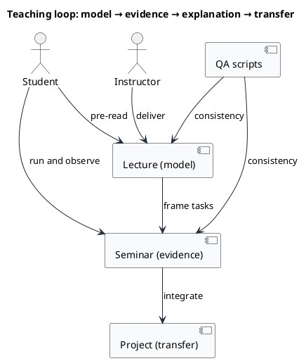

# Computer Networks — Course Kit (EN)


-blue)


This repository is a complete teaching kit for an undergraduate computer networks module.
It is organised as a sequence of lectures and evidence producing seminars, supported by projects, tooling and reproducible diagrams.

You should treat the kit as a laboratory manual, not only as a slide collection.
The pedagogical intent is to move from declarative claims to defensible explanations supported by observable artefacts such as packet captures, logs and deterministic runs.

> **Language policy:** the core materials are in English (British).
> Some files are intentionally bilingual (EN + RO) and Romanian instructor materials remain in Romanian.

---

## Start here

### If you are a student

1. Read `current-outline.md` to understand the weekly sequence.
2. Complete the environment setup in `00_TOOLS/Prerequisites/Prerequisites.md` (or agree an alternative with your instructor).
3. Start with [S01](04_SEMINARS/S01/) and keep evidence as you work.

### If you are teaching

1. Use the week-by-week map below to plan the lecture–seminar pairing.
2. Standardise the environment early.
   The default Windows stack is WSL2 + Ubuntu + Docker Engine + Portainer.
3. Mark on evidence not on screenshots.
   Require submissions framed as claim → evidence → interpretation → limitation.

---

## Contents

- [What is inside](#what-is-inside)
- [Learning design](#learning-design)
- [Tooling you will use](#tooling-you-will-use)
- [Quick start pathways](#quick-start-pathways)
- [Clone the repository](#clone-the-repository)
- [Verify your lab environment](#verify-your-lab-environment)
- [How to run a seminar](#how-to-run-a-seminar)
- [Week-by-week map](#week-by-week-map)
- [Diagrams and rendering](#diagrams-and-rendering)
- [With and without Portainer](#with-and-without-portainer)
- [With and without Mininet-SDN](#with-and-without-mininet-sdn)
- [Quality checks and formatting](#quality-checks-and-formatting)
- [Safety and scope](#safety-and-scope)
- [Licence and permitted use](#licence-and-permitted-use)
- [Repository structure](#repository-structure)

---

## What is inside

| Area | What it contains | What you use it for |
| --- | --- | --- |
| `00_APPENDIX/` | Week 0 onboarding, optional bridge material, quizzes, troubleshooting notes | reduce toolchain friction and standardise baseline skills |
| `00_TOOLS/` | PlantUML tooling, offline formatting, QA scripts | keep the kit deterministic and maintainable |
| `01_GHID_MININET-SDN/` | Mininet-SDN setup guide (VM based) | controlled topologies for SDN and routing demonstrations |
| `02_PROJECTS/` | project briefs, marking evidence expectations, diagrams and helper tools | assessment by reproducible artefacts |
| `03_LECTURES/` | lecture Markdown with scenarios and diagrams | conceptual model building plus short demonstrations |
| `04_SEMINARS/` | seminar explanations, tasks, scenarios, code and Docker configs | practical work with evidence capture |

---

## Learning design

The kit uses a repeated loop:

1. **Model**: you introduce a concept and the constraints under which it is valid.
2. **Observation**: you run a controlled scenario and observe behaviour.
3. **Explanation**: you justify observations with protocol level reasoning.
4. **Transfer**: you reuse the same reasoning in a different context.

### Diagram source (PlantUML)



---

## Tooling you will use

You do not need to install everything on day one.
You should expand your toolchain as the seminars demand it.

| Tool | Why it matters | Where you will use it |
| --- | --- | --- |
| 🧭 Git | versioned distribution and updates | cloning, updating and optional contributions |
| 🐍 Python 3.10+ | runnable scripts and protocol exercises | seminars, scenarios and project tooling |
| 🔎 Wireshark and tshark | packet capture and protocol inspection | S01 and most later labs |
| 🐳 Docker Engine and Docker Compose | isolated services and reproducible stacks | many seminars and several lecture scenarios |
| 🏁 COMPNET lab runner (optional) | consistent start/stop commands for Compose scenarios | selected lecture scenarios (Phase C pilot) |
| 🎛️ Portainer CE (optional) | visual inspection of containers and networks | convenient debugging and classroom demos |
| ☕ Java 8+ | PlantUML rendering | diagrams in lectures, seminars and projects |
| 🧩 Node.js (optional) | formatting checks (Prettier) | if you edit Markdown or HTML |
| 🌐 Mininet-SDN (optional) | controlled virtual topologies | SDN and routing related activities |

The default Windows student stack is WSL2 + Ubuntu + Docker Engine + Portainer.
The full installation is documented in `00_TOOLS/Prerequisites/Prerequisites.md`.

---

## Quick start pathways

Choose the pathway that matches your context.
The kit remains usable even if you do not have Mininet-SDN or Portainer.

### Pathway A: read only (no installs)

- Use GitHub to read the materials.
- Start with `current-outline.md` then follow into `03_LECTURES/` and `04_SEMINARS/`.

### Pathway B: Python only (no Docker, no Mininet)

This supports early seminars and many lecture scenarios.

```bash
git clone https://github.com/antonioclim/COMPNET-EN.git
cd COMPNET-EN
python -m venv .venv
source .venv/bin/activate
python -m pip install --upgrade pip
```

Where additional Python packages are needed, the relevant seminar directory will specify them.

### Pathway C: Docker labs with or without Portainer

Docker is the default execution substrate for multi service labs.
Portainer is a convenience layer.
If you do not install it, you can still complete the labs using the Docker CLI.

Minimum checks:

```bash
docker version
docker compose version
```

Optional Portainer (Linux, WSL2 or any host running Docker Engine):

```bash
docker volume create portainer_data

docker run -d \
  --name portainer \
  --restart=always \
  -p 9000:9000 \
  -p 9443:9443 \
  -v /var/run/docker.sock:/var/run/docker.sock \
  -v portainer_data:/data \
  portainer/portainer-ce:latest

# open http://localhost:9000
```

### Pathway D: Mininet-SDN (optional)

Mininet-SDN is used when you need a controlled topology that behaves like a network rather than a set of containers.
It is primarily relevant for SDN style exercises and selected routing demonstrations.

- See `01_GHID_MININET-SDN/SETUP-GUIDE-COMPNET-EN.md`.
- On Windows, this is typically used via a VM.

---

## Clone the repository

### Full clone

```bash
git clone https://github.com/antonioclim/COMPNET-EN.git
cd COMPNET-EN
```

### Update an existing clone

```bash
git pull
```

### Clone only what you need (sparse checkout)

Sparse checkout is useful when you want only a single lecture, a single seminar or a small subset for a given week.
It reduces local clutter and supports a week-by-week workflow.

> These commands require Git 2.25+.

#### Only lectures

```bash
git clone --depth 1 --sparse https://github.com/antonioclim/COMPNET-EN.git COMPNET-EN
cd COMPNET-EN
git sparse-checkout set 03_LECTURES 00_TOOLS
```

#### Only seminars

```bash
git clone --depth 1 --sparse https://github.com/antonioclim/COMPNET-EN.git COMPNET-EN
cd COMPNET-EN
git sparse-checkout set 04_SEMINARS 00_TOOLS
```

#### A single lecture (example: C08)

```bash
git clone --depth 1 --sparse https://github.com/antonioclim/COMPNET-EN.git COMPNET-EN
cd COMPNET-EN
git sparse-checkout set 03_LECTURES/C08 00_TOOLS
```

#### A single seminar (example: S12)

```bash
git clone --depth 1 --sparse https://github.com/antonioclim/COMPNET-EN.git COMPNET-EN
cd COMPNET-EN
git sparse-checkout set 04_SEMINARS/S12 00_TOOLS
```

#### A full week bundle (example: Lecture 05 and Seminar 05)

```bash
git clone --depth 1 --sparse https://github.com/antonioclim/COMPNET-EN.git COMPNET-EN
cd COMPNET-EN
git sparse-checkout set 03_LECTURES/C05 04_SEMINARS/S05 00_TOOLS
```

#### Move to the next week without recloning

If you already have a sparse checkout, you can switch what is present in your working tree.

```bash
# example: switch from Week 05 to Week 06

git sparse-checkout set 03_LECTURES/C06 04_SEMINARS/S06 00_TOOLS
```

<details>
<summary>Advanced: reduce download size (partial clone)</summary>

If your Git version and network support it, you can combine sparse checkout with a partial clone.
This can reduce the initial download because file contents are fetched on demand.

```bash
git clone --depth 1 --filter=blob:none --sparse https://github.com/antonioclim/COMPNET-EN.git COMPNET-EN
cd COMPNET-EN
git sparse-checkout set 03_LECTURES/C01 04_SEMINARS/S01 00_TOOLS
```

</details>

---

## Verify your lab environment

Before S01 you should validate that the baseline tools are working.

```bash
bash 00_TOOLS/Prerequisites/verify_lab_environment.sh
```

The script checks for core commands and expected versions.
If it reports missing components, follow `00_TOOLS/Prerequisites/Prerequisites.md`.

---

## How to run a seminar

Seminar directories are written as a sequence of short parts.
You should follow the order because later tasks assume earlier artefacts.

A pragmatic workflow is:

1. Open the seminar README for the context and evidence expectations.
2. Read each part file in order.
   Scenario files frame the experiment.
   Task files state what you must produce.
3. Run commands from inside the seminar directory so relative paths work.
4. Capture evidence as you go:
   - terminal outputs
   - `.pcapng` packet captures
   - Docker logs
5. Clean up between attempts.
   If a seminar uses Docker Compose, prefer `docker compose down -v`.

---

## Week-by-week map

This is both a navigation tool and a dependency map.

| Week | Lecture | Seminar | Primary focus | Typical stack |
| --- | --- | --- | --- | --- |
| 01 | [C01 Network fundamentals](03_LECTURES/C01/) | [S01 Wireshark and netcat](04_SEMINARS/S01/) | observation and tooling literacy | Wireshark |
| 02 | [C02 OSI and TCP/IP models](03_LECTURES/C02/) | [S02 sockets (TCP and UDP)](04_SEMINARS/S02/) | application level reasoning | Python, Wireshark |
| 03 | [C03 intro network programming](03_LECTURES/C03/) | [S03 broadcast, multicast and tunnelling](04_SEMINARS/S03/) | UDP patterns | Python, Wireshark |
| 04 | [C04 physical and data link](03_LECTURES/C04/) | [S04 custom protocols](04_SEMINARS/S04/) | framing, parsing and robustness | Python |
| 05 | [C05 addressing and subnetting](03_LECTURES/C05/) | [S05 subnetting and simulation](04_SEMINARS/S05/) | address planning as a design skill | Python |
| 06 | [C06 NAT, ARP, DHCP, NDP and ICMP](03_LECTURES/C06/) | [S06 SDN and topologies](04_SEMINARS/S06/) | controlled network behaviour | Mininet-SDN (optional), Wireshark |
| 07 | [C07 routing protocols](03_LECTURES/C07/) | [S07 capture filters and scanning](04_SEMINARS/S07/) | observation discipline and safety | Python, Wireshark |
| 08 | [C08 TCP, UDP and TLS](03_LECTURES/C08/) | [S08 HTTP servers and proxies](04_SEMINARS/S08/) | protocol evolution and trade-offs | Python, Docker, Wireshark |
| 09 | [C09 session and presentation](03_LECTURES/C09/) | [S09 FTP patterns](04_SEMINARS/S09/) | state and representation | Python, Docker |
| 10 | [C10 HTTP(S)](03_LECTURES/C10/) | [S10 DNS, SSH and FTP in containers](04_SEMINARS/S10/) | service composition | Docker |
| 11 | [C11 FTP, DNS and SSH](03_LECTURES/C11/) | [S11 load balancing](04_SEMINARS/S11/) | reverse proxies and failure modes | Docker |
| 12 | [C12 SMTP, POP3 and IMAP](03_LECTURES/C12/) | [S12 JSON-RPC, Protobuf and gRPC](04_SEMINARS/S12/) | structured APIs | Python, Docker |
| 13 | [C13 IoT and network security](03_LECTURES/C13/) | [S13 scanning and vulnerability reasoning](04_SEMINARS/S13/) | security literacy | Docker, Wireshark |

<details>
<summary>Course coverage: lecture and seminar indices</summary>

Lecture index is maintained in `03_LECTURES/README.md`.
Seminar index is maintained in `04_SEMINARS/README.md`.

- Lectures: `03_LECTURES/C01/` … `03_LECTURES/C13/`
- Seminars: `04_SEMINARS/S01/` … `04_SEMINARS/S13/`

</details>

---

## Diagrams and rendering

Diagrams are authored in PlantUML so you can regenerate them and avoid diagram drift.

1. Download `plantuml.jar` (kept out of Git)

```bash
bash 00_TOOLS/plantuml/get_plantuml_jar.sh
```

2. Render diagrams for one lecture or one seminar

```bash
cd 03_LECTURES/C01/assets
bash render.sh
```

3. Render all diagram sets (lectures, seminars and projects)

```bash
bash 00_TOOLS/plantuml/get_plantuml_jar.sh

find . -path "*/assets/render.sh" -print0 | while IFS= read -r -d '' f; do
  (cd "$(dirname "$f")" && bash ./render.sh)
done
```

---

## With and without Portainer

Portainer is a management interface.
Docker Engine is what actually runs the containers.

You can deliver and complete the course without Portainer.
The value of Portainer is observability for beginners and rapid inspection during seminars.

| Common action | Portainer approach | CLI equivalent |
| --- | --- | --- |
| list containers | Containers view | `docker ps` |
| view logs | container logs panel | `docker logs -f <container>` |
| inspect networks | Networks view | `docker network ls` and `docker network inspect <net>` |
| bring up a stack | Stacks feature (if enabled) | `docker compose up -d` |
| stop and clean | container stop and remove | `docker compose down -v` |

---

## With and without Mininet-SDN

Mininet-SDN is not a prerequisite for the whole module.
It is a specialised environment for controlled topology work.

| Capability | Without Mininet-SDN | With Mininet-SDN |
| --- | --- | --- |
| service composition | Docker networks | virtual switches and hosts |
| routing demonstrations | limited, container centric | native routing style topologies |
| SDN flow experimentation | not available | available |
| required for | most weeks | selected tasks, mainly S06 |

If you do not have Mininet-SDN, you can still complete the majority of seminars.
Where Mininet-SDN is expected, the seminar will state it explicitly and provide alternatives where feasible.

---

## Quality checks and formatting

If you change the repository you should keep it deterministic.
The following checks are safe to run locally from the repository root.

```bash
python 00_TOOLS/qa/check_markdown_links.py
python 00_TOOLS/qa/check_integrity.py
```

If you edit Markdown or HTML, run formatting:

```bash
npm install
npm run format:check

# or offline
node format-offline.js --write
```

---

## Safety and scope

Several seminars include scanning and security related activities.
You must restrict all scanning and testing to controlled laboratory networks and approved targets.
Do not point these exercises at public infrastructure.

---

## Licence and permitted use

This repository is distributed under a **Restrictive Educational Licence**.
You should read `LICENCE.md` before reuse.

In practical terms:

| Allowed without additional permission | Not allowed without explicit written permission |
| --- | --- |
| personal study, local execution and local modification | redistribution, mirroring and organised teaching outside ASE-CSIE |
| personal notes for private reference | commercial use and paid training |
| citation as required by the licence | publishing derivative works without meeting the licence conditions |

### Citation format (required by the licence)

```text
Clim, A. (2025). Computer Networks — Course Kit (EN). Bucharest University of Economic Studies (ASE), Faculty of Economic Cybernetics, Statistics and Informatics (CSIE). https://github.com/antonioclim/COMPNET-EN
```

---

## Repository structure

```text
.
├── 00_APPENDIX
├── 00_TOOLS
├── 01_GHID_MININET-SDN
├── 02_PROJECTS
├── 03_LECTURES
├── 04_SEMINARS
├── CHANGELOG.md
├── LICENCE.md
├── current-outline.md
└── requirements-optional.txt
```
