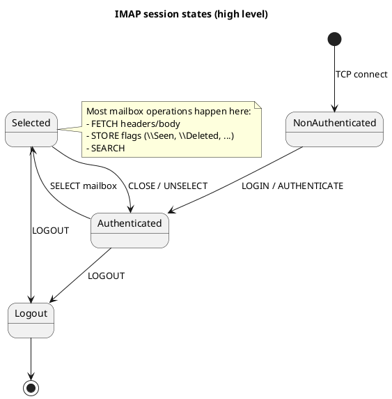

## Curs 12 – Nivelul aplicație

### SMTP, POP3, IMAP, WebMail

---

### REȚELE DE CALCULATOARE

### Curs 12

---

### E-MAIL: SMTP, POP3, IMAP, WEBMAIL

---

## Obiectivele cursului

* Înțelegerea arhitecturii sistemelor de e-mail
* Rolul și limitele SMTP, POP3 și IMAP
* Structura mesajelor e-mail (RFC 822 + MIME)
* Diferențe operaționale POP3 vs IMAP
* Rolul WebMail ca interfață de aplicație
* Corelarea protocoalelor cu scenarii reale și implementări Python

---

## Arhitectura generală a e-mailului

* Sistem distribuit, asincron
* Bazat pe:

  * SMTP – transfer
  * POP3 / IMAP – acces
  * MIME – conținut
  * DNS (MX) – rutare
* Separare clară:

  * transport
  * stocare
  * prezentare

---

## Componentele sistemului de e-mail

* **MUA (Mail User Agent)**

  * Client de e-mail
  * CLI, GUI, WebMail
* **MTA (Mail Transfer Agent)**

  * Transfer între servere
* **MDA (Mail Delivery Agent)**

  * Livrare în mailbox
* **Mailbox**

  * Stocare persistentă

(vezi diagrama de arhitectură e-mail)

---

## SMTP – Simple Mail Transfer Protocol

---

### Rolul SMTP

* Protocol de **transfer**, nu de citire
* Text-based
* Model cerere–răspuns
* Funcționează peste TCP
* Fără stare
* Inițial fără autentificare

---

### Porturi SMTP

* 25 – relay server-to-server
* 587 – submission (client → server)
* 465 – SMTPS (implicit TLS)

---

### Flux SMTP tipic

1. Client → SMTP Submission
2. Relay între servere
3. Livrare către mailbox destinatar
4. Disponibil pentru POP3 / IMAP / WebMail

---

### Plic vs mesaj

* **Plic SMTP**

  * MAIL FROM
  * RCPT TO
* **Mesaj**

  * Antete RFC 822
  * Corp MIME

---

### Antete RFC 822 (esențiale)

* From
* To
* Cc / Bcc
* Subject
* Date
* Message-ID
* Received (adăugat pe traseu)

---

### MIME – Multipurpose Internet Mail Extensions

* Permite:

  * atașamente
  * encoding binar
  * mesaje multipart
* Antete:

  * Content-Type
  * Content-Transfer-Encoding
  * MIME-Version

---

### Tipuri MIME uzuale

* text/plain
* text/html
* image/jpeg
* application/pdf
* multipart/mixed
* multipart/alternative

---

### SMTP – comenzi de bază

* HELO / EHLO
* MAIL FROM
* RCPT TO
* DATA
* RSET
* NOOP
* QUIT

---

### SMTP – coduri de răspuns

* 2xx – succes
* 3xx – continuare
* 4xx – eroare temporară
* 5xx – eroare permanentă

---

### Limitările SMTP

* Nu oferă:

  * acces la mesaje
  * sincronizare
  * structură mailbox
* Inițial nesecurizat
* Vulnerabil la spam (istoric)

---

## POP3 – Post Office Protocol

---

### Caracteristici POP3

* Protocol de **descărcare**
* Model simplu client–server
* Port 110 / 995 (TLS)
* Autentificare obligatorie
* Mesajele sunt:

  * descărcate
  * opțional șterse de pe server

---

### POP3 – comenzi uzuale

* USER / PASS
* STAT
* LIST
* RETR
* DELE
* NOOP
* QUIT

---

### Model operațional POP3

* Conectare
* Descărcare mesaje
* Stocare locală
* (Opțional) ștergere pe server
* Deconectare

---

### Avantaje POP3

* Simplu
* Offline-friendly
* Consum minim de resurse server
* Ușor de implementat

---

### Dezavantaje POP3

* Fără sincronizare
* Fără foldere
* Probleme multi-device
* Risc de pierdere locală

---

## IMAP – Internet Message Access Protocol

---

### Caracteristici IMAP

* Protocol de **acces**
* Mesajele rămân pe server
* Port 143 / 993 (TLS)
* Suport multi-client
* Sincronizare stare

---

### Funcționalități IMAP

* Foldere
* Marcatori (flags)
* Descărcare parțială
* Notificări
* Acces concurent

---

### Stările unei sesiuni IMAP

* Neautentificată
* Autentificată
* Selectată
* Logout

---

### Marcatori IMAP

* \Seen
* \Answered
* \Flagged
* \Deleted
* \Draft
* \Recent

---

### Comenzi IMAP uzuale

* LOGIN
* SELECT
* FETCH
* SEARCH
* STORE
* COPY
* EXPUNGE
* LOGOUT

---

### Model operațional IMAP

* Conectare
* Autentificare
* Selectare mailbox
* Operații incremental
* Deconectare

---

## POP3 vs IMAP

| Caracteristică | POP3  | IMAP    |
| -------------- | ----- | ------- |
| Stocare        | Local | Server  |
| Multi-device   | Nu    | Da      |
| Foldere        | Nu    | Da      |
| Offline        | Bun   | Limitat |
| Complexitate   | Mică  | Mare    |

---

## WebMail

---

### Ce este WebMail

* Interfață web pentru e-mail
* Utilizează:

  * SMTP pentru trimitere
  * IMAP pentru acces
* Rulează complet la nivel aplicație

(vezi din nou diagrama arhitecturii e-mail)

---

### Avantaje WebMail

* Fără client dedicat
* Multi-device
* Fără cache local
* Integrare cu agenda și filtre

---

### WebMail în arhitectură

* Browser → HTTPS
* Server WebMail → IMAP / SMTP
* Nicio logică de e-mail în browser

---

## Securitate în e-mail

* STARTTLS / SMTPS / IMAPS
* Autentificare
* Spam filtering
* DKIM / SPF / DMARC (menționate conceptual)

---

## Corelare cu scenariile de laborator

* **SMTP**

  * server local
  * relay
  * MIME attachments
* **POP3**

  * descărcare mesaje
* **IMAP**

  * acces selectiv
  * flags
* **WebMail**

  * interfață completă peste aceleași protocoale

---

## Poanta cursului

E-mailul:

* nu este „doar SMTP”
* este un **ecosistem de protocoale**
* separă:

  * transport
  * stocare
  * prezentare

---

## Vă mulțumesc

### Ne vedem la cursul următor
